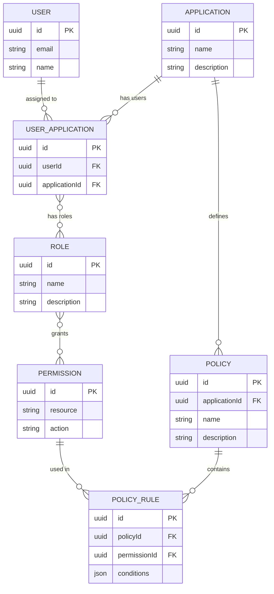

```mermaid
erDiagram
    USER {
        uuid id PK
        string email
        string name
    }

    APPLICATION {
        uuid id PK
        string name
        string description
    }

    USER_APPLICATION {
        uuid id PK
        uuid userId FK
        uuid applicationId FK
    }

    ROLE {
        uuid id PK
        string name
        string description
    }

    PERMISSION {
        uuid id PK
        string resource
        string action
    }

    POLICY {
        uuid id PK
        uuid applicationId FK
        string name
        string description
    }

    POLICY_RULE {
        uuid id PK
        uuid policyId FK
        uuid permissionId FK
        json conditions
    }

    %% Relaciones
    USER ||--o{ USER_APPLICATION : "assigned to"
    APPLICATION ||--o{ USER_APPLICATION : "has users"

    USER_APPLICATION }o--o{ ROLE : "has roles"
    ROLE }o--o{ PERMISSION : "grants"

    APPLICATION ||--o{ POLICY : "defines"
    POLICY ||--o{ POLICY_RULE : "contains"
    PERMISSION ||--o{ POLICY_RULE : "used in"

```