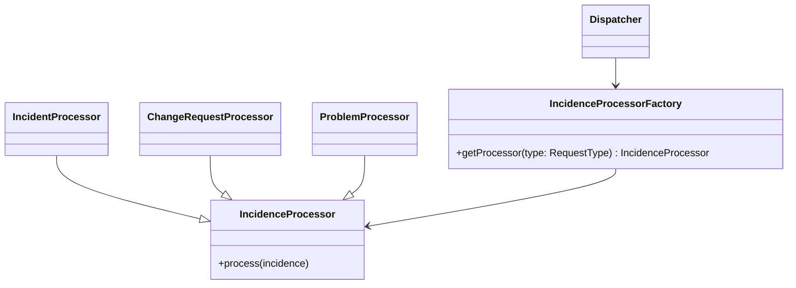
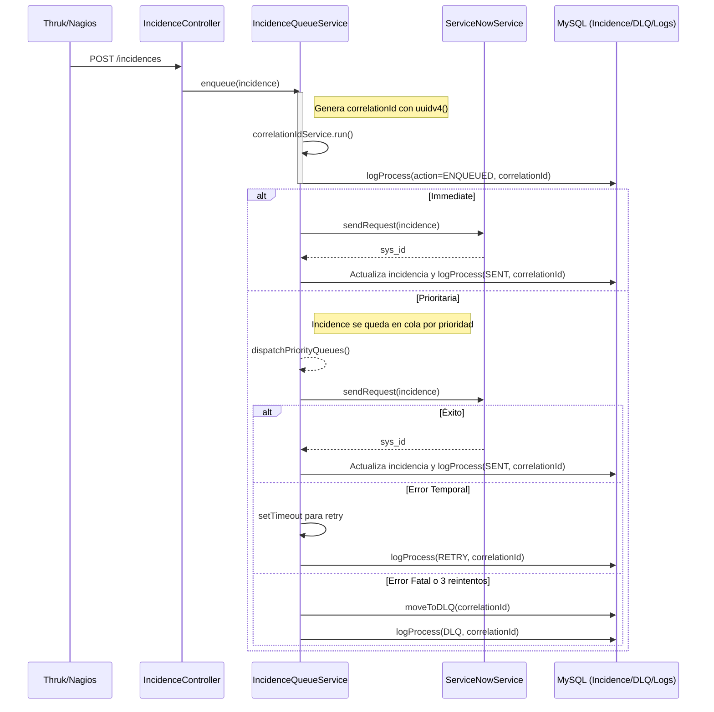
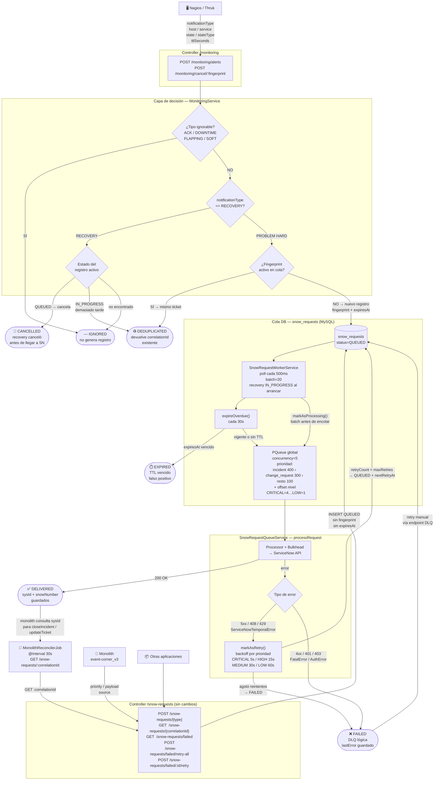

src/
├── app.module.ts
├── main.ts
├── common/
│   └── enums/
│       ├── request-priority.enum.ts
│       └── request-type.enum.ts
├── incidence/
│   ├── incidence.controller.ts
│   ├── incidence.module.ts
│   ├── incidence.service.ts
│   └── entities/incidence.entity.ts
├── service-now/
│   ├── service-now.module.ts
│   └── service-now.service.ts
└── database/
    └── database.module.ts

---

---

---

