# Architecture Diagrams — monolito-event-corner_v3

> Diagramas de componentes y secuencias para entender cómo funciona el sistema Event Corner v3.

---

## 1. Diagrama de Componentes — Vista General

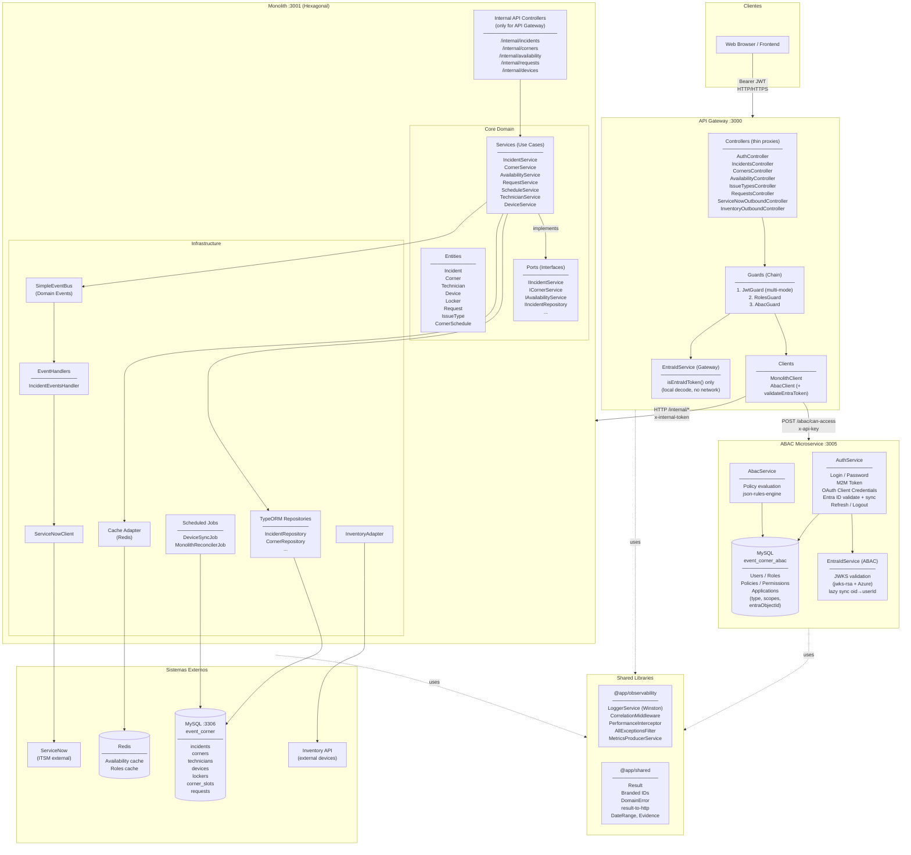

---

## 2. Diagrama de Componentes — API Gateway en detalle

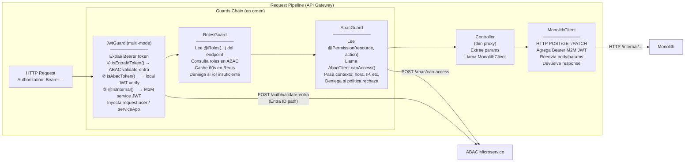

---

## 3. Diagrama de Componentes — Monolith (Arquitectura Hexagonal)

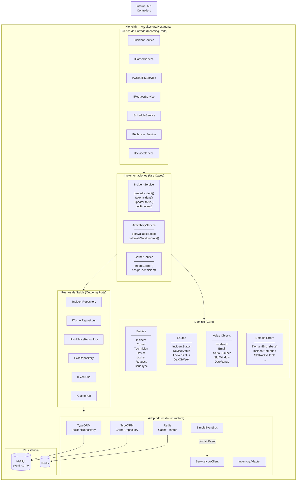

---

## 4. ~~Diagrama de Secuencia — Login por contraseña~~ (NO DISPONIBLE)

> **Requerimiento del cliente:** los usuarios finales deben autenticarse exclusivamente con **Entra ID / Azure AD**.
> El flujo de login por email/contraseña (`POST /api/auth/login`) **no está expuesto** en el gateway en esta versión.
> Ver sección 4c para el flujo Entra ID.

---

## 4b. Diagrama de Secuencia — OAuth 2.0 Client Credentials (app externa)

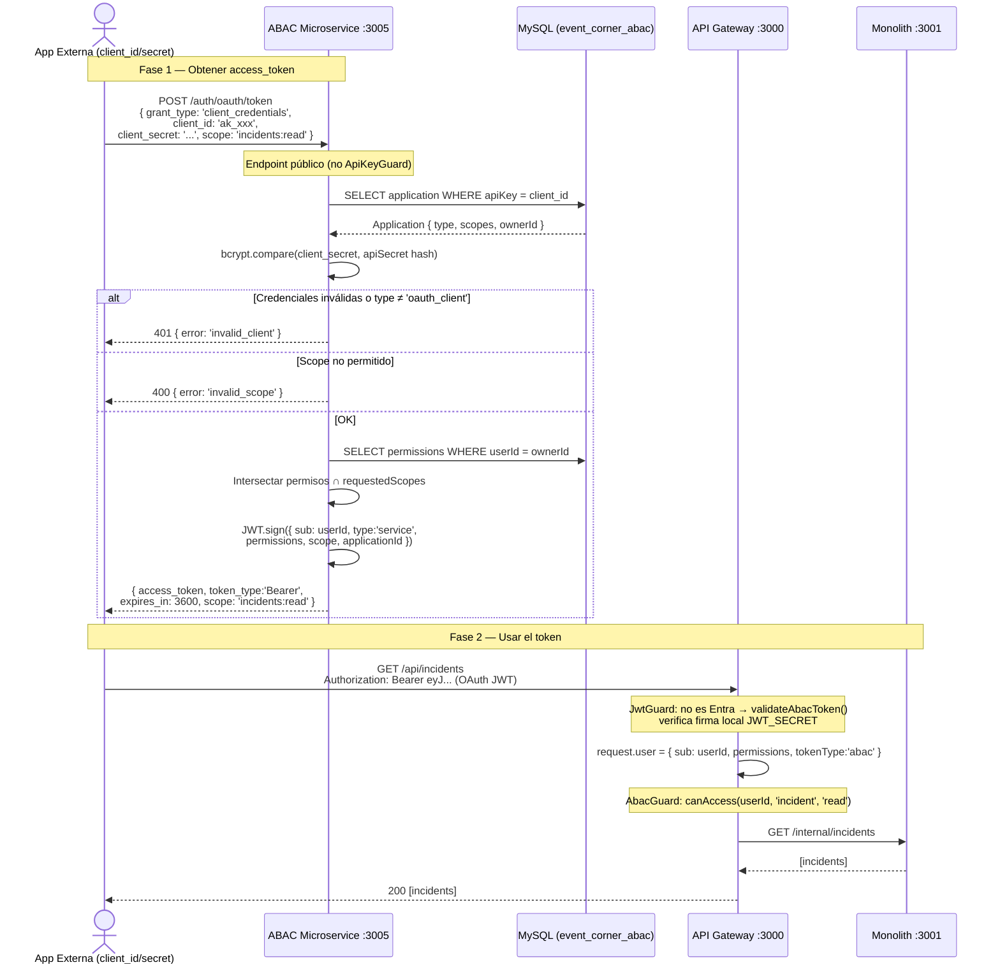

---

## 4c. Diagrama de Secuencia — Entra ID / Azure AD

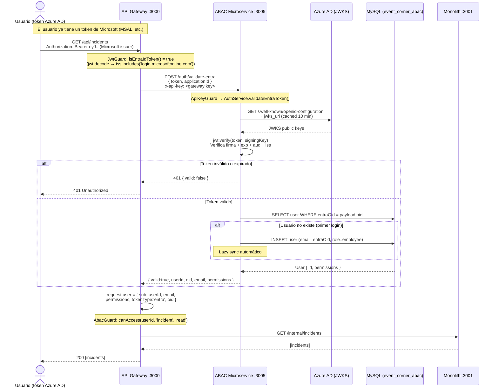

---

## 4d. Diagrama de Secuencia — M2M Token (servicio interno)

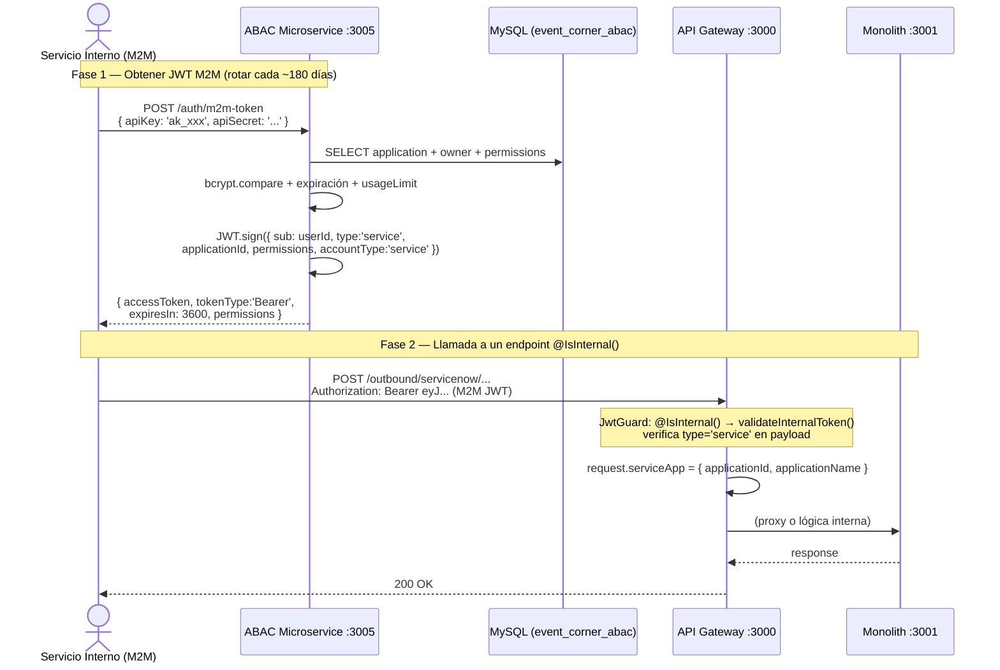

---

## 5. Diagrama de Secuencia — Request con Guards (JWT + Roles + ABAC)

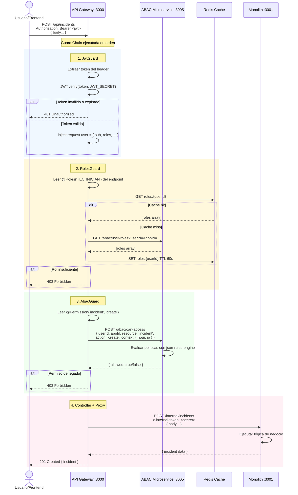

---

## 6. Diagrama de Secuencia — Crear un Incidente (flujo completo)

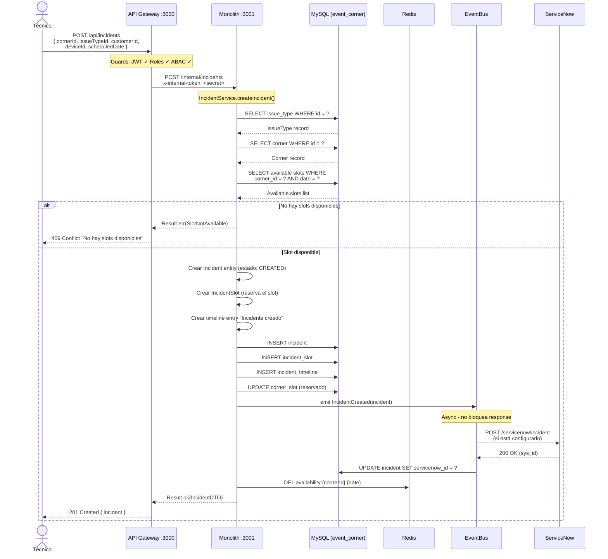

---

## 7. Diagrama de Secuencia — Máquina de Estados del Incidente

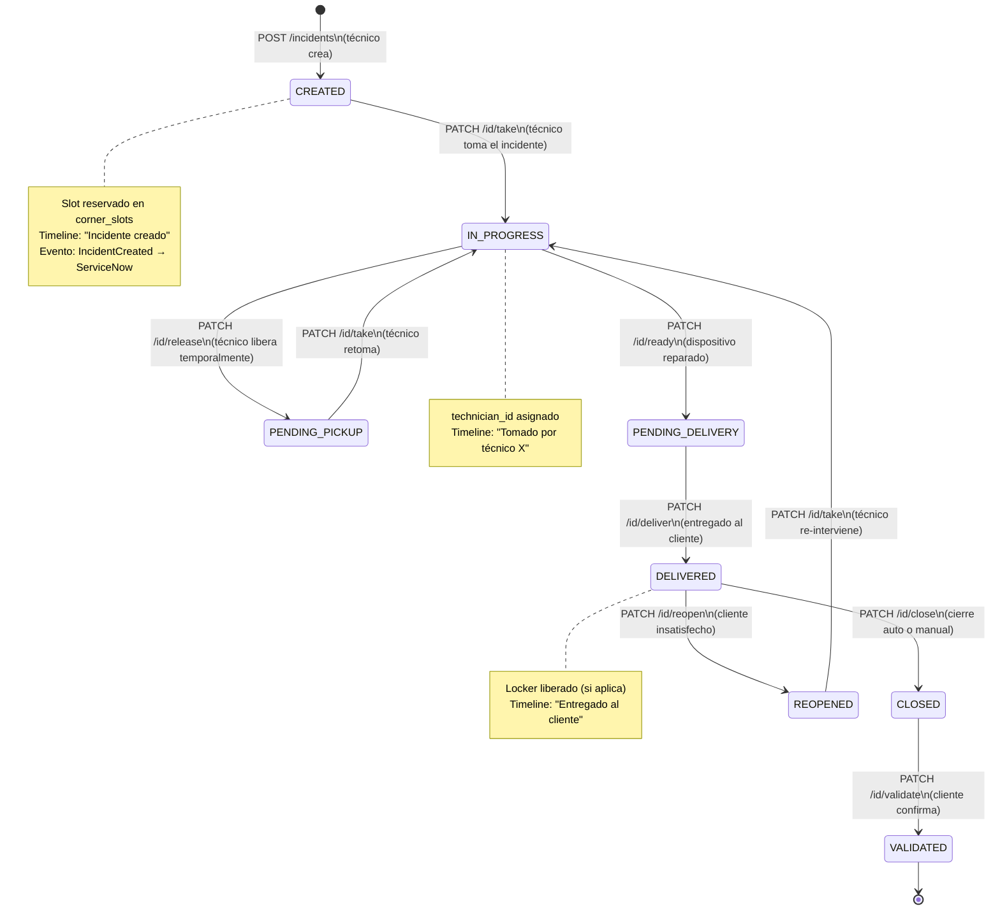

---

## 8. Diagrama de Secuencia — Verificar Disponibilidad de Slots

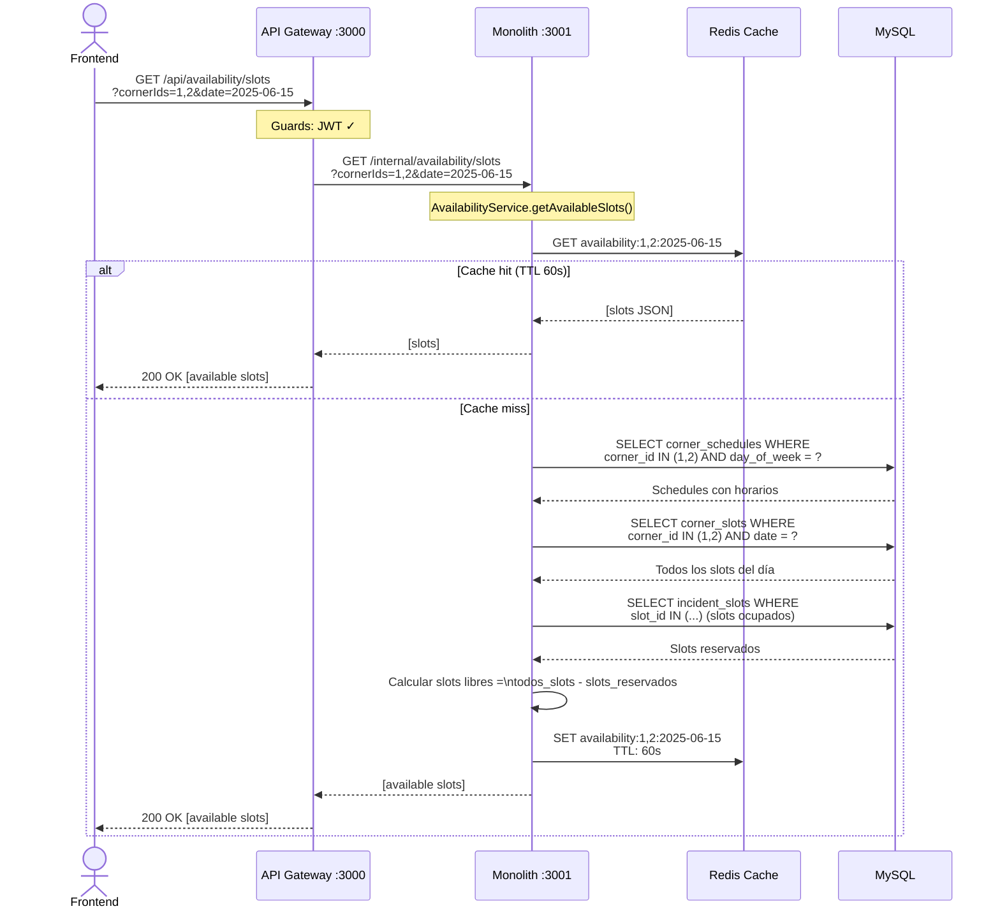

---

## 9. Diagrama de Secuencia — Evaluación ABAC (Permisos)

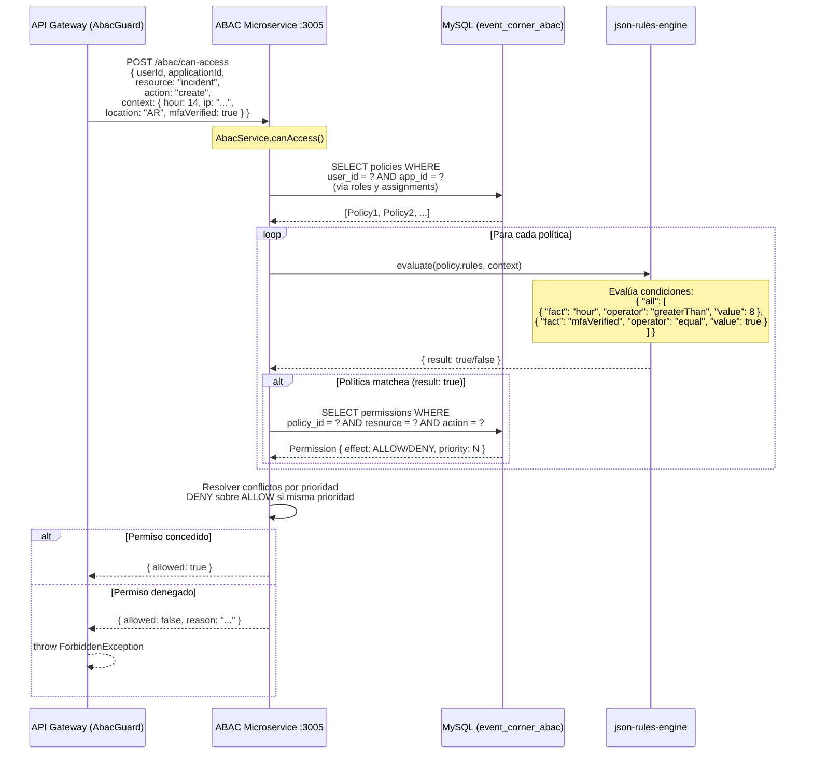

---

## 10. Diagrama de Componentes — Observabilidad

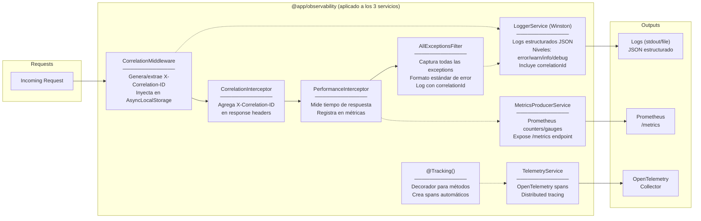

---

## Resumen de Puertos y Tecnologías

| Servicio | Puerto | Base de Datos | Responsabilidad |
|----------|--------|---------------|-----------------|
| API Gateway | :3000 | — (sin DB propia) | Proxy público, autenticación, guards |
| Monolith | :3001 | MySQL `event_corner` | Lógica de negocio, dominio, persistencia |
| ABAC Microservice | :3005 | MySQL `event_corner_abac` | Autenticación, autorización, políticas |

| Tecnología | Uso |
|------------|-----|
| NestJS 11 | Framework base de los 3 servicios |
| TypeORM | ORM para MySQL en Monolith y ABAC |
| MySQL 8 | Persistencia principal (2 bases) |
| Redis | Cache de disponibilidad y roles (TTL 60s) |
| JWT + bcrypt | Autenticación de usuarios y M2M |
| json-rules-engine | Evaluación de políticas ABAC |
| Winston | Logging estructurado |
| Prometheus | Métricas de rendimiento |
| OpenTelemetry | Distributed tracing |
| PM2 | Process manager en producción |
| Axios | HTTP client entre servicios |
| jwks-rsa | Validación de tokens Azure AD (JWKS) — en abac-microservice |
| OAuth 2.0 RFC 6749 | Client Credentials flow para apps externas |

### Modos de autenticación soportados

| Modo | Endpoint de obtención | Quién lo usa | token `type` en JWT |
|---|---|---|---|
| **Entra ID (Azure AD)** ⭐ | Token obtenido de Microsoft (MSAL) | Todos los usuarios finales | — (validado en ABAC via JWKS) |
| M2M (servicio) | `POST /auth/m2m-token` | Servicios internos con apiKey/apiSecret | `'service'` |
| OAuth Client Credentials | `POST /auth/oauth/token` | Apps externas con client_id/secret + scopes | `'service'` |

> ⭐ **Requerimiento del cliente:** los usuarios finales solo pueden autenticarse con Entra ID. No hay login por email/contraseña en esta versión.

Todos los modos producen un `userId` que fluye sin cambios por el pipeline ABAC (`canAccess()`).

### Nuevos endpoints ABAC (desde 2026-03-27)

| Endpoint | Auth | Propósito |
|---|---|---|
| `POST /auth/oauth/token` | público (client_id/secret en body) | OAuth 2.0 Client Credentials |
| `POST /auth/validate-entra` | ApiKeyGuard | Validar token Azure AD + lazy sync |
| `POST /applications/oauth` | admin | Crear OAuth client app |
| `POST /applications/:id/rotate-secret` | admin | Rotar client_secret de OAuth app |
