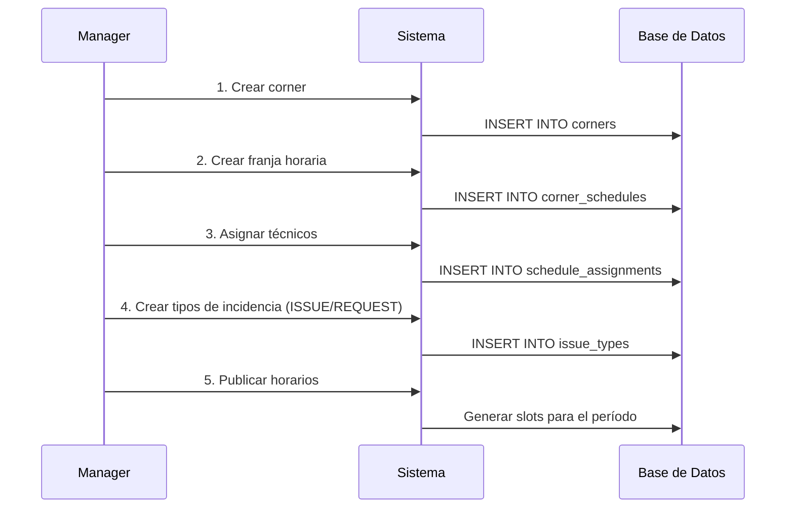
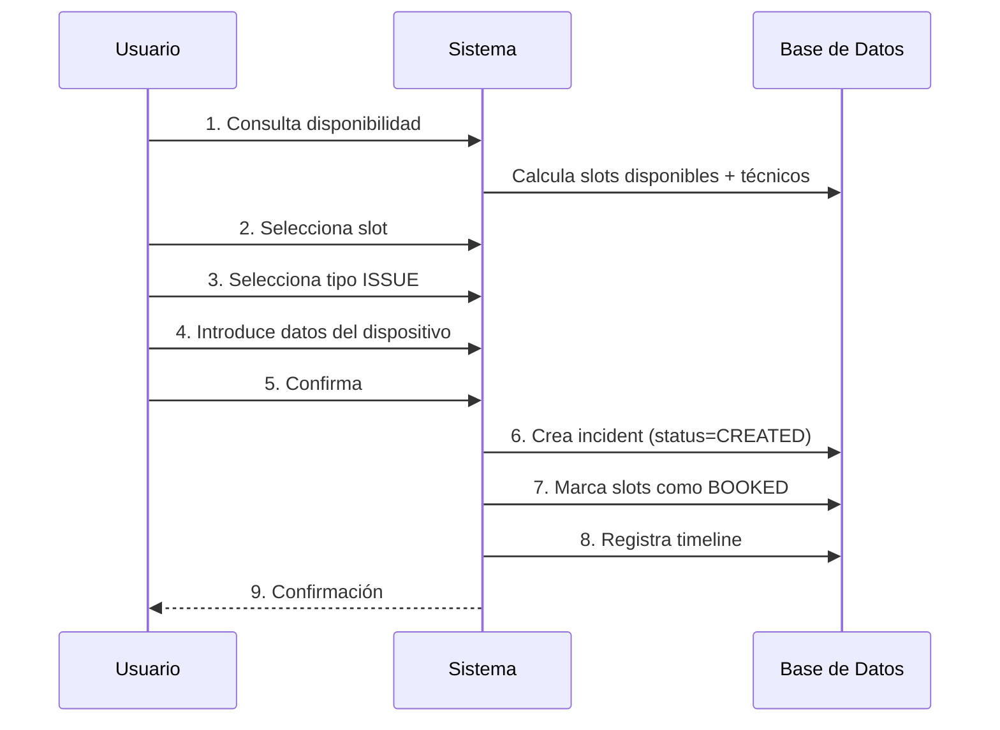
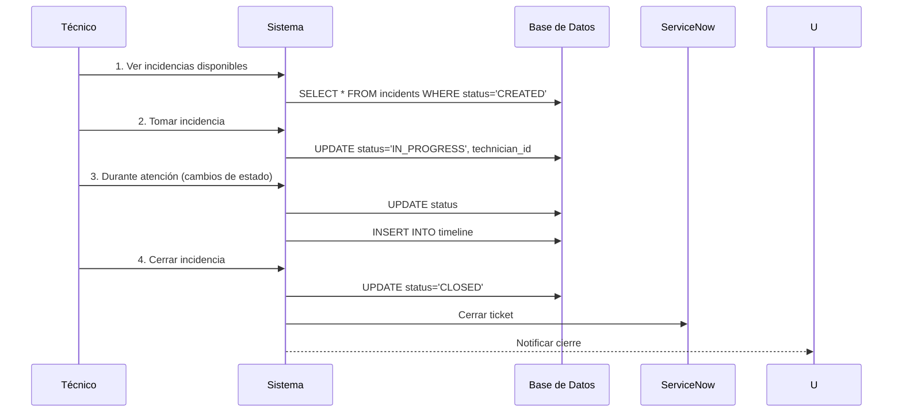
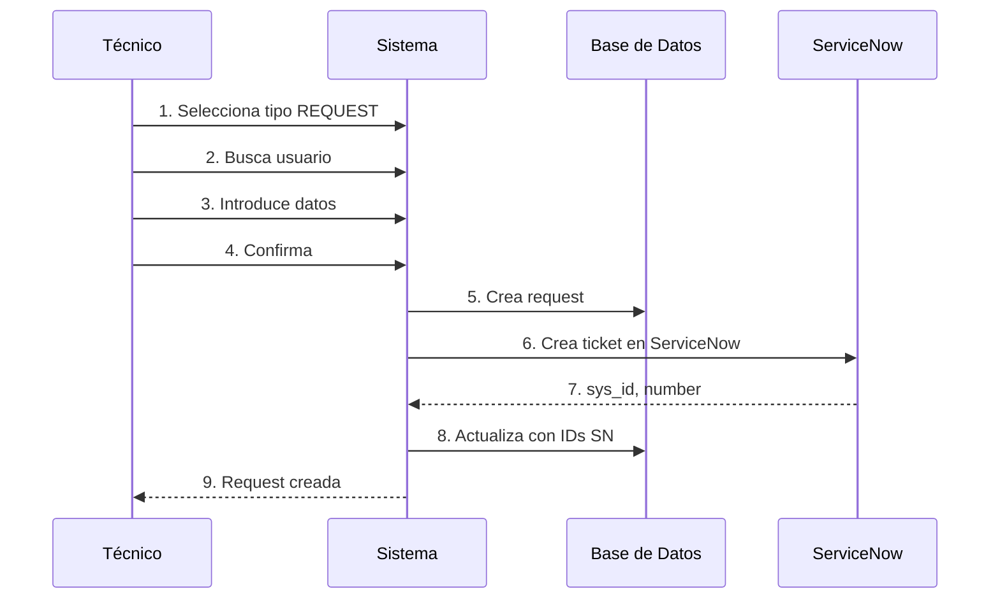

# Documentación del Sistema Event Corner

## Tabla de Contenidos
1. [Visión General](#visión-general)
2. [Arquitectura](#arquitectura)
3. [Modelo de Dominio](#modelo-de-dominio)
4. [Casos de Uso](#casos-de-uso)
5. [API Endpoints](#api-endpoints)
6. [Ejemplos con CURL](#ejemplos-con-curl)
7. [Flujos Completos](#flujos-completos)
8. [Integración con ServiceNow](#integración-con-servicenow)
9. [Manejo de Errores](#manejo-de-errores)

---

## Visión General

Event Corner es un sistema de gestión de citas técnicas en ubicaciones físicas ("corners") donde:

- **Usuarios** (empleados corporativos) reservan citas para incidencias de hardware. Se autentican **exclusivamente con Entra ID (Azure AD)** — no hay login por contraseña.
- **Técnicos** se auto-asignan las incidencias disponibles y las gestionan
- **Managers** configuran franjas horarias, asignan técnicos y gestionan tipos de incidencia
- **Incidencias de hardware** se atienden en corners (requieren atención física)
- **Solicitudes administrativas** (REQUEST-*) se envían directamente a ServiceNow

### Autenticación

| Actor | Mecanismo | Token |
|---|---|---|
| Usuarios finales | **Entra ID (Azure AD)** — token obtenido via MSAL | Bearer JWT de Microsoft → validado por ABAC via JWKS |
| Servicios internos | **M2M JWT** — `POST /auth/m2m-token` en ABAC | Bearer JWT firmado con `JWT_SECRET` |
| Apps externas | **OAuth 2.0 Client Credentials** — `POST /auth/oauth/token` | Bearer JWT con scopes limitados |

---

## Arquitectura

El sistema sigue una **arquitectura hexagonal** (puertos y adaptadores) con las siguientes capas:

```
┌─────────────────────────────────────────────────────────────┐
│                    ADAPTADORES DE ENTRADA                   │
│  (Controladores REST, GraphQL, CLI, etc.)                   │
├─────────────────────────────────────────────────────────────┤
│                        PUERTOS DE ENTRADA                    │
│  (Interfaces de servicios: IIncidentService, etc.)          │
├─────────────────────────────────────────────────────────────┤
│                      SERVICIOS DE APLICACIÓN                 │
│  (Casos de uso: IncidentService, AvailabilityService, etc.) │
├─────────────────────────────────────────────────────────────┤
│                         DOMINIO                              │
│  (Entidades, Value Objects, Enums)                          │
├─────────────────────────────────────────────────────────────┤
│                       PUERTOS DE SALIDA                      │
│  (Interfaces de repositorios: IIncidentRepository, etc.)    │
├─────────────────────────────────────────────────────────────┤
│                    ADAPTADORES DE SALIDA                     │
│  (TypeORM, Cache Local, Event Bus, ServiceNow API)          │
└─────────────────────────────────────────────────────────────┘
```

### Tecnologías Utilizadas

- **NestJS** - Framework de Node.js
- **TypeORM** - ORM para MySQL 8
- **MySQL 8** - Base de datos relacional
- **TypeScript** - Lenguaje de programación
- **Result Pattern** - Manejo funcional de errores
- **Event Sourcing** - Para trazabilidad de incidencias

---

## Modelo de Dominio

### Entidades Principales

#### `Incident` (Incidencia)
Representa una cita creada por un usuario para resolver un problema de hardware.
|-----------------------|------------------|------------------------------------------|
| Propiedad             | Tipo             | Descripción                              |
|-----------------------|------------------|------------------------------------------|
| `id`                  | `IncidentId`     | Identificador único                      |
| `issueTypeId`         | `IssueTypeId`    | Tipo de incidencia                       |
| `customerId`          | `CustomerId`     | Usuario que crea la cita                 |
| `cornerId`            | `CornerId`       | Corner donde se atiende                  |
| `slotIds`             | `SlotId[]`       | Slots que ocupa la cita                  |
| `scheduledRange`      | `DateRange`      | Rango de fecha/hora                      |
| `status`              | `IncidentStatus` | Estado actual                            |
| `currentTechnicianId` | `TechnicianId`   | Técnico que atiende (null si disponible) |
| `servicenowId`        | `string`         | ID del ticket en ServiceNow              |
|-----------------------|------------------|------------------------------------------|

**Estados:**
```
CREATED                      → Cita creada, dispositivo no entregado aún
DELIVERED                    → Dispositivo entregado al corner
IN_PROGRESS                  → Técnico trabajando en la resolución
PENDING_THIRD_PARTY          → Esperando acción de tercero
PENDING_USER                 → Esperando acción del usuario
PENDING_SPARE_PART           → Esperando llegada de repuesto
PENDING_PICKUP               → Dispositivo reparado listo para recoger
PENDING_REPLACEMENT_DELIVERY → Sustitución lista para recoger
CLOSED                       → Cliente recogió, cita cerrada
REOPENED                     → Reabierta por técnico
VALIDATED                    → Validada por cliente (post-cierre)
CANCELED                     → Cancelada por cliente
```

**Transiciones válidas:**
```
CREATED   → DELIVERED, CANCELED
DELIVERED → IN_PROGRESS, PENDING_THIRD_PARTY, PENDING_USER, PENDING_SPARE_PART
IN_PROGRESS → PENDING_THIRD_PARTY, PENDING_USER, PENDING_SPARE_PART,
              PENDING_PICKUP, PENDING_REPLACEMENT_DELIVERY
PENDING_THIRD_PARTY / PENDING_USER / PENDING_SPARE_PART → IN_PROGRESS
PENDING_PICKUP / PENDING_REPLACEMENT_DELIVERY → CLOSED
CLOSED → REOPENED (via reopen()), VALIDATED (via validate())
REOPENED → IN_PROGRESS
```

#### `Request` (Solicitud)
Representa una solicitud administrativa creada por un técnico (onboarding, decomisión, etc.) que va directo a ServiceNow.

|----------------|------------------|------------------------------------------|
| Propiedad      | Tipo             | Descripción                              |
|----------------|------------------|------------------------------------------|
| `id`           | `RequestId`      | Identificador único                      |
| `issueTypeId`  | `IssueTypeId`    | Tipo de solicitud                        |
| `technicianId` | `TechnicianId`   | Técnico que crea                         |
| `customerId`   | `CustomerId`     | Usuario sujeto de la solicitud           |
| `companyId`    | `CompanyId`      | Empresa del usuario                      |
| `scheduledAt`  | `Date`           | Fecha programada                         |
| `status`       | `string`         | Estado                                   |
|----------------|------------------|------------------------------------------|

#### `IssueType` (Tipo de Incidencia)
Catálogo de tipos configurables desde el panel de administración.

|--------------------------|------------------|------------------------------------------|
| Propiedad                | Tipo             | Descripción                              |
|--------------------------|------------------|------------------------------------------|
| `id`                     | `IssueTypeId`    | Identificador único                      |                                        |
| `name`                   | `string`         | Nombre descriptivo                       | "Avería de portátil"                   |
| `category`               | `IssueCategory`  | Categoría                                | `ISSUE`, `REQUEST-DECOMMISSION`        |
| `deviceType`             | `string`         | Tipo de hardware                         | "Portátil", "Tableta"                  |
| `workMinutes`            | `number`         | Duración del servicio                    | 30                                     |
| `spareMinutes`           | `number`         | Minutos de margen                        | 15                                     |
| `closeMinutes`           | `number`         | Minutos para cierre                      | 5          |
| `notUserVisible`         | `boolean`        | Oculto para usuarios                     | false      |
| `position`               | `number`         | Orden en UI                              | 1          |
| `icon`                   | `string`         | Icono                                    | "laptop"   |
| `npsDisabled`            | `boolean`        | Sin encuesta                             | false      |
| `servicenowCategory`     | `string`         | Categoría en SN                          | "hardware" |
| `servicenowCloseCategory`| `string`         | Categoría de cierre                      | "resolved" |

#### `Corner` (Punto de Servicio)
Ubicación física donde se atienden incidencias.

| Propiedad | Tipo | Descripción |
|-----------|------|-------------|
| `id` | `CornerId` | Identificador único |
| `name` | `string` | Nombre del corner |
| `servicenowLocation` | `string` | Ubicación en ServiceNow |
| `slotDurationMinutes` | `number` | Duración de cada slot (ej: 15) |
| `onlyTechnicians` | `boolean` | Solo técnicos pueden crear |

#### `CornerSchedule` (Franja Horaria)
Franjas definidas por el manager para cada corner.

| Propiedad | Tipo | Descripción |
|-----------|------|-------------|
| `id` | `ScheduleId` | Identificador único |
| `cornerId` | `CornerId` | Corner asociado |
| `dayOfWeek` | `DayOfWeek` | Día de la semana |
| `startTime` | `string` | Hora inicio (HH:MM) |
| `endTime` | `string` | Hora fin (HH:MM) |
| `validFrom` | `Date` | Desde fecha |
| `validUntil` | `Date` | Hasta fecha |
| `technicianIds` | `TechnicianId[]` | Técnicos asignados |

#### `Slot` (Bloque de Tiempo)
Slots generados a partir de las franjas horarias.

| Propiedad | Tipo | Descripción |
|-----------|------|-------------|
| `id` | `SlotId` | Identificador único |
| `cornerId` | `CornerId` | Corner |
| `scheduleId` | `ScheduleId` | Franja origen |
| `timeRange` | `DateRange` | Rango de tiempo |
| `status` | `SlotStatus` | `AVAILABLE`, `BOOKED`, `EXPIRED` |

#### `Technician` (Técnico)
Profesional que atiende incidencias.

| Propiedad | Tipo | Descripción |
|-----------|------|-------------|
| `id` | `TechnicianId` | Identificador único |
| `name` | `string` | Nombre |
| `email` | `string` | Email |
| `cornerId` | `CornerId` | Corner al que pertenece |
| `disabled` | `boolean` | Deshabilitado |

#### `User` (Usuario)
Empleado que crea incidencias. Se autentica con Entra ID (Azure AD).

| Propiedad | Tipo | Descripción |
|-----------|------|-------------|
| `id` | `UserId` | Identificador único |
| `externalId` | `string` | ID externo (oid de Azure AD en usuarios Entra) |
| `domain` | `string` | Dominio corporativo |
| `principalName` | `string` | UPN de Azure (nombre@dominio) |
| `email` | `Email` | Email |
| `companyId` | `CompanyId` | Empresa |
| `cornerId` | `CornerId` | Corner habitual |

#### `Company` (Empresa)
Cliente del sistema.

| Propiedad | Tipo | Descripción |
|-----------|------|-------------|
| `id` | `CompanyId` | Identificador único |
| `name` | `string` | Nombre |
| `ldapName` | `string` | Nombre en LDAP |
| `servicenowProfileId` | `ServiceNowProfileId` | Perfil SN asociado |

#### `ServiceNowProfile` (Perfil SN)
Perfil de integración con ServiceNow.

| Propiedad | Tipo | Descripción |
|-----------|------|-------------|
| `id` | `ServiceNowProfileId` | Identificador único |
| `name` | `string` | Nombre del perfil |
| `snowCompanySysId` | `ServiceNowId` | sys_id en ServiceNow |
| `snowCompanyName` | `string` | Nombre en ServiceNow |

#### `Locker` (Taquilla)
Taquilla física para entregas.

| Propiedad | Tipo | Descripción |
|-----------|------|-------------|
| `id` | `LockerId` | Identificador |
| `lockerCode` | `string` | Código visible |
| `status` | `LockerStatus` | `AVAILABLE`, `OCCUPIED`, `OUT_OF_SERVICE` |

#### `Device` (Dispositivo)
Registro contextual de dispositivo afectado.

| Propiedad | Tipo | Descripción |
|-----------|------|-------------|
| `id` | `DeviceId` | Identificador |
| `serialNumber` | `SerialNumber` | Número de serie |
| `model` | `string` | Modelo |
| `deviceType` | `string` | Tipo |

### Value Objects

| Value Object | Propósito |
|--------------|-----------|
| `IncidentId` | ID tipado para incidencias |
| `TechnicianId` | ID tipado para técnicos |
| `CornerId` | ID tipado para corners |
| `SlotId` | ID tipado para slots |
| `DateRange` | Rango de fechas con validaciones |
| `Email` | Email con validación de formato |
| `SerialNumber` | Número de serie normalizado |
| `DeviceType` | Tipo de dispositivo controlado |
| `WorkMinutes` | Minutos de trabajo con validación |
| `ServiceNowId` | ID de ServiceNow |

### Enums

```typescript
enum IncidentStatus {
  CREATED = 'CREATED',
  DELIVERED = 'DELIVERED',
  IN_PROGRESS = 'IN_PROGRESS',
  PENDING_THIRD_PARTY = 'PENDING_THIRD_PARTY',
  PENDING_USER = 'PENDING_USER',
  PENDING_SPARE_PART = 'PENDING_SPARE_PART',
  PENDING_PICKUP = 'PENDING_PICKUP',
  PENDING_REPLACEMENT_DELIVERY = 'PENDING_REPLACEMENT_DELIVERY',
  CLOSED = 'CLOSED',
  REOPENED = 'REOPENED',
  VALIDATED = 'VALIDATED',
  CANCELED = 'CANCELED'
}

enum IssueCategory {
  ISSUE = 'ISSUE',
  REQUEST = 'REQUEST',
  REQUEST_ONBOARDING = 'REQUEST-ONBOARDING',
  REQUEST_DECOMMISSION = 'REQUEST-DECOMMISSION',
  REQUEST_DELIVERY = 'REQUEST-DELIVERY'
}

enum SlotStatus {
  AVAILABLE = 'AVAILABLE',
  BOOKED = 'BOOKED',
  EXPIRED = 'EXPIRED'
}

enum DayOfWeek {
  MONDAY = 'MON',
  TUESDAY = 'TUE',
  WEDNESDAY = 'WED',
  THURSDAY = 'THU',
  FRIDAY = 'FRI',
  SATURDAY = 'SAT',
  SUNDAY = 'SUN'
}
```

---

## Casos de Uso

### 1. Gestión de Corners

#### Crear Corner
```typescript
// Command
{
  name: "Torre Central - Piso 3",
  slotDurationMinutes: 15,
  onlyTechnicians: false,
  servicenowLocation: "MAD-TC-03"
}
```

#### Añadir Franja Horaria
```typescript
// Command
{
  cornerId: "corner_123",
  name: "Mañana Lunes",
  dayOfWeek: "MON",
  startTime: "09:00",
  endTime: "14:00",
  validFrom: "2026-03-01",
  validUntil: "2026-03-31"
}
```

#### Asignar Técnicos a Franja
```typescript
// Command
{
  scheduleId: "schedule_123",
  technicianIds: ["tech_1", "tech_2", "tech_3"]
}
```

### 2. Gestión de Tipos de Incidencia (Admin)

#### Crear Tipo ISSUE (Hardware)
```typescript
// Command
{
  profileId: "prof_santander",
  name: "Avería de portátil",
  category: "ISSUE",
  deviceType: "Portátil",
  workMinutes: 30,
  spareMinutes: 15,
  closeMinutes: 5,
  notUserVisible: false,
  position: 1,
  icon: "laptop",
  npsDisabled: false,
  servicenowCategory: "hardware",
  servicenowCloseCategory: "hardware_error"
}
```

#### Crear Tipo REQUEST (Administrativo)
```typescript
// Command
{
  profileId: "prof_santander",
  name: "Decomisión digital (portátil)",
  category: "REQUEST-DECOMMISSION",
  deviceType: "Portátil",
  workMinutes: 20,
  spareMinutes: 0,
  closeMinutes: 0,
  notUserVisible: true,
  position: 2,
  icon: "delete",
  npsDisabled: false
}
```

### 3. Consulta de Disponibilidad

#### Obtener Slots Disponibles
```typescript
// Query
{
  cornerId: "corner_123",
  date: "2026-03-09",
  duration: 30
}

// Response
[
  {
    start: "2026-03-09T09:00:00Z",
    end: "2026-03-09T09:30:00Z",
    available: false,
    reason: "SLOTS_OCCUPIED"
  },
  {
    start: "2026-03-09T09:30:00Z",
    end: "2026-03-09T10:00:00Z",
    available: true,
    technicians: {
      total: 3,
      available: 2,
      availableNames: ["María López", "Pedro Gómez"],
      occupied: [
        { id: "tech_1", name: "Juan Pérez", occupiedUntil: "2026-03-09T09:30:00Z" }
      ]
    }
  }
]
```

### 4. Creación de Incidencia (Usuario)

#### Crear Cita
```typescript
// Command
{
  issueTypeId: "averia_portatil",
  customerId: "user_123",
  cornerId: "corner_123",
  slotIds: ["slot_0930", "slot_0945"],
  startTime: "2026-03-09T09:30:00Z",
  endTime: "2026-03-09T10:00:00Z",
  origin: "CUSTOMER_APP",
  device: {
    serialNumber: "ABC123XYZ",
    model: "ThinkPad T14",
    deviceType: "LAPTOP"
  }
}
```

### 5. Gestión de Incidencias (Técnico)

#### Ver Incidencias Disponibles
```typescript
// GET /api/incidents/available?cornerId=corner_123
// Response: Lista de incidencias en estado CREATED
```

#### Tomar Incidencia
```typescript
// Command
{
  incidentId: "inc_123",
  technicianId: "tech_456"
}
```

#### Liberar Incidencia
```typescript
// Command
{
  incidentId: "inc_123",
  technicianId: "tech_456",
  reason: "Cambio de turno"
}
```

#### Cambiar Estado
```typescript
// Command
{
  incidentId: "inc_123",
  technicianId: "tech_456",
  newStatus: "IN_PROGRESS",
  comment: "Comenzando reparación"
}
```

### 6. Creación de Request (Técnico)

```typescript
// Command
{
  issueTypeId: "decomision_portatil",
  technicianId: "tech_456",
  customerId: "user_789",
  cornerId: "corner_123",
  companyId: "company_456",
  scheduledAt: "2026-03-10T11:00:00Z",
  notes: "Decomisión por baja voluntaria"
}
```

---

## API Endpoints

### Corners

| Método | Endpoint | Descripción |
|--------|----------|-------------|
| `GET` | `/api/corners` | Lista todos los corners activos |
| `GET` | `/api/corners/:id` | Obtiene un corner por ID |
| `POST` | `/api/corners` | Crea un nuevo corner |
| `PUT` | `/api/corners/:id` | Actualiza un corner |
| `DELETE` | `/api/corners/:id` | Desactiva un corner |
| `POST` | `/api/corners/:id/schedules` | Añade franja horaria |
| `GET` | `/api/corners/:id/schedules` | Lista franjas del corner |
| `POST` | `/api/corners/:id/schedules/:scheduleId/technicians` | Asigna técnicos a franja |

### Tipos de Incidencia (Admin)

| Método | Endpoint | Descripción |
|--------|----------|-------------|
| `GET` | `/api/admin/issue-types` | Lista todos los tipos |
| `GET` | `/api/admin/issue-types/:id` | Obtiene tipo por ID |
| `POST` | `/api/admin/issue-types` | Crea nuevo tipo |
| `PUT` | `/api/admin/issue-types/:id` | Actualiza tipo |
| `DELETE` | `/api/admin/issue-types/:id` | Desactiva tipo |

### Disponibilidad

| Método | Endpoint | Descripción |
|--------|----------|-------------|
| `GET` | `/api/availability/:cornerId` | Obtiene disponibilidad para un corner |
| `GET` | `/api/availability/:cornerId/technicians` | Disponibilidad de técnicos |

### Incidencias

| Método | Endpoint | Descripción |
|--------|----------|-------------|
| `GET` | `/api/incidents/available` | Incidencias disponibles para tomar |
| `GET` | `/api/incidents/technician/:technicianId` | Incidencias de un técnico |
| `GET` | `/api/incidents/:id` | Detalle de incidencia |
| `POST` | `/api/incidents` | Crear nueva incidencia |
| `PATCH` | `/api/incidents/:id/take` | Tomar incidencia |
| `PATCH` | `/api/incidents/:id/release` | Liberar incidencia |
| `PATCH` | `/api/incidents/:id/status` | Cambiar estado |

### Requests

| Método | Endpoint | Descripción |
|--------|----------|-------------|
| `GET` | `/api/requests` | Lista requests (con filtros) |
| `GET` | `/api/requests/:id` | Detalle de request |
| `POST` | `/api/requests` | Crear nueva request |
| `PATCH` | `/api/requests/:id/status` | Cambiar estado |

### Técnicos

| Método | Endpoint | Descripción |
|--------|----------|-------------|
| `GET` | `/api/technicians` | Lista técnicos |
| `GET` | `/api/technicians/:id` | Detalle de técnico |
| `POST` | `/api/technicians` | Crear técnico |
| `PUT` | `/api/technicians/:id` | Actualizar técnico |
| `PATCH` | `/api/technicians/:id/disable` | Deshabilitar técnico |
| `PATCH` | `/api/technicians/:id/enable` | Habilitar técnico |

### Usuarios

| Método | Endpoint | Descripción |
|--------|----------|-------------|
| `GET` | `/api/users/:id` | Detalle de usuario |
| `PATCH` | `/api/users/:id/corner` | Actualizar corner habitual |

> Los usuarios se crean automáticamente en el primer login con Entra ID (lazy sync). No hay endpoint de creación manual ni sincronización LDAP.

---

## Ejemplos con CURL

### 1. Crear un Corner

```bash
curl -X POST http://localhost:3000/api/corners \
  -H "Content-Type: application/json" \
  -d '{
    "name": "Torre Central - Piso 3",
    "slotDurationMinutes": 15,
    "onlyTechnicians": false,
    "servicenowLocation": "MAD-TC-03",
    "clientName": "Banco Santander",
    "description": "Soporte hardware planta 3"
  }'
```

**Respuesta:**
```json
{
  "id": "corner_123",
  "name": "Torre Central - Piso 3",
  "slotDurationMinutes": 15,
  "onlyTechnicians": false,
  "servicenowLocation": "MAD-TC-03",
  "isActive": true,
  "createdAt": "2026-03-06T10:00:00Z"
}
```

### 2. Añadir Franja Horaria

```bash
curl -X POST http://localhost:3000/api/corners/corner_123/schedules \
  -H "Content-Type: application/json" \
  -d '{
    "name": "Mañana Lunes",
    "dayOfWeek": "MON",
    "startTime": "09:00",
    "endTime": "14:00",
    "validFrom": "2026-03-01",
    "validUntil": "2026-03-31"
  }'
```

### 3. Asignar Técnicos a Franja

```bash
curl -X POST http://localhost:3000/api/corners/corner_123/schedules/schedule_456/technicians \
  -H "Content-Type: application/json" \
  -d '{
    "technicianIds": ["tech_1", "tech_2", "tech_3"]
  }'
```

### 4. Crear Tipo de Incidencia (ISSUE)

```bash
curl -X POST http://localhost:3000/api/admin/issue-types \
  -H "Content-Type: application/json" \
  -d '{
    "profileId": "prof_santander",
    "name": "Avería de portátil",
    "category": "ISSUE",
    "deviceType": "Portátil",
    "workMinutes": 30,
    "spareMinutes": 15,
    "closeMinutes": 5,
    "notUserVisible": false,
    "position": 1,
    "icon": "laptop",
    "npsDisabled": false,
    "servicenowCategory": "hardware",
    "servicenowCloseCategory": "hardware_error"
  }'
```

### 5. Crear Tipo de Incidencia (REQUEST)

```bash
curl -X POST http://localhost:3000/api/admin/issue-types \
  -H "Content-Type: application/json" \
  -d '{
    "profileId": "prof_santander",
    "name": "Decomisión digital (portátil)",
    "category": "REQUEST-DECOMMISSION",
    "deviceType": "Portátil",
    "workMinutes": 20,
    "spareMinutes": 0,
    "closeMinutes": 0,
    "notUserVisible": true,
    "position": 2,
    "icon": "delete",
    "npsDisabled": false
  }'
```

### 6. Consultar Disponibilidad

```bash
curl -X GET "http://localhost:3000/api/availability/corner_123?date=2026-03-09&duration=30"
```

**Respuesta:**
```json
[
  {
    "start": "2026-03-09T09:30:00Z",
    "end": "2026-03-09T10:00:00Z",
    "available": true,
    "technicians": {
      "total": 3,
      "available": 2,
      "availableNames": ["María López", "Pedro Gómez"],
      "occupied": [
        {
          "id": "tech_1",
          "name": "Juan Pérez",
          "occupiedUntil": "2026-03-09T09:30:00Z"
        }
      ]
    }
  }
]
```

### 7. Crear Incidencia (Usuario)

```bash
curl -X POST http://localhost:3000/api/incidents \
  -H "Content-Type: application/json" \
  -d '{
    "issueTypeId": "averia_portatil",
    "customerId": "user_123",
    "cornerId": "corner_123",
    "slotIds": ["slot_0930", "slot_0945"],
    "startTime": "2026-03-09T09:30:00Z",
    "endTime": "2026-03-09T10:00:00Z",
    "origin": "CUSTOMER_APP",
    "device": {
      "serialNumber": "ABC123XYZ",
      "model": "ThinkPad T14",
      "deviceType": "LAPTOP"
    }
  }'
```

**Respuesta:**
```json
{
  "id": "inc_123",
  "status": "CREATED",
  "scheduledStart": "2026-03-09T09:30:00Z",
  "scheduledEnd": "2026-03-09T10:00:00Z",
  "message": "Cita creada exitosamente"
}
```

### 8. Ver Incidencias Disponibles (Técnico)

```bash
curl -X GET http://localhost:3000/api/incidents/available?cornerId=corner_123
```

**Respuesta:**
```json
[
  {
    "id": "inc_123",
    "start": "2026-03-09T09:30:00Z",
    "end": "2026-03-09T10:00:00Z",
    "customerName": "Juan Pérez",
    "issueType": "Avería de portátil",
    "deviceModel": "ThinkPad T14",
    "duration": 30
  }
]
```

### 9. Tomar Incidencia

```bash
curl -X PATCH http://localhost:3000/api/incidents/inc_123/take \
  -H "Content-Type: application/json" \
  -d '{
    "technicianId": "tech_456"
  }'
```

**Respuesta:**
```json
{
  "id": "inc_123",
  "status": "IN_PROGRESS",
  "currentTechnicianId": "tech_456",
  "message": "Incidencia asignada"
}
```

### 10. Cambiar Estado de Incidencia

```bash
curl -X PATCH http://localhost:3000/api/incidents/inc_123/status \
  -H "Content-Type: application/json" \
  -d '{
    "technicianId": "tech_456",
    "newStatus": "PAUSED",
    "comment": "Esperando repuesto de pantalla"
  }'
```

### 11. Liberar Incidencia

```bash
curl -X PATCH http://localhost:3000/api/incidents/inc_123/release \
  -H "Content-Type: application/json" \
  -d '{
    "technicianId": "tech_456",
    "reason": "Cambio de turno"
  }'
```

**Respuesta:**
```json
{
  "id": "inc_123",
  "status": "CREATED",
  "currentTechnicianId": null,
  "message": "Incidencia liberada"
}
```

### 12. Crear Request (Técnico)

```bash
curl -X POST http://localhost:3000/api/requests \
  -H "Content-Type: application/json" \
  -d '{
    "issueTypeId": "decomision_portatil",
    "technicianId": "tech_456",
    "customerId": "user_789",
    "cornerId": "corner_123",
    "companyId": "company_456",
    "scheduledAt": "2026-03-10T11:00:00Z",
    "notes": "Decomisión por baja voluntaria"
  }'
```

### 13. Crear Técnico

```bash
curl -X POST http://localhost:3000/api/technicians \
  -H "Content-Type: application/json" \
  -d '{
    "name": "María",
    "lastName": "López",
    "email": "maria.lopez@empresa.com",
    "cornerId": "corner_123"
  }'
```

### 14. Sincronizar Usuario desde LDAP

```bash
curl -X POST http://localhost:3000/api/users/sync \
  -H "Content-Type: application/json" \
  -d '{
    "ldap_id": "jperez",
    "name": "Juan",
    "last_name": "Pérez",
    "full_name": "Juan Pérez García",
    "email": "juan.perez@empresa.com",
    "company_ldap_name": "santander_es",
    "ldap_domain": "EMPRESA",
    "ldap_principal_name": "jperez@empresa.com"
  }'
```

### 15. Registrar Token de Dispositivo

```bash
curl -X POST http://localhost:3000/api/users/user_123/device-token \
  -H "Content-Type: application/json" \
  -d '{
    "token": "fcm_token_abc123..."
  }'
```

---

## Flujos Completos

### Flujo 1: Configuración Inicial (Manager)



### Flujo 2: Usuario Reserva Cita



### Flujo 3: Técnico Gestiona Incidencia



### Flujo 4: Técnico Crea Request



---

## Integración con ServiceNow

### Mapeo de Campos

| Campo SN | Origen en Incident | Origen en Request |
|----------|-------------------|-------------------|
| `company` | `user.companyId` → `company.servicenowProfile.snowCompanySysId` | `request.companyId` → `company.servicenowProfile.snowCompanySysId` |
| `category` | `issueType.servicenowCategory` | `issueType.servicenowCategory` |
| `assignment_group` | Calculado por lógica de negocio (ubicación + tipo) | Calculado por lógica de negocio |
| `location` | `corner.servicenowLocation` | `corner.servicenowLocation` |
| `short_description` | `Incidente: {issueType.name}` | `Solicitud: {issueType.name}` |
| `caller_id` | `user.email` | `technician.email` |
| `expected_start` | `incident.scheduledStart` | `request.scheduledAt` |

### Lógica de Asignación de Grupo

```typescript
function getServiceNowGroup(corner: Corner, issueType: IssueType): string {
  // Lógica basada en ubicación y tipo
  if (corner.name.includes('Madrid')) {
    if (issueType.deviceType === 'Portátil') return 'SOPORTE_HW_MAD';
    if (issueType.deviceType === 'Impresora') return 'SOPORTE_IMP_MAD';
  }
  
  if (corner.name.includes('Barcelona')) {
    if (issueType.deviceType === 'Portátil') return 'SOPORTE_HW_BCN';
    if (issueType.deviceType === 'Impresora') return 'SOPORTE_IMP_BCN';
  }
  
  return 'SOPORTE_GENERAL';
}
```

---

## Manejo de Errores

### Patrón Result

Todos los servicios devuelven `Result<T, E>` para manejo funcional de errores:

```typescript
const result = await incidentService.takeIncident(command);

if (result.isSuccess) {
  const incident = result.unwrap();
  // Procesar éxito
} else {
  const error = result.unwrapError();
  // Manejar error específico
  if (error instanceof IncidentNotAvailableError) {
    // La incidencia ya no está disponible
  }
}
```

### Tipos de Error

| Error | Código HTTP | Descripción |
|-------|-------------|-------------|
| `IncidentNotFoundError` | 404 | Incidencia no encontrada |
| `IncidentNotAvailableError` | 409 | Incidencia no disponible para tomar |
| `InvalidIncidentStateError` | 400 | Estado inválido para la operación |
| `TechnicianNotAuthorizedError` | 403 | Técnico no autorizado |
| `SlotNotAvailableError` | 409 | Slot no disponible |
| `InsufficientSlotsError` | 400 | Slots insuficientes para la duración |
| `LockerNotAvailableError` | 409 | Taquilla no disponible |
| `TechnicianNotAvailableError` | 409 | Técnico no disponible |

### Ejemplo de Respuesta de Error

```json
{
  "statusCode": 409,
  "error": "INCIDENT_NOT_AVAILABLE",
  "message": "Incident inc_123 is not available to be taken",
  "timestamp": "2026-03-06T10:00:00Z"
}
```

---

## Consideraciones de Seguridad

### Autenticación
- JWT para usuarios y técnicos
- LDAP para sincronización de usuarios
- Roles: `user`, `technician`, `manager`, `admin`

### Validaciones
- Todos los inputs se validan con class-validator
- Value Objects inmutables garantizan integridad de datos
- Transacciones ACID en operaciones críticas

### Auditoría
- Timeline de incidencias registra todas las acciones
- Event sourcing para trazabilidad completa

---

## Rendimiento y Escalabilidad

### Caché
- Caché local con TTL de 30 segundos para disponibilidad
- Invalidación por eventos cuando cambian datos

### Índices de Base de Datos
```sql
CREATE INDEX idx_incidents_status_available ON incidents(status) WHERE status = 'CREATED';
CREATE INDEX idx_incidents_technician ON incidents(current_technician_id);
CREATE INDEX idx_slots_corner_date ON corner_slots(corner_id, starts_at, status);
CREATE INDEX idx_incident_slots_lookup ON incident_slots(slot_id, incident_id);
```

### Jobs Programados
- Generación de slots (diario)
- Marcado de slots expirados (cada hora)
- Liberación de incidencias abandonadas (cada 30 minutos)