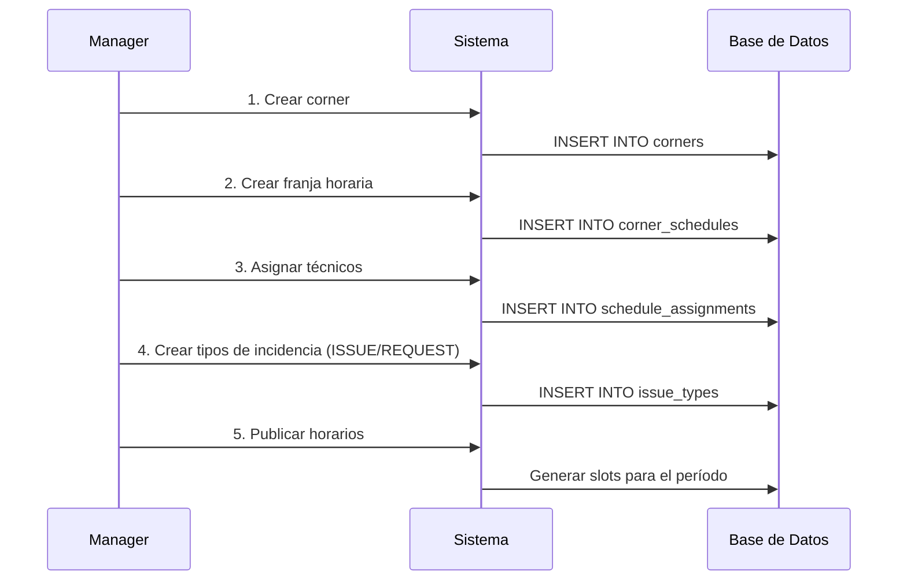
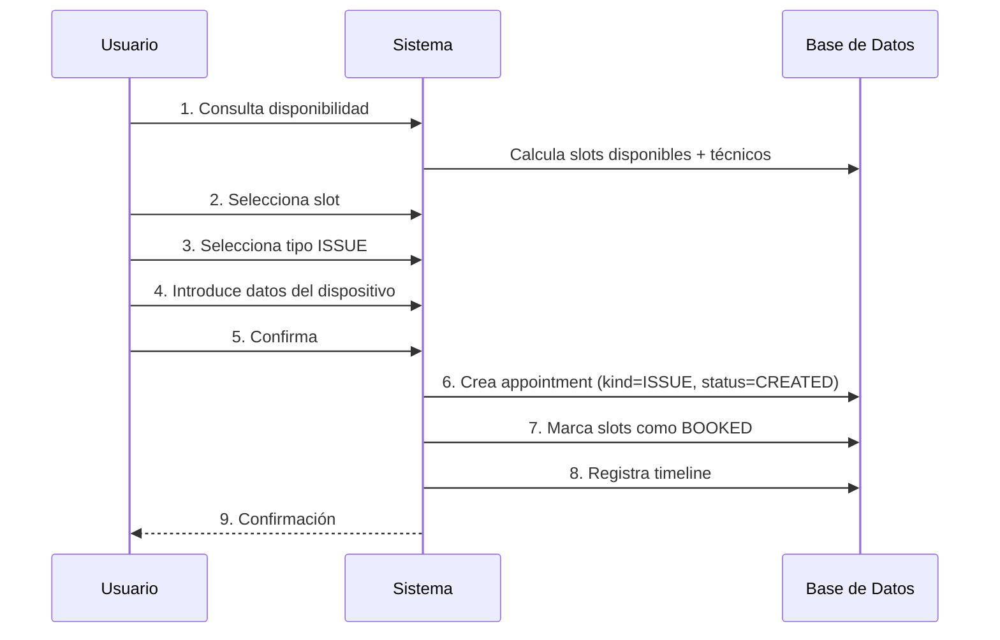
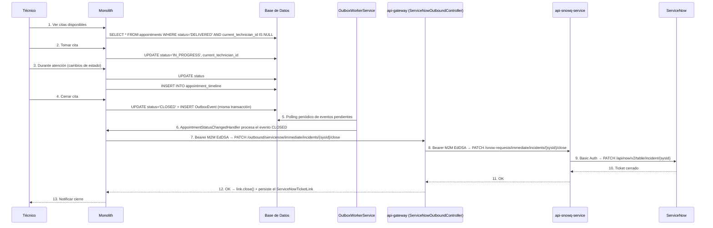
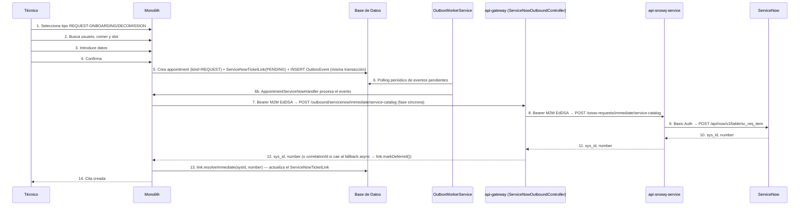

# Documentación del Sistema Event Corner

> Este archivo cubre el monolito (dominio, endpoints, integración SN). Para el **mapa completo del ecosistema** (todos los servicios, puertos, autenticación, orden de arranque) ver [`infrastructure-diagram.md`](./infrastructure-diagram.md). Para el modelo entidad-relación ver [`er-diagram.md`](./er-diagram.md).

## Tabla de Contenidos
1. [Visión General](#visión-general)
2. [Arquitectura](#arquitectura)
3. [Modelo de Dominio](#modelo-de-dominio)
4. [Casos de Uso](#casos-de-uso)
5. [API Endpoints](#api-endpoints)
6. [Ejemplos con CURL](#ejemplos-con-curl)
7. [Flujos Completos](#flujos-completos)
8. [Integración con ServiceNow](#integración-con-servicenow)
9. [Manejo de Errores](#manejo-de-errores)

---

## Visión General

Event Corner es un sistema de gestión de citas técnicas en ubicaciones físicas ("corners") donde:

- **Usuarios** (empleados corporativos) reservan citas para incidencias de hardware o trámites administrativos. Se autentican **exclusivamente con Entra ID (Azure AD)** — no hay login por contraseña.
- **Técnicos** se auto-asignan las citas disponibles y las gestionan
- **Managers** configuran franjas horarias, asignan técnicos y gestionan tipos de cita
- Todas las citas — de hardware (`ISSUE`, `CREATE-DELIVERY`, `CREATE-COLLECTION`) o administrativas (`REQUEST-ONBOARDING`, `REQUEST-DECOMISSION`) — se atienden en un corner y ocupan slots; lo único que cambia entre ambas es qué tipo de ticket ServiceNow generan (`incident` vs `sc_req_item`/`sc_task`), decidido por `Appointment.kind`

### Autenticación

| Actor | Mecanismo | Token |
|---|---|---|
| Usuarios finales | **Entra ID (Azure AD)** — token obtenido via MSAL | Bearer JWT de Microsoft → validado por ABAC via JWKS |
| Servicios internos | **M2M JWT (Ed25519/EdDSA)** — `POST /auth/m2m-token` en ABAC | ABAC firma con `ED25519_PRIVATE_KEY`/`ED25519_KID`; cada servicio verifica localmente con `ED25519_PUBLIC_KEY` (sin llamada de red) |
| Apps externas | **OAuth 2.0 Client Credentials** — `POST /auth/oauth/token` | Bearer JWT con scopes limitados |

---

## Arquitectura

El sistema sigue una **arquitectura hexagonal** (puertos y adaptadores) con las siguientes capas:

```
┌─────────────────────────────────────────────────────────────┐
│                    ADAPTADORES DE ENTRADA                   │
│  (Controladores REST, GraphQL, CLI, etc.)                   │
├─────────────────────────────────────────────────────────────┤
│                        PUERTOS DE ENTRADA                    │
│  (Interfaces de servicios: IAppointmentService, etc.)       │
├─────────────────────────────────────────────────────────────┤
│                      SERVICIOS DE APLICACIÓN                 │
│  (Casos de uso: AppointmentService, AvailabilityService...) │
├─────────────────────────────────────────────────────────────┤
│                         DOMINIO                              │
│  (Entidades, Value Objects, Enums)                          │
├─────────────────────────────────────────────────────────────┤
│                       PUERTOS DE SALIDA                      │
│  (Interfaces de repositorios: IAppointmentRepository, etc.) │
├─────────────────────────────────────────────────────────────┤
│                    ADAPTADORES DE SALIDA                     │
│  (TypeORM, Cache Local, Event Bus, ServiceNow API)          │
└─────────────────────────────────────────────────────────────┘
```

### Tecnologías Utilizadas

- **NestJS** - Framework de Node.js
- **TypeORM** - ORM para MySQL 8
- **MySQL 8** - Base de datos relacional
- **TypeScript** - Lenguaje de programación
- **Result Pattern** - Manejo funcional de errores
- **Event Sourcing** - Para trazabilidad de citas
- **Outbox Pattern** - Entrega garantizada de eventos hacia ServiceNow (`OutboxEvent` + `OutboxWorkerService`)

---

## Modelo de Dominio

> **Remodelado (2026-07):** `Incident` y `Request` se unificaron en una única entidad **`Appointment`** ("Cita"). Ya no existen tablas ni entidades separadas — cualquier `IssueType` (categoría `ISSUE`, `CREATE-DELIVERY`, `CREATE-COLLECTION`, `REQUEST-ONBOARDING`, `REQUEST-DECOMISSION`) pasa por el mismo agregado. Lo que antes era `Incident.servicenowId`/`servicenowNumber` inline ahora vive en una entidad separada, `ServiceNowTicketLink`, para soportar citas con más de un ticket asociado (ver más abajo).

### Entidades Principales

#### `Appointment` (Cita)
Agregado raíz único que reemplaza a `Incident` + `Request`. `kind` decide el mecanismo técnico de creación de ticket SN, no la clase del agregado.

| Propiedad | Tipo | Descripción |
|-----------|------|-------------|
| `id` | `AppointmentId` | Identificador único |
| `issueId` | `number \| null` | Correlativo incremental (referencia externa estable, ej. para `correlation_id` en SN) |
| `kind` | `AppointmentKind` | `ISSUE` (crea `incident`) o `REQUEST` (crea `sc_req_item`/`sc_task`) — derivado de `IssueType.category` vía `appointmentKindFromIssueCategory()` |
| `issueTypeId` | `IssueTypeId` | Tipo de cita (catálogo) |
| `customerId` | `CustomerId` | Usuario que la cita atiende/afecta |
| `companyId` | `CompanyId` | Empresa del cliente |
| `cornerId` | `CornerId` | Corner donde se atiende |
| `slotIds` | `SlotId[]` | Slots que ocupa la cita |
| `scheduledRange` | `DateRange` | Rango de fecha/hora programado |
| `estimatedCloseAt` | `Date \| null` | Fecha estimada de cierre (editable por el técnico, independiente del slot) |
| `durationMinutes` | `number` | Duración total |
| `status` | `AppointmentStatus` | Estado actual |
| `currentTechnicianId` | `TechnicianId \| null` | Técnico que atiende (null si disponible) |
| `createdByTechnicianId` | `TechnicianId \| null` | Técnico que creó la cita (walk-in / REQUEST) |
| `deviceId` | `string \| null` | Dispositivo afectado (opcional) |
| `lockerId` | `LockerId \| null` | Taquilla asignada (opcional) |
| `priority` | `number` | Prioridad de atención |
| `origin` | `AppointmentOrigin` | Canal de origen (ej. `CUSTOMER_APP`, `event-corner-app-batch`) |
| `comment` | `string \| null` | Comentario/nota libre |
| `closedAt` | `Date \| null` | Fecha de cierre real |
| `metadata` | `Record<string, any>` | Datos adicionales por kind |

Enriquecimiento de solo-lectura (poblado por el repositorio desde relaciones, no persistido en el agregado): `issueTypeInfo`, `cornerInfo`, `customerInfo` (incluye `upn`), `technicianInfo`, `deviceInfo`, y `serviceNowLinkInfo` (`sysId`/`number`/`correlationId` del ticket **primary** más reciente, resuelto desde `ServiceNowTicketLink`).

**Estados (`AppointmentStatus`):**
```
CREATED                      → Cita creada, dispositivo no entregado aún
DELIVERED                    → Dispositivo entregado al corner
IN_PROGRESS                  → Técnico trabajando en la resolución
PAUSED                       → Pausada
PENDING_THIRD_PARTY          → Esperando acción de tercero
PENDING_USER                 → Esperando acción del usuario
PENDING_SPARE_PART           → Esperando llegada de repuesto
PENDING_PICKUP               → Dispositivo reparado listo para recoger
PENDING_REPLACEMENT_DELIVERY → Sustitución lista para recoger
CLOSED                       → Cliente recogió, cita cerrada
REOPENED                     → Reabierta por técnico
VALIDATED                    → Validada por cliente (post-cierre) — terminal
CANCELED                     → Cancelada por cliente — terminal
```

`ACTIVE_STATUSES` = todo lo anterior salvo `CLOSED`/`VALIDATED`/`CANCELED`. Se usa como filtro por defecto en `/citas` (event-corner-app) para no traer el historial completo de un corner con mucho volumen — un checkbox "Todas las citas" lo desactiva. También es el conjunto de estados desde los que se puede cancelar (ver abajo).

**Transiciones válidas** (`VALID_STATUS_TRANSITIONS`, `appointment.constants.ts`):
```
CREATED                       → DELIVERED, CANCELED
DELIVERED                     → IN_PROGRESS, CLOSED, CANCELED
IN_PROGRESS                   → PENDING_THIRD_PARTY, PENDING_USER, PENDING_SPARE_PART,
                                 PENDING_PICKUP, PENDING_REPLACEMENT_DELIVERY, CLOSED, CANCELED
PENDING_THIRD_PARTY / PENDING_USER / PENDING_SPARE_PART
  / PENDING_PICKUP / PENDING_REPLACEMENT_DELIVERY → IN_PROGRESS, CLOSED, CANCELED
CLOSED     → REOPENED (via reopen()), VALIDATED (via validate()) — no cancelable
REOPENED   → DELIVERED, CLOSED, CANCELED
VALIDATED / CANCELED → terminal, sin salida
```

`CANCELED` es alcanzable desde **cualquier estado activo** (`ACTIVE_STATUSES`), no solo `CREATED`/`REOPENED` — el cliente puede cancelar aunque el técnico ya haya empezado a trabajar. `CLOSED`/`VALIDATED` siguen siendo terminales respecto a `CANCELED` (una cita ya cerrada se reabre con `reopen()`, no se cancela). Si al cancelar ya existía un `ServiceNowTicketLink` con `sysId` (ticket activo en SN), `AppointmentStatusChangedHandler` cierra el ticket real (`ServiceNowIntegrationService.closeTicket(link, 'canceled', ...)`) y marca el link `CLOSED`; si todavía no tenía `sysId` (creación diferida en curso), se marca `ABANDONED` para que `SnowOrphanRecoveryJob` no lo reencole.

#### `ServiceNowTicketLink` (Vínculo con ticket ServiceNow)
Vínculo polimórfico 1:N entre un `Appointment` y uno o más tickets de ServiceNow. Reemplaza los campos `servicenowId`/`servicenowNumber` inline que tenía `Incident`. Una cita `REQUEST` puede tener un link `sc_req_item` (la RITM, `role='primary'`) y uno o más `sc_task` de cumplimiento (`role='fulfillment'`, enlazados de vuelta vía `parentRequestSysId`).

| Propiedad | Tipo | Descripción |
|-----------|------|-------------|
| `id` | `string` | Identificador único |
| `appointmentId` | `AppointmentId` | Cita asociada |
| `type` | `'incident' \| 'sc_req_item' \| 'sc_task'` | Tabla SN del ticket |
| `role` | `'primary' \| 'fulfillment'` | Cuál es "el" ticket a pollear/cerrar |
| `sysId` | `ServiceNowId \| null` | `sys_id` del ticket en SN (null hasta resolverse) |
| `number` | `ServiceNowNumber \| null` | Número visible (ej. `INC0001234`) |
| `parentRequestSysId` | `string \| null` | Solo para `type='sc_task'`: `sys_id` de la RITM padre |
| `snowqCorrelationId` | `string \| null` | Correlation ID mientras el ticket está en modo async (api-snowq-service) |
| `status` | `'PENDING' \| 'ACTIVE' \| 'CLOSED' \| 'ABANDONED'` | Estado del vínculo |
| `closedAt` | `Date \| null` | Fecha de cierre |

Métodos de dominio: `resolveImmediate(sysId, number)` (creación síncrona), `markDeferred(correlationId)` (encolado async), `reconcileDelivered(sysId, number)` (resuelto por el reconciler), `close()`, `abandon()` (recuperación de huérfanos — deja el link como auditoría en vez de sobreescribirlo).

#### `IssueType` (Tipo de Incidencia)
Catálogo de tipos configurables desde el panel de administración.

|--------------------------|------------------|------------------------------------------|
| Propiedad                | Tipo             | Descripción                              |
|--------------------------|------------------|------------------------------------------|
| `id`                     | `IssueTypeId`    | Identificador único                      |                                        |
| `name`                   | `string`         | Nombre descriptivo                       | "Avería de portátil"                   |
| `category`               | `IssueCategory`  | Categoría                                | `ISSUE`, `REQUEST-DECOMMISSION`        |
| `deviceType`             | `string`         | Tipo de hardware                         | "Portátil", "Tableta"                  |
| `workMinutes`            | `number`         | Duración del servicio                    | 30                                     |
| `spareMinutes`           | `number`         | Minutos de margen                        | 15                                     |
| `closeMinutes`           | `number`         | Minutos para cierre                      | 5          |
| `notUserVisible`         | `boolean`        | Oculto para usuarios                     | false      |
| `position`               | `number`         | Orden en UI                              | 1          |
| `icon`                   | `string`         | Icono                                    | "laptop"   |
| `npsDisabled`            | `boolean`        | Sin encuesta                             | false      |
| `servicenowCategory`     | `string`         | Categoría en SN                          | "hardware" |
| `servicenowCloseCategory`| `string`         | Categoría de cierre                      | "resolved" |

#### `Corner` (Punto de Servicio)
Ubicación física donde se atienden citas.

| Propiedad | Tipo | Descripción |
|-----------|------|-------------|
| `id` | `CornerId` | Identificador único |
| `name` | `string` | Nombre del corner |
| `servicenowLocation` | `string` | Ubicación en ServiceNow |
| `slotDurationMinutes` | `number` | Duración de cada slot (ej: 15) |
| `onlyTechnicians` | `boolean` | Solo técnicos pueden crear |

#### `CornerSchedule` (Franja Horaria)
Franjas definidas por el manager para cada corner.

| Propiedad | Tipo | Descripción |
|-----------|------|-------------|
| `id` | `ScheduleId` | Identificador único |
| `cornerId` | `CornerId` | Corner asociado |
| `dayOfWeek` | `DayOfWeek` | Día de la semana |
| `startTime` | `string` | Hora inicio (HH:MM) |
| `endTime` | `string` | Hora fin (HH:MM) |
| `validFrom` | `Date` | Desde fecha |
| `validUntil` | `Date` | Hasta fecha |
| `technicianIds` | `TechnicianId[]` | Técnicos asignados |

#### `Slot` (Bloque de Tiempo)
Slots generados a partir de las franjas horarias.

| Propiedad | Tipo | Descripción |
|-----------|------|-------------|
| `id` | `SlotId` | Identificador único |
| `cornerId` | `CornerId` | Corner |
| `scheduleId` | `ScheduleId` | Franja origen |
| `timeRange` | `DateRange` | Rango de tiempo |
| `status` | `SlotStatus` | `AVAILABLE`, `BOOKED`, `EXPIRED` |

#### `Technician` (Técnico)
Profesional que atiende citas.

| Propiedad | Tipo | Descripción |
|-----------|------|-------------|
| `id` | `TechnicianId` | Identificador único |
| `name` | `string` | Nombre |
| `email` | `string` | Email |
| `cornerId` | `CornerId` | Corner al que pertenece |
| `disabled` | `boolean` | Deshabilitado |

#### `User` (Usuario)
Empleado que crea citas. Se autentica con Entra ID (Azure AD).

| Propiedad | Tipo | Descripción |
|-----------|------|-------------|
| `id` | `UserId` | Identificador único |
| `externalId` | `string` | ID externo (oid de Azure AD en usuarios Entra) |
| `domain` | `string` | Dominio corporativo |
| `upn` | `string \| null` | User Principal Name — identificador primario del usuario en el frontend (ej. `x249401@company.com`). **Único** (constraint agregado en `1785700000000-RenamePrincipalNameToUpnOnUsers`). Reemplaza al viejo `principalName`. |
| `email` | `string \| null` | Email de contacto — campo separado de `upn`, reservado para notificaciones futuras |
| `companyId` | `CompanyId` | Empresa |
| `cornerId` | `CornerId` | Corner habitual |

#### `Company` (Empresa)
Cliente del sistema.

| Propiedad | Tipo | Descripción |
|-----------|------|-------------|
| `id` | `CompanyId` | Identificador único |
| `name` | `string` | Nombre |
| `ldapName` | `string` | Nombre en LDAP |
| `servicenowProfileId` | `ServiceNowProfileId` | Perfil SN asociado |

#### `ServiceNowProfile` (Perfil SN)
Perfil de integración con ServiceNow.

| Propiedad | Tipo | Descripción |
|-----------|------|-------------|
| `id` | `ServiceNowProfileId` | Identificador único |
| `name` | `string` | Nombre del perfil |
| `snowCompanySysId` | `ServiceNowId` | sys_id en ServiceNow |
| `snowCompanyName` | `string` | Nombre en ServiceNow |

#### `Locker` (Taquilla)
Taquilla física para entregas.

| Propiedad | Tipo | Descripción |
|-----------|------|-------------|
| `id` | `LockerId` | Identificador |
| `lockerCode` | `string` | Código visible |
| `status` | `LockerStatus` | `AVAILABLE`, `OCCUPIED`, `OUT_OF_SERVICE` |

#### `Device` (Dispositivo)
Registro contextual de dispositivo afectado.

| Propiedad | Tipo | Descripción |
|-----------|------|-------------|
| `id` | `DeviceId` | Identificador |
| `serialNumber` | `SerialNumber` | Número de serie |
| `model` | `string` | Modelo |
| `deviceType` | `string` | Tipo |

### Value Objects

| Value Object | Propósito |
|--------------|-----------|
| `TechnicianId` | ID tipado para técnicos |
| `CornerId` | ID tipado para corners |
| `SlotId` | ID tipado para slots |
| `AppointmentId` | ID tipado para citas |
| `DateRange` | Rango de fechas con validaciones |
| `Email` | Email con validación de formato |
| `SerialNumber` | Número de serie normalizado |
| `DeviceType` | Tipo de dispositivo controlado |
| `WorkMinutes` | Minutos de trabajo con validación |
| `ServiceNowId` | `sys_id` de ServiceNow |
| `ServiceNowNumber` | Número visible de ServiceNow (ej. `INC0001234`) |
| `ServiceNowTicketType` | `'incident' \| 'sc_req_item' \| 'sc_task'` — tabla SN del ticket |

### Enums

```typescript
enum AppointmentStatus {
  CREATED = 'CREATED',
  DELIVERED = 'DELIVERED',
  IN_PROGRESS = 'IN_PROGRESS',
  PAUSED = 'PAUSED',
  PENDING_THIRD_PARTY = 'PENDING_THIRD_PARTY',
  PENDING_USER = 'PENDING_USER',
  PENDING_SPARE_PART = 'PENDING_SPARE_PART',
  PENDING_PICKUP = 'PENDING_PICKUP',
  PENDING_REPLACEMENT_DELIVERY = 'PENDING_REPLACEMENT_DELIVERY',
  CLOSED = 'CLOSED',
  REOPENED = 'REOPENED',
  VALIDATED = 'VALIDATED',
  CANCELED = 'CANCELED'
}

/** Mecanismo técnico de creación de ticket SN — no la categoría de negocio. */
enum AppointmentKind {
  ISSUE = 'ISSUE',
  REQUEST = 'REQUEST'
}

/** Categoría de negocio del IssueType. ISSUE/CREATE-DELIVERY/CREATE-COLLECTION → incident;
 *  REQUEST-ONBOARDING/REQUEST-DECOMISSION → sc_task (vía RITM sc_req_item). */
enum IssueCategory {
  ISSUE = 'ISSUE',
  CREATE_DELIVERY = 'CREATE-DELIVERY',
  CREATE_COLLECTION = 'CREATE-COLLECTION',
  REQUEST_ONBOARDING = 'REQUEST-ONBOARDING',
  REQUEST_DECOMISSION = 'REQUEST-DECOMISSION'
}

enum SlotStatus {
  AVAILABLE = 'AVAILABLE',
  BOOKED = 'BOOKED',
  EXPIRED = 'EXPIRED'
}

enum DayOfWeek {
  MONDAY = 'MON',
  TUESDAY = 'TUE',
  WEDNESDAY = 'WED',
  THURSDAY = 'THU',
  FRIDAY = 'FRI',
  SATURDAY = 'SAT',
  SUNDAY = 'SUN'
}
```

---

## Casos de Uso

### 1. Gestión de Corners

#### Crear Corner
```typescript
// Command
{
  name: "Torre Central - Piso 3",
  slotDurationMinutes: 15,
  onlyTechnicians: false,
  servicenowLocation: "MAD-TC-03"
}
```

#### Añadir Franja Horaria
```typescript
// Command
{
  cornerId: "corner_123",
  name: "Mañana Lunes",
  dayOfWeek: "MON",
  startTime: "09:00",
  endTime: "14:00",
  validFrom: "2026-03-01",
  validUntil: "2026-03-31"
}
```

#### Asignar Técnicos a Franja
```typescript
// Command
{
  scheduleId: "schedule_123",
  technicianIds: ["tech_1", "tech_2", "tech_3"]
}
```

### 2. Gestión de Tipos de Cita (Admin)

`category` determina el `AppointmentKind` (mecanismo de ticket SN) que tendrán las citas creadas con este tipo — ver `appointmentKindFromIssueCategory()`. Valores válidos: `ISSUE`, `CREATE-DELIVERY`, `CREATE-COLLECTION`, `REQUEST-ONBOARDING`, `REQUEST-DECOMISSION` (una sola M, coincide con el valor real de producción).

#### Crear Tipo ISSUE (Hardware)
```typescript
// Command
{
  profileId: "prof_santander",
  name: "Avería de portátil",
  category: "ISSUE",
  deviceType: "Portátil",
  workMinutes: 30,
  spareMinutes: 15,
  closeMinutes: 5,
  notUserVisible: false,
  position: 1,
  icon: "laptop",
  npsDisabled: false,
  servicenowCategory: "hardware",
  servicenowCloseCategory: "hardware_error"
}
```

#### Crear Tipo REQUEST-DECOMISSION (Administrativo)
```typescript
// Command
{
  profileId: "prof_santander",
  name: "Decomisión digital (portátil)",
  category: "REQUEST-DECOMISSION",
  deviceType: "Portátil",
  workMinutes: 20,
  spareMinutes: 0,
  closeMinutes: 0,
  notUserVisible: true,
  position: 2,
  icon: "delete",
  npsDisabled: false
}
```

### 3. Consulta de Disponibilidad

#### Obtener Slots Disponibles
```typescript
// Query
{
  cornerId: "corner_123",
  date: "2026-03-09",
  duration: 30
}

// Response
[
  {
    start: "2026-03-09T09:00:00Z",
    end: "2026-03-09T09:30:00Z",
    available: false,
    reason: "SLOTS_OCCUPIED"
  },
  {
    start: "2026-03-09T09:30:00Z",
    end: "2026-03-09T10:00:00Z",
    available: true,
    technicians: {
      total: 3,
      available: 2,
      availableNames: ["María López", "Pedro Gómez"],
      occupied: [
        { id: "tech_1", name: "Juan Pérez", occupiedUntil: "2026-03-09T09:30:00Z" }
      ]
    }
  }
]
```

### 4. Creación de Cita (Usuario o Técnico)

Un único comando de creación sirve tanto para incidencias de hardware (`kind=ISSUE`) como para trámites administrativos (`kind=REQUEST`, ej. onboarding/decomisión) — lo que cambia es el `issueTypeId` elegido, cuya `category` determina el `kind` automáticamente (`appointmentKindFromIssueCategory()`). `cornerId`/`slotIds` son obligatorios en ambos casos.

#### Crear Cita (hardware — ISSUE)
```typescript
// Command → POST /api/appointments
{
  issueTypeId: "averia_portatil",     // category='ISSUE' → kind=ISSUE (ticket SN: incident)
  customerId: "user_123",
  cornerId: "corner_123",
  slotIds: ["slot_0930", "slot_0945"],
  startTime: "2026-03-09T09:30:00Z",
  endTime: "2026-03-09T10:00:00Z",
  origin: "CUSTOMER_APP",
  device: {
    serialNumber: "ABC123XYZ",
    model: "ThinkPad T14",
    deviceType: "LAPTOP"
  }
}
```

#### Crear Cita (administrativa — REQUEST, creada por un técnico)
```typescript
// Command → POST /api/appointments
{
  issueTypeId: "decomision_portatil", // category='REQUEST-DECOMISSION' → kind=REQUEST (ticket SN: sc_req_item/sc_task)
  customerId: "user_789",
  cornerId: "corner_123",
  slotIds: ["slot_1100"],
  startTime: "2026-03-10T11:00:00Z",
  endTime: "2026-03-10T11:30:00Z",
  origin: "gateway",
  device: { serialNumber: "ABC123XYZ" },
  notes: "Decomisión por baja voluntaria"
}
```

### 5. Gestión de Citas (Técnico)

#### Ver Citas Disponibles
```typescript
// GET /api/appointments/available?cornerId=corner_123
// Response: Lista de citas en estado DELIVERED sin técnico asignado
```

#### Tomar Cita
```typescript
// Command → PATCH /api/appointments/:id/take
{
  technicianId: "tech_456",
  slotIds: ["slot_0930"]   // opcional
}
```

#### Liberar Cita
```typescript
// Command → PATCH /api/appointments/:id/release
{
  technicianId: "tech_456",
  reason: "Cambio de turno"
}
```

#### Cambiar Estado
```typescript
// Command → PATCH /api/appointments/:id/status
{
  newStatus: "IN_PROGRESS",
  comment: "Comenzando reparación"
}
```

#### Registrar Entrega, Validar, Reabrir
```typescript
// PATCH /api/appointments/:id/deliver   { technicianId }
// PATCH /api/appointments/:id/validate  { customerId }
// PATCH /api/appointments/:id/reopen    { customerId, reason }
```

---

## API Endpoints

### Corners

| Método | Endpoint | Descripción |
|--------|----------|-------------|
| `GET` | `/api/corners` | Lista todos los corners activos |
| `GET` | `/api/corners/:id` | Obtiene un corner por ID |
| `POST` | `/api/corners` | Crea un nuevo corner |
| `PUT` | `/api/corners/:id` | Actualiza un corner |
| `DELETE` | `/api/corners/:id` | Desactiva un corner |
| `POST` | `/api/corners/:id/schedules` | Añade franja horaria |
| `GET` | `/api/corners/:id/schedules` | Lista franjas del corner |
| `POST` | `/api/corners/:id/schedules/:scheduleId/technicians` | Asigna técnicos a franja |

### Tipos de Cita (Admin)

| Método | Endpoint | Descripción |
|--------|----------|-------------|
| `GET` | `/api/admin/issue-types` | Lista todos los tipos |
| `GET` | `/api/admin/issue-types/:id` | Obtiene tipo por ID |
| `POST` | `/api/admin/issue-types` | Crea nuevo tipo |
| `PUT` | `/api/admin/issue-types/:id` | Actualiza tipo |
| `DELETE` | `/api/admin/issue-types/:id` | Desactiva tipo |

### Disponibilidad

| Método | Endpoint | Descripción |
|--------|----------|-------------|
| `GET` | `/api/availability/:cornerId` | Obtiene disponibilidad para un corner |
| `GET` | `/api/availability/:cornerId/technicians` | Disponibilidad de técnicos |

### Citas (Appointments)

Superficie unificada — reemplaza los antiguos `/api/incidents` y `/api/requests` (borrados en el remodelado). Controller real: `@Controller('api/appointments')` (`apps/api-gateway/src/inbound/appointments/appointments.controller.ts`), proxy delgado hacia `/internal/appointments` del monolito.

| Método | Endpoint | Permiso ABAC | Descripción |
|--------|----------|--------------|-------------|
| `GET` | `/api/appointments` | `appointment:list` | Búsqueda paginada con filtros (`cornerId`, `status`, `issueTypeId`, `customerEmail`\* [matchea también `upn`], `servicenowNumber`, `deviceSerial`, `dateFrom`/`dateTo`, `availableOnly`) |
| `GET` | `/api/appointments/suggestions/device-serial?cornerId=&q=` | `appointment:list` | Autocomplete de seriales de dispositivo, acotado al corner |
| `GET` | `/api/appointments/suggestions/servicenow-number?cornerId=&q=` | `appointment:list` | Autocomplete de números de ticket SN, acotado al corner |
| `GET` | `/api/appointments/available?cornerId=` | `appointment:list` | Citas en `DELIVERED` sin técnico asignado |
| `GET` | `/api/appointments/mine` | `appointment:read` | Citas del usuario autenticado (vía JWT) |
| `GET` | `/api/appointments/technician/:technicianId` | `appointment:list` | Citas activas de un técnico |
| `GET` | `/api/appointments/:id` | `appointment:read` | Detalle de cita |
| `GET` | `/api/appointments/:id/timeline` | `appointment:read` | Historial/línea de tiempo de la cita |
| `POST` | `/api/appointments` | `appointment:create` | Crea una cita (`kind` se deriva del `IssueType` elegido) |
| `POST` | `/api/appointments/:id/notes` | `appointment:change-status` | Agrega una nota sin cambiar el estado |
| `PATCH` | `/api/appointments/:id/deliver` | `appointment:deliver` | Registra entrega del dispositivo (CREATED→DELIVERED) |
| `PATCH` | `/api/appointments/:id/take` | `appointment:take` | Técnico toma la cita |
| `PATCH` | `/api/appointments/:id/release` | `appointment:release` | Técnico libera la cita |
| `PATCH` | `/api/appointments/:id/reschedule` | `appointment:change-status` | Reprograma horario/slots |
| `PATCH` | `/api/appointments/:id/estimated-close` | `appointment:change-status` | Corrige la fecha estimada de cierre |
| `PATCH` | `/api/appointments/:id/status` | `appointment:change-status` | Cambia de estado (incluye cierre → dispara cierre de ticket SN) |
| `PATCH` | `/api/appointments/:id/cancel` | `appointment:change-status` | Cliente cancela desde cualquier estado activo (`ACTIVE_STATUSES`) → `CANCELED` |
| `PATCH` | `/api/appointments/:id/validate` | `appointment:validate` | Cliente valida la resolución (CLOSED→VALIDATED) |
| `PATCH` | `/api/appointments/:id/reopen` | `appointment:reopen` | Cliente rechaza la resolución (CLOSED→REOPENED) |

\* El nombre del parámetro `customerEmail` se mantiene por compatibilidad de API, pero la query matchea contra `email` **o** `upn` del cliente.

### Técnicos

| Método | Endpoint | Descripción |
|--------|----------|-------------|
Controller real: `@Controller('api/admin/technicians')` (`apps/api-gateway/src/inbound/admin/technicians.controller.ts`). No existe `PUT` genérico de actualización.

| Método | Endpoint | Descripción |
|--------|----------|-------------|
| `GET` | `/api/admin/technicians` | Lista técnicos (filtro opcional `cornerId`) |
| `GET` | `/api/admin/technicians/:id` | Detalle de técnico |
| `GET` | `/api/admin/technicians/users` | Lista usuarios disponibles para vincular como técnico |
| `GET` | `/api/admin/technicians/lookup-user?email=` | Busca usuario por email para vincular |
| `POST` | `/api/admin/technicians` | Crea técnico vinculado a un `User` existente |
| `PATCH` | `/api/admin/technicians/:id/corner` | Asigna/transfiere técnico a un corner |
| `PATCH` | `/api/admin/technicians/:id/disable` | Deshabilitar técnico |
| `PATCH` | `/api/admin/technicians/:id/enable` | Habilitar técnico |
| `DELETE` | `/api/admin/technicians/:id` | Eliminar técnico |

### Usuarios

| Método | Endpoint | Descripción |
|--------|----------|-------------|
| `GET` | `/api/users/:id` | Detalle de usuario |
| `PATCH` | `/api/users/:id/corner` | Actualizar corner habitual |

> Los usuarios se crean automáticamente en el primer login con Entra ID (lazy sync). **No existe sincronización LDAP ni endpoint de creación manual de usuarios** (`POST /api/users/sync` no existe en el código). La gestión de usuarios/técnicos vive en `apps/api-gateway/src/inbound/admin/technicians.controller.ts` (`GET users`, `GET lookup-user`) y `apps/api-gateway/src/inbound/admin/users.controller.ts`.

---

## Ejemplos con CURL

### 1. Crear un Corner

```bash
curl -X POST http://localhost:3000/api/corners \
  -H "Content-Type: application/json" \
  -d '{
    "name": "Torre Central - Piso 3",
    "slotDurationMinutes": 15,
    "onlyTechnicians": false,
    "servicenowLocation": "MAD-TC-03",
    "clientName": "Banco Santander",
    "description": "Soporte hardware planta 3"
  }'
```

**Respuesta:**
```json
{
  "id": "corner_123",
  "name": "Torre Central - Piso 3",
  "slotDurationMinutes": 15,
  "onlyTechnicians": false,
  "servicenowLocation": "MAD-TC-03",
  "isActive": true,
  "createdAt": "2026-03-06T10:00:00Z"
}
```

### 2. Añadir Franja Horaria

```bash
curl -X POST http://localhost:3000/api/corners/corner_123/schedules \
  -H "Content-Type: application/json" \
  -d '{
    "name": "Mañana Lunes",
    "dayOfWeek": "MON",
    "startTime": "09:00",
    "endTime": "14:00",
    "validFrom": "2026-03-01",
    "validUntil": "2026-03-31"
  }'
```

### 3. Asignar Técnicos a Franja

```bash
curl -X POST http://localhost:3000/api/corners/corner_123/schedules/schedule_456/technicians \
  -H "Content-Type: application/json" \
  -d '{
    "technicianIds": ["tech_1", "tech_2", "tech_3"]
  }'
```

### 4. Crear Tipo de Cita (ISSUE — hardware)

```bash
curl -X POST http://localhost:3000/api/admin/issue-types \
  -H "Content-Type: application/json" \
  -d '{
    "profileId": "prof_santander",
    "name": "Avería de portátil",
    "category": "ISSUE",
    "deviceType": "Portátil",
    "workMinutes": 30,
    "spareMinutes": 15,
    "closeMinutes": 5,
    "notUserVisible": false,
    "position": 1,
    "icon": "laptop",
    "npsDisabled": false,
    "servicenowCategory": "hardware",
    "servicenowCloseCategory": "hardware_error"
  }'
```

### 5. Crear Tipo de Cita (REQUEST-DECOMISSION — administrativo)

```bash
curl -X POST http://localhost:3000/api/admin/issue-types \
  -H "Content-Type: application/json" \
  -d '{
    "profileId": "prof_santander",
    "name": "Decomisión digital (portátil)",
    "category": "REQUEST-DECOMISSION",
    "deviceType": "Portátil",
    "workMinutes": 20,
    "spareMinutes": 0,
    "closeMinutes": 0,
    "notUserVisible": true,
    "position": 2,
    "icon": "delete",
    "npsDisabled": false
  }'
```

### 6. Consultar Disponibilidad

```bash
curl -X GET "http://localhost:3000/api/availability/corner_123?date=2026-03-09&duration=30"
```

**Respuesta:**
```json
[
  {
    "start": "2026-03-09T09:30:00Z",
    "end": "2026-03-09T10:00:00Z",
    "available": true,
    "technicians": {
      "total": 3,
      "available": 2,
      "availableNames": ["María López", "Pedro Gómez"],
      "occupied": [
        {
          "id": "tech_1",
          "name": "Juan Pérez",
          "occupiedUntil": "2026-03-09T09:30:00Z"
        }
      ]
    }
  }
]
```

### 7. Crear Cita (Usuario o Técnico)

```bash
curl -X POST http://localhost:3000/api/appointments \
  -H "Content-Type: application/json" \
  -d '{
    "issueTypeId": "averia_portatil",
    "customerId": "user_123",
    "cornerId": "corner_123",
    "slotIds": ["slot_0930", "slot_0945"],
    "startTime": "2026-03-09T09:30:00Z",
    "endTime": "2026-03-09T10:00:00Z",
    "origin": "CUSTOMER_APP",
    "device": {
      "serialNumber": "ABC123XYZ",
      "model": "ThinkPad T14",
      "deviceType": "LAPTOP"
    }
  }'
```

**Respuesta:**
```json
{
  "id": "appt_123",
  "kind": "ISSUE",
  "status": "CREATED",
  "scheduledRange": { "start": "2026-03-09T09:30:00Z", "end": "2026-03-09T10:00:00Z" }
}
```

### 8. Ver Citas Disponibles (Técnico)

```bash
curl -X GET http://localhost:3000/api/appointments/available?cornerId=corner_123
```

**Respuesta:**
```json
[
  {
    "id": "appt_123",
    "kind": "ISSUE",
    "status": "DELIVERED",
    "scheduledRange": { "start": "2026-03-09T09:30:00Z", "end": "2026-03-09T10:00:00Z" },
    "issueType": { "name": "Avería de portátil" },
    "device": { "serialNumber": "ABC123XYZ", "model": "ThinkPad T14" }
  }
]
```

### 9. Tomar Cita

```bash
curl -X PATCH http://localhost:3000/api/appointments/appt_123/take \
  -H "Content-Type: application/json" \
  -d '{
    "technicianId": "tech_456"
  }'
```

**Respuesta:**
```json
{
  "id": "appt_123",
  "status": "IN_PROGRESS",
  "currentTechnicianId": "tech_456"
}
```

### 10. Cambiar Estado de Cita

```bash
curl -X PATCH http://localhost:3000/api/appointments/appt_123/status \
  -H "Content-Type: application/json" \
  -d '{
    "newStatus": "PAUSED",
    "comment": "Esperando repuesto de pantalla"
  }'
```

### 11. Liberar Cita

```bash
curl -X PATCH http://localhost:3000/api/appointments/appt_123/release \
  -H "Content-Type: application/json" \
  -d '{
    "technicianId": "tech_456",
    "reason": "Cambio de turno"
  }'
```

**Respuesta:**
```json
{
  "id": "appt_123",
  "status": "CREATED",
  "currentTechnicianId": null
}
```

### 12. Crear Cita administrativa (REQUEST, creada por un Técnico)

```bash
curl -X POST http://localhost:3000/api/appointments \
  -H "Content-Type: application/json" \
  -d '{
    "issueTypeId": "decomision_portatil",
    "customerId": "user_789",
    "cornerId": "corner_123",
    "slotIds": ["slot_1100"],
    "startTime": "2026-03-10T11:00:00Z",
    "endTime": "2026-03-10T11:30:00Z",
    "origin": "gateway",
    "device": { "serialNumber": "ABC123XYZ" },
    "notes": "Decomisión por baja voluntaria"
  }'
```

### 13. Crear Técnico

```bash
curl -X POST http://localhost:3000/api/admin/technicians \
  -H "Content-Type: application/json" \
  -d '{
    "userId": "user_456",
    "name": "María",
    "lastName": "López",
    "email": "maria.lopez@empresa.com",
    "cornerId": "corner_123"
  }'
```

### 14. Sincronizar Dispositivos de un Usuario (Minerva)

```bash
curl -X POST http://localhost:3000/api/devices/sync-user/user_123
```

**Respuesta:**
```json
{ "synced": 2, "errors": 0 }
```

---

## Flujos Completos

### Flujo 1: Configuración Inicial (Manager)



### Flujo 2: Usuario Reserva Cita



### Flujo 3: Técnico Gestiona una Cita (ISSUE) — creación + cierre de ticket

El monolith **nunca llama directo a ServiceNow**. Tanto la creación como el cierre son asíncronos vía patrón Outbox: el cambio se persiste transaccionalmente junto a un `OutboxEvent`, y un worker (`OutboxWorkerService`) lo despacha a un handler que llama al gateway. La creación del ticket la maneja `AppointmentServiceNowHandler`; los cambios de estado y el cierre los maneja `AppointmentStatusChangedHandler`, operando sobre el `ServiceNowTicketLink` (`role='primary'`) de la cita — no sobre un campo inline.



### Flujo 4: Técnico Crea una Cita administrativa (REQUEST)

La creación también pasa por Outbox: el `Appointment` (kind=REQUEST) se persiste junto a un `ServiceNowTicketLink` en estado `PENDING` y su `OutboxEvent`, y el worker crea el ticket en ServiceNow en dos fases (síncrona inmediata + fallback async) a través del gateway y api-snowq-service.



---

## Integración con ServiceNow

### Mapeo de Campos

Un único mapeo aplica a cualquier `Appointment`, sea `kind=ISSUE` (crea `incident`) o `kind=REQUEST` (crea `sc_req_item`/`sc_task`) — ya no hay dos rutas de mapeo separadas.

| Campo SN | Origen |
|----------|--------|
| `company` | `resolveSnowCompanySysId()`: `company.profile.snow_company_sys_id` → fallback `SN_DEFAULT_COMPANY_SYS_ID` |
| `category` | `issueType.servicenowCategory` |
| `assignment_group` | `resolveAssignmentGroup()` — cadena de 4 niveles (ver abajo) |
| `location` | `corner.servicenowLocation` |
| `caller_id` | `user.upn` (UPN) |
| `correlation_id` | `device.serialNumber` |
| `expected_start` | `appointment.scheduledRange.start` |

### Lógica de Asignación de Grupo

`resolveAssignmentGroup()` en `apps/monolith/src/core/services/servicenow/servicenow-integration.service.ts` sigue esta cadena de fallback (sin lógica hardcodeada por ciudad):

```
1. CompanyIssueConfig(company.id, issueTypeId)              → servicenow_group específico de la empresa
2. CompanyIssueConfig(SN_DEFAULT_COMPANY_ID, issueTypeId)   → fallback a la config de la empresa default
3. Corner.snow_assignment_group                              → fallback al grupo configurado en el corner
4. 'SOPORTE_GENERAL'                                          → fallback final + warn log (indica config faltante)
```

---

## Manejo de Errores

### Patrón Result

Todos los servicios devuelven `Result<T, E>` para manejo funcional de errores:

```typescript
const result = await appointmentService.takeAppointment(command);

if (result.isSuccess) {
  const appointment = result.unwrap();
  // Procesar éxito
} else {
  const error = result.unwrapError();
  // Manejar error específico
  if (error instanceof AppointmentNotAvailableError) {
    // La cita ya no está disponible
  }
}
```

### Tipos de Error

| Error | Código HTTP | Descripción |
|-------|-------------|-------------|
| `AppointmentNotFoundError` | 404 | Cita no encontrada |
| `AppointmentNotAvailableError` | 409 | Cita no disponible para tomar |
| `InvalidAppointmentStateError` | 400 | Estado inválido para la operación |
| `AppointmentTechnicianNotAuthorizedError` | 403 | Técnico no autorizado para operar sobre la cita |
| `DeviceHasActiveAppointmentError` | 409 | El dispositivo ya tiene una cita activa |
| `SlotNotAvailableError` | 409 | Slot no disponible |
| `InsufficientSlotsError` | 400 | Slots insuficientes para la duración |
| `LockerNotAvailableError` | 409 | Taquilla no disponible |
| `TechnicianNotAvailableError` | 409 | Técnico no disponible |
| `IssueTypeTreeInUseError` | 409 | No se puede borrar un árbol de tipos con citas o configuraciones asociadas |

`unwrapOrThrow()` (`libs/shared/src/utils/result-to-http.ts`) mapea el `.code` del error a status HTTP por substring: contiene `NOT_FOUND`→404, `UNAUTHORIZED`/`NOT_AUTHORIZED`→403, `ALREADY`/`INVALID`/`UNAVAILABLE`/`NOT_AVAILABLE`/`INSUFFICIENT`→409, default→400.

### Ejemplo de Respuesta de Error

```json
{
  "statusCode": 409,
  "error": "APPOINTMENT_NOT_AVAILABLE",
  "message": "Appointment appt_123 is not available to be taken",
  "timestamp": "2026-03-06T10:00:00Z"
}
```

---

## Consideraciones de Seguridad

### Autenticación
- **Usuarios finales**: exclusivamente Entra ID (Azure AD) — sin login por contraseña ni LDAP. Token Bearer JWT de Microsoft validado por ABAC vía JWKS/RS256, con lazy sync del usuario en el primer login.
- **Servicios internos (M2M)**: JWT firmado con Ed25519/EdDSA por ABAC (`ED25519_PRIVATE_KEY`/`ED25519_KID`); cada servicio lo verifica localmente con `ED25519_PUBLIC_KEY`, sin llamada de red.
- **Apps externas**: OAuth 2.0 Client Credentials, JWT con scopes limitados (scopes = permisos ABAC `resource:action`).
- Autorización vía ABAC (`json-rules-engine`): permisos `resource:action` resueltos por rol/política, no por roles fijos hardcodeados.

### Validaciones
- Todos los inputs se validan con class-validator
- Value Objects inmutables garantizan integridad de datos
- Transacciones ACID en operaciones críticas

### Auditoría
- `appointment_timeline` registra todas las acciones de la cita
- Event sourcing para trazabilidad completa

---

## Rendimiento y Escalabilidad

### Caché
- Caché local con TTL de 30 segundos para disponibilidad
- Invalidación por eventos cuando cambian datos

### Índices de Base de Datos
```sql
CREATE INDEX idx_appointments_status_available ON appointments(status) WHERE status = 'CREATED';
CREATE INDEX idx_appointments_technician ON appointments(current_technician_id);
CREATE INDEX idx_slots_corner_date ON corner_slots(corner_id, starts_at, status);
CREATE INDEX idx_appointment_slots_lookup ON appointment_slots(slot_id, appointment_id);
CREATE INDEX idx_snow_ticket_link_appointment ON servicenow_ticket_links(appointment_id);
CREATE INDEX idx_snow_ticket_link_status ON servicenow_ticket_links(status);
```

### Jobs Programados
- Generación de slots (diario)
- Marcado de slots expirados (cada hora)
- Liberación de citas abandonadas (cada 30 minutos)
- `OutboxWorkerService` — polling de eventos pendientes cada 5s (backoff exponencial, máx. 5 reintentos)