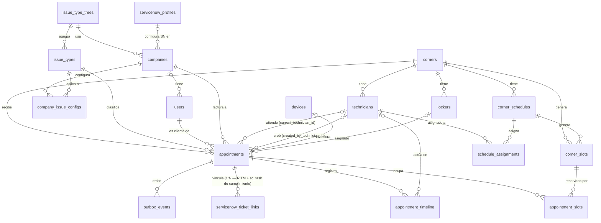
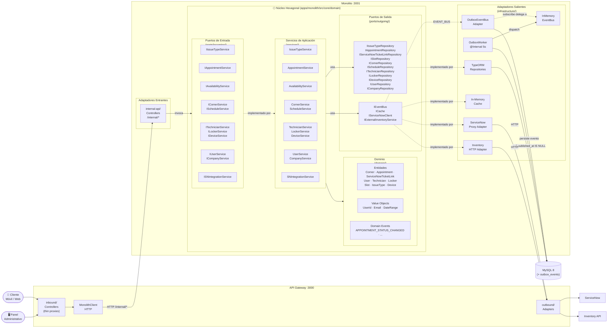
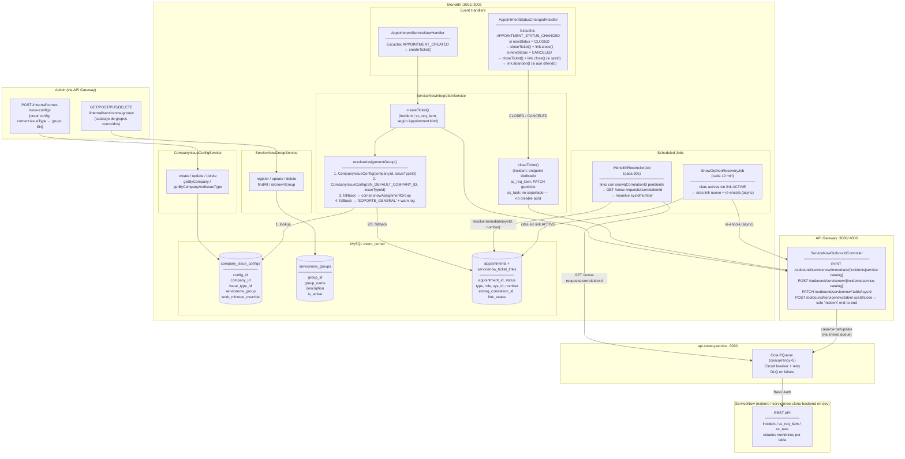
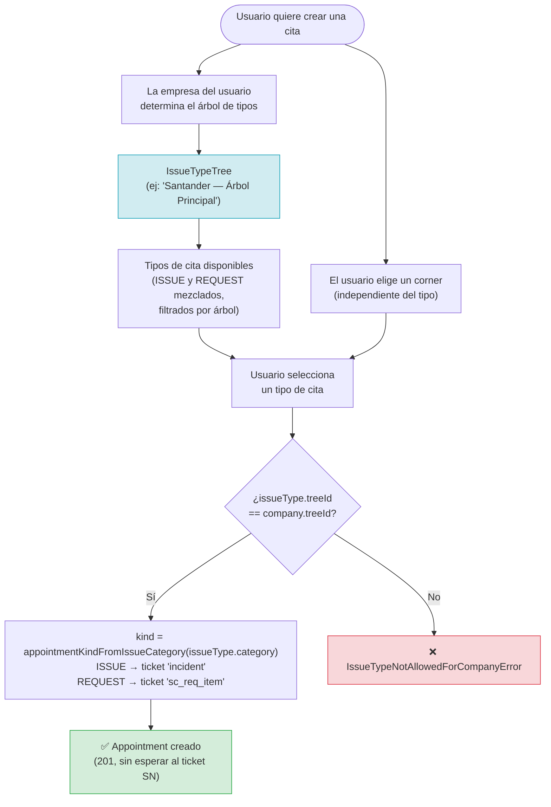

# Modelo Entidad-Relación — Event Corner v3

> Generado a partir de las entidades TypeORM del monolito y ABAC. Para el mapa de **infraestructura y servicios** (no solo el modelo de datos) ver [`infrastructure-diagram.md`](./infrastructure-diagram.md).
> Última actualización: 2026-08-18 — completado el modelo UML de dominio y el diagrama de resolución SN al `Appointment` unificado (2026-07-30: `Incident`+`Request` → `Appointment`, ver `1785500000000-BackfillAppointmentsFromIncidentsAndRequests` / `1785600000000-DropIncidentsAndRequestsLegacyTables`). Incluye la cancelación desde cualquier estado activo y el fix de cierre de tickets `sc_req_item`.



```mermaid
erDiagram

    %% ── Árbol de tipos de incidencia ──────────────────────────────────────────
    issue_type_trees {
        varchar tree_id PK "Identificador único del árbol"
        varchar name "unique — Nombre del árbol de categorías"
        timestamp created_at "Fecha de creación"
        timestamp updated_at "Fecha de última modificación"
    }

    issue_types {
        varchar issue_type_id PK "Identificador único del tipo"
        varchar tree_id FK "Árbol al que pertenece"
        varchar name "Nombre visible del tipo de cita"
        varchar category "ISSUE | CREATE-DELIVERY | CREATE-COLLECTION | REQUEST-ONBOARDING | REQUEST-DECOMISSION — decide el AppointmentKind (ISSUE→incident, REQUEST→sc_req_item/sc_task)"
        varchar device_type "nullable — tipo de dispositivo afectado"
        varchar servicenow_category "nullable — categoría en ServiceNow"
        varchar servicenow_close_category "nullable — categoría de cierre en SN"
        int     work_minutes "Tiempo estimado de trabajo (min)"
        int     spare_minutes "Tiempo de tolerancia adicional (min)"
        int     close_minutes "Tiempo para cierre automático (min)"
        boolean not_user_visible "true = solo visible para técnicos"
        int     position "Orden de aparición en la app"
        varchar icon "nullable — nombre del icono"
        boolean nps_disabled "true = no enviar encuesta NPS al cerrar"
        boolean is_active "false = tipo desactivado"
        timestamp created_at "Fecha de creación"
        timestamp updated_at "Fecha de última modificación"
    }

    %% ── Empresas ──────────────────────────────────────────────────────────────
    companies {
        varchar company_id PK "Identificador único de la empresa"
        varchar name "unique — Nombre comercial de la empresa"
        varchar tree_id FK "Árbol de tipos de incidencia asignado"
        varchar profile_id FK "nullable — perfil ServiceNow asignado"
        boolean is_active "false = empresa desactivada"
        timestamp created_at "Fecha de creación"
        timestamp updated_at "Fecha de última modificación"
    }

    %% ── Usuarios ──────────────────────────────────────────────────────────────
    users {
        varchar customer_id PK "Identificador interno del usuario"
        varchar external_id "unique — ID del usuario en el proveedor de identidad"
        varchar name "nullable — Nombre de pila"
        varchar last_name "nullable — Apellido"
        varchar full_name "nullable — Nombre completo concatenado"
        varchar email "nullable — Correo electrónico corporativo"
        varchar company_id FK "nullable — Empresa asignada manualmente por admin"
        varchar domain "nullable — Dominio corporativo del proveedor de identidad"
        varchar upn "nullable — UPN del proveedor de identidad (user@domain)"
        text    device_tokens "nullable — Tokens push para notificaciones (JSON array)"
        boolean is_active "false = usuario desactivado"
        timestamp created_at "Fecha de creación"
        timestamp updated_at "Fecha de última sincronización"
    }

    %% ── Corners ───────────────────────────────────────────────────────────────
    corners {
        varchar corner_id PK "Identificador único del corner"
        varchar name "Nombre del punto de servicio"
        varchar client_name "nullable — Nombre del cliente corporativo"
        varchar description "nullable — Descripción del corner"
        varchar servicenow_location "nullable — Ubicación registrada en ServiceNow"
        varchar snow_assignment_group "nullable — Grupo de asignación en SN"
        decimal latitude "nullable — Latitud geográfica"
        decimal longitude "nullable — Longitud geográfica"
        boolean only_technicians "true = solo técnicos pueden iniciar citas"
        boolean is_active "false = corner fuera de servicio"
        timestamp created_at "Fecha de creación"
        timestamp updated_at "Fecha de última modificación"
    }

    %% ── Técnicos ──────────────────────────────────────────────────────────────
    technicians {
        varchar technician_id PK "Identificador único del técnico"
        varchar corner_id FK "Corner al que está adscrito"
        varchar name "Nombre de pila"
        varchar last_name "nullable — Apellido"
        varchar full_name "nullable — Nombre completo"
        varchar email "Correo de contacto"
        boolean disabled "true = técnico inhabilitado"
        timestamp created_at "Fecha de creación"
        timestamp updated_at "Fecha de última modificación"
    }

    %% ── Lockers ───────────────────────────────────────────────────────────────
    lockers {
        varchar locker_id PK "Identificador único del locker"
        varchar corner_id FK "Corner donde está ubicado físicamente"
        varchar locker_code "unique — Código físico del locker"
        varchar status "AVAILABLE | OCCUPIED | OUT_OF_SERVICE"
        varchar description "nullable — Descripción o ubicación física"
        timestamp created_at "Fecha de creación"
        timestamp updated_at "Fecha de último cambio de estado"
    }

    %% ── Dispositivos ──────────────────────────────────────────────────────────
    devices {
        varchar device_id PK "Identificador único del dispositivo"
        varchar serial_number "unique — Número de serie"
        varchar model "nullable — Modelo del dispositivo"
        varchar brand "nullable — Marca del dispositivo"
        varchar device_type "nullable — Tipo: laptop, phone, tablet, etc."
        varchar assigned_user_id "nullable — soft ref al usuario asignado (sin FK)"
        varchar assigned_user_name "nullable — Nombre del usuario asignado (desnormalizado)"
        enum    status "SYNCED | STALE | NOT_FOUND | SYNC_ERROR | VIRTUAL | DISABLED — estado del equipo"
        boolean is_virtual "true = dispositivo virtual o simulado"
        timestamp last_sync_at "Última sincronización con inventario externo"
        timestamp created_at "Fecha de primera sincronización"
    }

    %% ── Horarios de corner ────────────────────────────────────────────────────
    corner_schedules {
        varchar schedule_id PK "Identificador único del horario"
        varchar corner_id FK "Corner al que aplica el horario"
        varchar name "Nombre descriptivo del horario"
        varchar day_of_week "MON|TUE|WED|THU|FRI|SAT|SUN — día de la semana"
        time    start_time "Hora de inicio de atención"
        time    end_time "Hora de fin de atención"
        date    valid_from "Fecha desde la que está vigente el horario"
        date    valid_until "Fecha hasta la que está vigente el horario"
        int     slot_duration_minutes "Duración de cada slot generado (min)"
        boolean is_active "false = horario desactivado"
        timestamp created_at "Fecha de creación"
        timestamp updated_at "Fecha de última modificación"
    }

    schedule_assignments {
        uuid    assignment_id PK "Identificador de la asignación"
        varchar schedule_id FK "Horario asignado al técnico"
        varchar technician_id FK "Técnico que cubre el horario"
        timestamp created_at "Fecha de asignación"
    }

    %% ── Slots ─────────────────────────────────────────────────────────────────
    corner_slots {
        varchar slot_id PK "Identificador único del slot"
        varchar corner_id FK "Corner al que pertenece (optimiza queries directos)"
        varchar schedule_id FK "Horario que generó este slot"
        timestamp starts_at "Inicio del intervalo de tiempo"
        timestamp ends_at "Fin del intervalo de tiempo"
        varchar status "AVAILABLE | HELD | BOOKED | EXPIRED"
        varchar held_by_user_id "nullable — ABAC user ID que retiene el slot (batch drafts)"
        timestamp held_until "nullable — cuándo expira el hold (TTL = 15 min)"
        timestamp created_at "Fecha de generación del slot"
        timestamp updated_at "Fecha de último cambio de estado"
    }

    %% ── Citas (unifica Incident + Request post-remodelado 2026-07) ────────────
    appointments {
        varchar appointment_id PK "Identificador único de la cita"
        int     issue_id "Correlativo incremental (issue_sequences) — referencia externa estable"
        varchar kind "ISSUE | REQUEST — mecanismo técnico de creación de ticket SN, no la categoría de negocio"
        varchar issue_type_id FK "Tipo de cita seleccionado"
        varchar customer_id FK "Usuario que la cita atiende/afecta"
        varchar company_id FK "Empresa del cliente"
        varchar corner_id FK "Corner donde se atiende"
        varchar device_id FK "nullable — Dispositivo involucrado"
        varchar locker_id FK "nullable — Locker asignado durante la atención"
        varchar current_technician_id FK "nullable — Técnico actualmente asignado"
        varchar created_by_technician_id FK "nullable — Técnico que creó la cita (walk-in / REQUEST)"
        varchar status "CREATED|DELIVERED|IN_PROGRESS|PAUSED|PENDING_THIRD_PARTY|PENDING_USER|PENDING_SPARE_PART|PENDING_PICKUP|PENDING_REPLACEMENT_DELIVERY|CLOSED|REOPENED|VALIDATED|CANCELED"
        int     priority "Prioridad del ticket (1 = alta)"
        varchar origin_channel "Canal de origen: CUSTOMER_APP | event-corner-app-batch | gateway | ..."
        timestamp scheduled_start "Inicio planificado de la cita"
        timestamp scheduled_end "Fin planificado de la cita"
        int     duration_minutes "Duración calculada a partir de los slots ocupados"
        timestamp estimated_close_at "nullable — fecha estimada de cierre, editable por el técnico"
        json    metadata "nullable — datos extra del canal de origen"
        text    comment "nullable — último comentario registrado por el técnico"
        timestamp closed_at "nullable — fecha y hora de cierre efectivo"
        timestamp created_at "Fecha de creación"
        timestamp updated_at "Fecha de última modificación"
    }

    appointment_slots {
        uuid    relation_id PK "Identificador de la relación"
        varchar appointment_id FK "Cita que ocupa el slot"
        varchar slot_id FK "Slot reservado por la cita"
        timestamp created_at "Fecha en que se reservó el slot"
    }

    appointment_timeline {
        uuid    activity_id PK "Identificador de la entrada del historial"
        varchar appointment_id FK "Cita a la que pertenece"
        varchar technician_id FK "nullable — Técnico que ejecutó la acción"
        varchar action_type "Tipo de acción: TAKEN | RELEASED | STATUS_CHANGED | ..."
        varchar from_status "nullable — Estado anterior a la acción"
        varchar to_status "nullable — Estado resultante de la acción"
        timestamp worked_from "nullable — Inicio del período de trabajo registrado"
        timestamp worked_until "nullable — Fin del período de trabajo registrado"
        varchar comment "nullable — Comentario asociado a la acción"
        timestamp created_at "Fecha y hora de la acción"
    }

    %% ── Vínculo con ServiceNow (reemplaza servicenow_id/servicenow_number inline) ──
    servicenow_ticket_links {
        varchar id PK "Identificador único del vínculo"
        varchar appointment_id FK "Cita asociada"
        varchar type "incident | sc_req_item | sc_task — tabla SN del ticket"
        varchar role "primary | fulfillment — cuál es *el* ticket a pollear/cerrar"
        varchar sys_id "nullable — sys_id del ticket en ServiceNow"
        varchar number "nullable — número legible del ticket (INC0012345, REQ0012345)"
        varchar parent_request_sys_id "nullable — solo para type=sc_task: sys_id de la RITM padre"
        varchar snowq_correlation_id "nullable — correlationId de api-snowq-service mientras el ticket está en modo async; se limpia al reconciliar"
        varchar status "PENDING | ACTIVE | CLOSED | ABANDONED"
        timestamp closed_at "nullable — fecha y hora de cierre"
        timestamp created_at "Fecha de creación"
        timestamp updated_at "Fecha de última modificación"
    }

    %% ── Batch Drafts (lote de incidencias) ──────────────────────────────────
    incident_batch_drafts {
        varchar id PK "UUID del draft"
        varchar user_id "ABAC user ID del técnico"
        timestamp created_at "Fecha de creación"
        timestamp updated_at "Fecha de última modificación"
    }

    incident_batch_draft_items {
        varchar id PK "UUID del item"
        varchar draft_id FK "Draft al que pertenece (ON DELETE CASCADE)"
        varchar local_id "UUID generado por el cliente (idempotencia)"
        varchar corner_id "Corner seleccionado"
        varchar corner_name "Nombre del corner (desnormalizado)"
        varchar customer_id "ID del usuario cliente"
        varchar customer_name "Nombre del cliente (desnormalizado)"
        varchar customer_email "Email del cliente (desnormalizado)"
        varchar device_serial "Serial del dispositivo"
        varchar issue_type_id "ID del tipo de incidencia"
        varchar issue_type_name "Nombre del tipo (desnormalizado)"
        json slot_ids "Array de slot IDs retenidos"
        timestamp start_time "Inicio del horario"
        timestamp end_time "Fin del horario"
        text description "nullable — descripción del problema"
        text notes "nullable — notas adicionales"
        varchar status "pending | error"
        text last_error "nullable — último mensaje de error"
        timestamp created_at "Fecha de creación"
    }

    incident_batch_drafts ||--o{ incident_batch_draft_items : "contiene"

    %% ── Outbox de eventos de dominio ─────────────────────────────────────────
    outbox_events {
        varchar event_id PK "UUID del evento (idempotency key)"
        varchar event_type "Tipo del evento: APPOINTMENT_CREATED, etc."
        varchar aggregate_id "ID del agregado que originó el evento"
        json    payload "Evento completo serializado (DomainEvent)"
        timestamp published_at "nullable — null = pendiente; fecha = ya despachado"
        timestamp created_at "Fecha de inserción (orden de procesamiento)"
        int     retry_count "Número de intentos de procesamiento realizados (default 0)"
        int     max_retries "Máximo de reintentos antes de mover a fallidos (default 5)"
        text    last_error "nullable — último mensaje de error capturado"
        timestamp retry_after "nullable — fecha mínima para el próximo reintento (backoff exponencial)"
        timestamp failed_at "nullable — fecha en que el evento fue marcado como fallido definitivamente"
    }

    %% ── Perfiles ServiceNow ───────────────────────────────────────────────────
    servicenow_profiles {
        varchar profile_id PK "Identificador único del perfil"
        varchar name "unique — Nombre identificador del perfil"
        varchar snow_company_sys_id "sys_id de la empresa en ServiceNow"
        varchar snow_company_name "Nombre de la empresa tal como aparece en SN"
        boolean is_active "false = perfil desactivado"
        timestamp created_at "Fecha de creación"
        timestamp updated_at "Fecha de última modificación"
    }

    %% ── Configuración de grupo SN por empresa/tipo ────────────────────────────
    company_issue_configs {
        varchar config_id PK "Identificador único de la configuración"
        varchar company_id FK "Empresa a la que aplica esta configuración"
        varchar issue_type_id FK "Tipo de incidencia al que aplica esta configuración"
        varchar servicenow_group "Grupo de asignación en SN para esta empresa+tipo (unique junto a company_id, issue_type_id)"
        int     work_minutes_override "nullable — sobreescribe issue_type.work_minutes para esta empresa"
        timestamp created_at "Fecha de creación"
    }

    %% ── Catálogo de grupos ServiceNow ─────────────────────────────────────────
    servicenow_groups {
        varchar group_id PK "Identificador único del grupo (sys_id en ServiceNow)"
        varchar group_name "unique — Nombre del grupo de asignación"
        varchar description "nullable — Descripción del grupo"
        boolean is_active "false = grupo desactivado"
        timestamp created_at "Fecha de creación"
        timestamp updated_at "Fecha de última modificación"
    }

    %% ── Relaciones ────────────────────────────────────────────────────────────

    issue_type_trees ||--o{ issue_types : "agrupa"
    issue_type_trees ||--o{ companies : "usa"

    servicenow_profiles |o--o{ companies : "configura SN en"

    companies |o--o{ users : "tiene"
    companies ||--o{ company_issue_configs : "configura"
    issue_types ||--o{ company_issue_configs : "aplica a"

    corners ||--o{ technicians : "tiene"
    corners ||--o{ lockers : "tiene"
    corners ||--o{ corner_schedules : "tiene"
    corners ||--o{ corner_slots : "genera"
    corners ||--o{ appointments : "recibe"

    technicians ||--o{ schedule_assignments : "asignado a"
    corner_schedules ||--o{ schedule_assignments : "asigna"

    corner_schedules ||--o{ corner_slots : "genera"

    issue_types ||--o{ appointments : "clasifica"
    users ||--o{ appointments : "es cliente de"
    companies ||--o{ appointments : "factura a"
    technicians |o--o{ appointments : "atiende / creó"
    devices |o--o{ appointments : "involucra"
    lockers |o--o{ appointments : "asignado"

    appointments ||--o{ appointment_slots : "ocupa"
    corner_slots ||--o{ appointment_slots : "reservado por"

    appointments ||--o{ appointment_timeline : "registra"
    technicians |o--o{ appointment_timeline : "actúa en"

    appointments ||--o{ servicenow_ticket_links : "vincula"

    appointments ||--o{ outbox_events : "emite"

    incident_batch_drafts ||--o{ incident_batch_draft_items : "contiene"
```

---

## Notas de diseño

> **Nota:** `incident_batch_drafts`/`incident_batch_draft_items` conservan el nombre `incident_*` por compatibilidad histórica de tabla, pero desde el remodelado retienen slots para citas de cualquier `kind` (ISSUE o REQUEST), no solo incidencias.

### Grupos de tablas

| Grupo | Tablas | Descripción |
|---|---|---|
| **Catálogo** | `issue_type_trees`, `issue_types` | Árbol de tipos de cita compartido entre empresas |
| **Organización** | `companies`, `users` | Empresas y sus empleados |
| **Infraestructura** | `corners`, `technicians`, `lockers`, `devices` | Física del corner |
| **Disponibilidad** | `corner_schedules`, `schedule_assignments`, `corner_slots` | Horarios y slots generados |
| **Citas** | `appointments`, `appointment_slots`, `appointment_timeline`, `servicenow_ticket_links` | Ciclo de vida unificado de citas (reemplaza `incidents`/`requests` — ver `1785600000000-DropIncidentsAndRequestsLegacyTables`) |
| **Catálogo SN** | `servicenow_profiles`, `servicenow_groups`, `company_issue_configs` | Catálogo de configuraciones ServiceNow. Una empresa referencia su perfil vía `profile_id FK`. `company_issue_configs` resuelve el grupo de asignación SN por empresa+tipo de cita (primer eslabón de `resolveAssignmentGroup()`); `servicenow_groups` es el catálogo local de grupos SN conocidos (sin FK entrante — solo referencia informativa). |
| **Outbox** | `outbox_events` | Persistencia transaccional de eventos de dominio. El worker los despacha al bus in-memory cada 5 s. |
| **Batch Drafts** | `incident_batch_drafts`, `incident_batch_draft_items` | Lote de citas pendiente de confirmación. Los slots se retienen (HELD) 15 min mientras el técnico arma el lote. |

### Descripción de tablas

#### Catálogo de tipos

| Tabla | Descripción |
|---|---|
| `issue_type_trees` | Árbol de clasificación de tipos de cita. Cada empresa apunta a un árbol (`company.tree_id`). Permite tener catálogos distintos por cliente sin duplicar filas. |
| `issue_types` | Tipo concreto de cita dentro de un árbol. Define tiempos operativos (`work_minutes`, `spare_minutes`, `close_minutes`), la categoría SN para crear el ticket, si es visible para el usuario final y su posición en el menú. `category` decide el `AppointmentKind` de las citas creadas con este tipo. |

#### Organización

| Tabla | Descripción |
|---|---|
| `servicenow_profiles` | Catálogo de configuraciones de empresa en ServiceNow. Almacena el `snow_company_sys_id` (sys_id del tenant SN) y el nombre tal como aparece en SN. Varias empresas del mismo cliente corporativo pueden compartir un perfil. |
| `company_issue_configs` | Configuración de grupo de asignación SN por empresa + tipo de cita (`Unique(company_id, issue_type_id)`). Es el **primer eslabón** de `resolveAssignmentGroup()`: si existe fila, su `servicenow_group` gana sobre el fallback de `SN_DEFAULT_COMPANY_ID` y sobre `corners.snow_assignment_group`. También permite `work_minutes_override` por empresa. |
| `servicenow_groups` | Catálogo local de grupos de asignación SN conocidos (`group_id` = sys_id en SN). Tabla de referencia sin FK entrante — no impone integridad referencial sobre `company_issue_configs.servicenow_group` ni `corners.snow_assignment_group`, solo documenta qué grupos existen. |
| `companies` | Empresa registrada en el sistema, identificada de forma única por su `name`. Vincula al árbol de tipos que le corresponde y, opcionalmente, al perfil SN. Sin perfil asignado, los tickets SN usan la empresa DEFAULT del `.env`. La asignación de usuarios a una empresa la realiza un administrador de forma manual. |
| `users` | Empleado del sistema. Se crea o actualiza automáticamente al hacer login (sync con el proveedor de identidad). `upn` (User Principal Name, único) es el identificador primario en el frontend; `email` queda como campo separado para notificaciones futuras. No está ligado a un corner fijo: puede ser atendido en cualquier punto. |

#### Infraestructura física

| Tabla | Descripción |
|---|---|
| `corners` | Punto de servicio físico donde se atienden citas. Tiene coordenadas geográficas, grupo de asignación en SN (`snow_assignment_group`) y el flag `only_technicians` para corners que solo aceptan atención iniciada por técnicos. |
| `technicians` | Personal técnico adscrito a un corner. Puede estar asignado a horarios de atención (`schedule_assignments`) y es el responsable de tomar y resolver citas. |
| `lockers` | Casillero físico de un corner. Tres estados: `AVAILABLE` (libre), `OCCUPIED` (asignado a una cita activa), `OUT_OF_SERVICE` (avería o mantenimiento). |
| `devices` | Dispositivo de hardware (PC, laptop, tablet, etc.) sincronizado desde el inventario externo. La asignación a un usuario es una referencia blanda (sin FK) para no acoplar su ciclo de vida al del usuario. |

#### Disponibilidad

| Tabla | Descripción |
|---|---|
| `corner_schedules` | Plantilla semanal de atención de un corner. Define el día de la semana, horario de inicio/fin, duración de cada slot y el rango de fechas en que aplica (`valid_from` / `valid_until`). |
| `schedule_assignments` | Tabla pivot que asigna qué técnicos cubren un horario específico. Permite rotar técnicos por franja sin tocar la plantilla del horario. |
| `corner_slots` | Slot de tiempo concreto materializado a partir de un `corner_schedule`. Estados: `AVAILABLE` (libre), `HELD` (retenido temporalmente por un técnico mientras arma un batch draft, TTL 15 min), `BOOKED` (reservado permanentemente por una cita), `EXPIRED` (venció sin uso). |

#### Citas (unifica Incident + Request)

| Tabla | Descripción |
|---|---|
| `appointments` | Agregado raíz único de cita — reemplaza `incidents` + `requests`. `kind` (`ISSUE`/`REQUEST`) decide el mecanismo técnico de creación de ticket SN, derivado de `issueType.category`. Registra el técnico actual y el que la creó, el dispositivo y locker involucrados (opcionales), y los tiempos planificados. Máquina de estados completa (13 valores + transiciones válidas) en `apps/monolith/src/core/domain/enums/appointment-status.enum.ts` — fuente de verdad, no repetir aquí para evitar desincronización. |
| `appointment_slots` | Tabla pivot que relaciona una cita con los slots que ocupa. Una cita puede requerir múltiples slots contiguos si la atención supera la duración de un slot. |
| `appointment_timeline` | Historial inmutable de cambios de estado de una cita. Cada fila registra quién actuó, qué cambio de estado ocurrió, los tiempos reales de trabajo y un comentario opcional. Es la fuente de verdad para auditoría y métricas. |
| `servicenow_ticket_links` | Vínculo polimórfico 1:N entre una cita y sus tickets SN — reemplaza los campos `servicenow_id`/`servicenow_number` inline que tenían `incidents`/`requests`. Soporta una RITM (`sc_req_item`, `role=primary`) con uno o más `sc_task` de cumplimiento (`role=fulfillment`) para citas `REQUEST`. |

---

### Decisiones clave

- **`users` no tiene `corner_id`** — un usuario puede ser atendido en cualquier corner, la FK era restrictiva e incorrecta respecto al legacy.
- **`company.tree_id`** vincula la empresa al árbol de tipos. Al crear una cita se valida que `issueType.treeId === company.treeId`.
- **`corners.snow_assignment_group`** — reemplaza el `servicenow_group` del legacy (JSON global hardcodeado) con un campo DB por corner.
- **`company.profile_id FK → servicenow_profiles`** — el perfil centraliza el `snow_company_sys_id` y el nombre SN. `null` = usar `SN_DEFAULT_COMPANY_SYS_ID` del `.env`. Varias empresas pueden compartir el mismo perfil SN.
- **`devices.assigned_user_id`** — referencia soft (no FK) para evitar acoplamiento con el ciclo de vida del usuario.
- **`appointment_slots`** — tabla pivot que relaciona qué slots ocupa una cita (una cita puede ocupar múltiples slots contiguos).
- **`servicenow_ticket_links` es 1:N respecto a `appointment`** (no 1:1 como el viejo campo inline) — necesario porque una cita `REQUEST` puede generar una RITM + una o más `sc_task` de cumplimiento.
- **`users.upn`** — reemplaza a `principal_name` (migración `1785700000000-RenamePrincipalNameToUpnOnUsers`), con constraint `UNIQUE`. `email` queda como campo de contacto separado, reservado para notificaciones futuras.

---

## Arquitectura Hexagonal — Implementación

> Arquitectura de puertos y adaptadores aplicada al monorepo Event Corner v3.



### Convenciones del diagrama

| Símbolo | Significado |
|---|---|
| `──►` flecha sólida | Llamada directa (invocación en tiempo de ejecución) |
| `- -►` flecha punteada | Implementa / satisface un puerto (Dependency Inversion) |
| `subgraph` azul `⬡` | Núcleo hexagonal — sin dependencias hacia afuera |
| `subgraph` Adaptadores | Código que sí puede depender de frameworks/infra |

### Reglas de dependencia

1. **El núcleo no importa nada de `infrastructure/` ni de `internal-api/`.**
   Solo depende de `@app/shared` (tipos utilitarios sin frameworks).
2. **Los puertos de salida son interfaces** (`IXxxRepository`, `IEventBus`, …).
   La DI se resuelve en `CoreServicesModule` mediante `useFactory`.
3. **Los adaptadores salientes egresan siempre por el API Gateway.**
   El monolito nunca llama directamente a ServiceNow o Inventory — usa los proxies `outbound/` del gateway.
4. **Los controladores `internal-api/` son finos** — solo deserializan la request, invocan el servicio y serializan la respuesta con `unwrapOrThrow()`.

### Mapa de tokens DI (`service-tokens.ts` / `tokens.ts`)

| Token | Tipo | Implementación |
|---|---|---|
| `ISSUE_TYPE_SERVICE` | `IIssueTypeService` | `IssueTypeService` |
| `APPOINTMENT_SERVICE` | `IAppointmentService` | `AppointmentService` |
| `AVAILABILITY_SERVICE` | `IAvailabilityService` | `AvailabilityService` |
| `CORNER_SERVICE` | `ICornerService` | `CornerService` |
| `SCHEDULE_SERVICE` | `IScheduleService` | `ScheduleService` |
| `TECHNICIAN_SERVICE` | `ITechnicianService` | `TechnicianService` |
| `LOCKER_SERVICE` | `ILockerService` | `LockerService` |
| `DEVICE_SERVICE` | `IDeviceService` | `DeviceService` |
| `USER_SERVICE` | `IUserService` | `UserService` |
| `COMPANY_SERVICE` | `ICompanyService` | `CompanyService` |
| `SERVICENOW_INTEGRATION_SERVICE` | `IServiceNowIntegrationService` | `ServiceNowIntegrationService` |
| `APPOINTMENT_REPOSITORY` | `IAppointmentRepository` | `TypeOrmAppointmentRepository` |
| `SERVICENOW_TICKET_LINK_REPOSITORY` | `IServiceNowTicketLinkRepository` | `TypeOrmServiceNowTicketLinkRepository` |
| `CORNER_REPOSITORY` | `ICornerRepository` | `TypeOrmCornerRepository` |
| `SLOT_REPOSITORY` | `ISlotRepository` | `TypeOrmSlotRepository` |
| `USER_REPOSITORY` | `IUserRepository` | `TypeOrmUserRepository` |
| `EVENT_BUS` | `IEventBus` | `InProcessEventBus` |
| `CACHE` | `ICache` | `InMemoryCache` |
| `SERVICENOW_CLIENT` | `IServiceNowClient` | `ServiceNowProxyAdapter` |
| `EXTERNAL_INVENTORY_SERVICE` | `IExternalInventoryService` | `InventoryHttpAdapter` |

---

> ⚠️ **Pendiente de actualizar:** de acá en adelante (`Modelo UML del Dominio`, `Diagrama de flujo de implementación`, `Checklist por entidad nueva`) el documento todavía describe las clases `Incident`/`Request` separadas, `IncidentServiceNowHandler`/`IncidentStatusChangedHandler`, y menciona `SnowSyncJob` — que **ya no existe** (se decidió que el monolito cierra los tickets SN directamente en vez de pollear estado, ver comentario en `appointment-status-changed.handler.ts`). Los diagramas ER, de relaciones y el mapa de tokens DI de más arriba en este archivo, y todo `documentation.md`, ya están actualizados al modelo `Appointment` unificado. Reemplazar `Incident`/`Request` por `Appointment` + `ServiceNowTicketLink` en las clases UML de abajo (`AppointmentServiceNowHandler`, `AppointmentStatusChangedHandler`) es el trabajo que falta — pendiente por el volumen de diagramas mermaid involucrados.

## Modelo UML del Dominio

> Diagrama de clases centrado en agregados, entidades y value objects del núcleo.
> Las flechas representan asociaciones de dominio, no FKs de base de datos.

```mermaid
classDiagram
    direction TB

    %% ══════════════════════════════════════════════════════
    %% VALUE OBJECTS
    %% ══════════════════════════════════════════════════════
    class Email {
        <<value object>>
        +string value
        +create(raw) Result~Email~
        +toString() string
    }
    class DateRange {
        <<value object>>
        +Date start
        +Date end
        +durationMinutes() int
        +create(s,e) Result~DateRange~
        +reconstitute(s,e) DateRange
    }
    class ServiceNowId {
        <<value object>>
        +string value
        +create(raw) Result~ServiceNowId~
    }
    class ServiceNowNumber {
        <<value object>>
        +string value
    }

    %% ══════════════════════════════════════════════════════
    %% CATÁLOGO DE TIPOS
    %% ══════════════════════════════════════════════════════
    class IssueTypeTree {
        <<aggregate root>>
        +IssueTypeTreeId id
        +string name
        +create() Result~IssueTypeTree~
        +reconstitute() IssueTypeTree
    }
    class IssueType {
        <<entity>>
        +IssueTypeId id
        +IssueTypeTreeId treeId
        +string name
        +IssueCategory category
        +string? deviceType
        +ServiceNowCategory? servicenowCategory
        +int workMinutes
        +int spareMinutes
        +int closeMinutes
        +bool notUserVisible
        +bool npsDisabled
        +bool isActive
        +update() void
    }

    %% ══════════════════════════════════════════════════════
    %% ORGANIZACIÓN
    %% ══════════════════════════════════════════════════════
    class ServiceNowProfile {
        <<aggregate root>>
        +ServiceNowProfileId id
        +string name
        +ServiceNowId snowCompanySysId
        +string snowCompanyName
        +bool isActive
        +update() void
        +activate() void
        +deactivate() void
    }
    class Company {
        <<aggregate root>>
        +CompanyId id
        +string name
        +IssueTypeTreeId treeId
        +ServiceNowProfileId? profileId
        +bool isActive
        +hasServiceNowProfile() bool
        +assignServiceNowProfile(id) void
        +assignTree(treeId) void
        +update(name) void
    }
    class User {
        <<aggregate root>>
        +UserId id
        +string externalId
        +string? name
        +string? lastName
        +string? fullName
        +Email? email
        +CompanyId? companyId
        +string? domain
        +string? upn
        +string[] deviceTokens
        +bool isActive
        +syncFromProvider(data) void
        +addDeviceToken(t) void
        +removeDeviceToken(t) void
        +clearDeviceTokens() void
        +updateCompany(id) void
        +activate() void
        +deactivate() void
    }

    %% ══════════════════════════════════════════════════════
    %% INFRAESTRUCTURA FÍSICA
    %% ══════════════════════════════════════════════════════
    class Corner {
        <<aggregate root>>
        +CornerId id
        +string name
        +string? clientName
        +string? servicenowLocation
        +string? snowAssignmentGroup
        +bool onlyTechnicians
        +bool isActive
        +updateInfo() void
    }
    class Technician {
        <<entity>>
        +TechnicianId id
        +CornerId cornerId
        +string name
        +string? lastName
        +string email
        +bool disabled
        +update() void
    }
    class Locker {
        <<entity>>
        +LockerId id
        +CornerId cornerId
        +string lockerCode
        +LockerStatus status
        +string? description
        +occupy() void
        +release() void
        +putOutOfService() void
    }
    class Device {
        <<aggregate root>>
        +DeviceId id
        +string serialNumber
        +string? model
        +string? brand
        +string? deviceType
        +string? assignedUserId
        +DeviceStatus status
        +bool isVirtual
        +retire() void
        +markStale() void
    }

    %% ══════════════════════════════════════════════════════
    %% DISPONIBILIDAD
    %% ══════════════════════════════════════════════════════
    class CornerSchedule {
        <<aggregate root>>
        +ScheduleId id
        +CornerId cornerId
        +string name
        +DayOfWeek dayOfWeek
        +string startTime
        +string endTime
        +Date validFrom
        +Date? validUntil
        +int slotDurationMinutes
        +bool isActive
        +generateSlots(from, to) CornerSlot[]
    }
    class CornerSlot {
        <<entity>>
        +SlotId id
        +CornerId cornerId
        +ScheduleId scheduleId
        +DateRange scheduledRange
        +SlotStatus status
        +book() void
        +expire() void
    }

    %% ══════════════════════════════════════════════════════
    %% OPERACIONES (unifica Incident + Request — remodelado 2026-07)
    %% ══════════════════════════════════════════════════════
    class Appointment {
        <<aggregate root>>
        +AppointmentId id
        +int? issueId
        +IssueTypeId issueTypeId
        +AppointmentKind kind
        +CustomerId customerId
        +CompanyId companyId
        +CornerId cornerId
        +SlotId[] slotIds
        +DateRange scheduledRange
        +int durationMinutes
        +AppointmentStatus status
        +AppointmentOrigin origin
        +int priority
        +TechnicianId? currentTechnicianId
        +TechnicianId? createdByTechnicianId
        +string? deviceId
        +LockerId? lockerId
        +Date? estimatedCloseAt
        +Date? closedAt
        +string? comment
        +isAvailableForTaking() bool
        +deliver(techId, comment?) Result~void~
        +take(techId) Result~void~
        +release(techId, reason?) Result~void~
        +changeStatus(newStatus, techId, comment?, closeCategory?) Result~void~
        +validate() Result~void~
        +reopen(reason?) Result~void~
        +reschedule(techId, slotIds, range) Result~void~
        +setEstimatedClose(techId, date) Result~void~
        +assignLocker(id) Result~void~
        +releaseLocker() Result~void~
        +addComment(techId, comment) Result~void~
        +create() Result~Appointment~
        +reconstitute() Appointment
    }
    class ServiceNowTicketLink {
        <<entity>>
        +string id
        +AppointmentId appointmentId
        +ServiceNowTicketType type
        +ServiceNowTicketLinkRole role
        +ServiceNowId? sysId
        +ServiceNowNumber? number
        +string? parentRequestSysId
        +string? snowqCorrelationId
        +ServiceNowTicketLinkStatus status
        +Date? closedAt
        +resolveImmediate(sysId, num) void
        +markDeferred(correlationId) void
        +reconcileDelivered(sysId, num) void
        +close(closedAt?) void
        +abandon() void
        +createPending(id, apptId, type, role, parentSysId?) Result~ServiceNowTicketLink~
        +reconstitute() ServiceNowTicketLink
    }

    %% ══════════════════════════════════════════════════════
    %% RELACIONES DE DOMINIO
    %% ══════════════════════════════════════════════════════

    IssueTypeTree "1" *-- "0..*" IssueType : contiene
    IssueTypeTree "1" <-- "0..*" Company : usa árbol

    ServiceNowProfile "0..1" <-- "0..*" Company : perfil SN

    Company "0..1" <-- "0..*" User : pertenece a

    Corner "1" *-- "0..*" Technician : emplea
    Corner "1" *-- "0..*" Locker : posee
    Corner "1" *-- "0..*" CornerSchedule : tiene

    CornerSchedule "1" ..> "0..*" CornerSlot : genera

    IssueType "1" <-- "0..*" Appointment : clasifica (deriva kind)
    User "1" <-- "0..*" Appointment : crea (customerId)
    Company "1" <-- "0..*" Appointment : asociada
    Corner "1" <-- "0..*" Appointment : recibe
    Technician "0..1" <-- "0..*" Appointment : atiende (current)
    Technician "0..1" <-- "0..*" Appointment : creó (createdBy, walk-in)
    Locker "0..1" <-- "0..1" Appointment : asignado
    CornerSlot "1..*" <-- "1" Appointment : ocupa
    Device "0..1" <-- "0..*" Appointment : involucra
    Device "0..1" ..> "0..1" User : asignado a (soft ref)

    Appointment "1" *-- "1..*" ServiceNowTicketLink : genera (primary + fulfillment)

    User --> Email : tiene
    Appointment --> DateRange : scheduledRange
    ServiceNowTicketLink --> ServiceNowId : sysId
    ServiceNowTicketLink --> ServiceNowNumber : number
    ServiceNowProfile --> ServiceNowId : snowCompanySysId
```



### Explicación del modelo UML

#### Estereotipos y sus reglas

| Estereotipo | Qué significa | Regla de oro |
|---|---|---|
| `<<aggregate root>>` | Punto de entrada al agregado. Solo se puede acceder a sus entidades hijas a través de él. | Se obtiene desde repositorio. Tiene `create()` + `reconstitute()`. Emite domain events desde `create()`. |
| `<<entity>>` | Objeto con identidad propia pero que **no existe** fuera de su agregado. | No tiene repositorio propio. Su persistencia es responsabilidad del aggregate root. |
| `<<value object>>` | Objeto sin identidad. Se define completamente por sus atributos. Inmutable. | No tiene `id`. Dos instancias con los mismos valores son iguales. Se pasa por valor, no por referencia. |

#### Convención de flechas

| Notación | Tipo | Significa |
|---|---|---|
| `A "1" *-- "0..*" B` | Composición | B no existe sin A. Si A se elimina, B también. Ej: `Corner *-- Locker` |
| `A "1" <-- "0..*" B` | Asociación | B conoce a A por su ID, pero son ciclos de vida independientes. Ej: `IssueType <-- Appointment` |
| `A "1" ..> "0..*" B` | Dependencia | A genera o usa instancias de B, pero B no vive dentro de A. Ej: `CornerSchedule ..> CornerSlot` |
| `A ..> B (soft ref)` | Referencia blanda | A guarda el ID de B como string, **sin FK en DB**. Ej: `Device ..> User` |

---

#### Grupos del modelo

##### Catálogo de tipos (`IssueTypeTree` → `IssueType`)

```
IssueTypeTree
  └── IssueType (INCIDENT | REQUEST)
        ├── workMinutes    → tiempo estimado de trabajo
        ├── spareMinutes   → tiempo de holgura antes del cierre
        ├── closeMinutes   → tiempo límite para cerrar
        └── servicenowCategory → categoría SN al abrir ticket
```

- `IssueTypeTree` agrupa los tipos de una empresa. Una empresa apunta a un árbol con `company.treeId`.
- Al crear una incidencia se valida: `issueType.treeId === company.treeId`. Si no coinciden → error.
- `category: INCIDENT | REQUEST` determina si el tipo aplica a incidencias, solicitudes o ambas.
- `notUserVisible = true` → el tipo existe en sistema pero no aparece en la app del usuario (usos internos).

##### Organización (`ServiceNowProfile` → `Company` → `User`)

```
ServiceNowProfile          ← catálogo de configuraciones SN (name, snowCompanySysId)
  └── Company              ← empresa interna, identificada por name (único). La asignación usuario→empresa la hace un admin
        ├── treeId         → árbol de tipos asignado
        ├── profileId?     → perfil SN (null = usar SN_DEFAULT_COMPANY_SYS_ID del .env)
        └── User           ← empleado de la empresa
              ├── externalId → identificador único en el proveedor de identidad
              ├── companyId? → null si el usuario no tiene empresa mapeada aún
              └── deviceTokens[] → tokens push para notificaciones móviles
```

- `User` **no tiene `cornerId`** — puede ser atendido en cualquier corner.
- La vinculación `company → user` es informativa: se usa para validar acceso y para el ticket SN.
- `ServiceNowProfile` agrupa el `snowCompanySysId` (sys_id en SN). Varias empresas pueden compartir el mismo perfil (mismo tenant SN).

##### Infraestructura física (`Corner` y sus partes)

```
Corner                             ← punto de servicio físico
  ├── snowAssignmentGroup?         → grupo SN que atiende este corner (reemplaza JSON hardcodeado)
  ├── servicenowLocation?          → ubicación SN para el ticket
  ├── onlyTechnicians              → si true, solo técnicos pueden crear incidencias
  ├── Technician[]                 → personal del corner (composición)
  ├── Locker[]                     → casilleros físicos (composición)
  └── CornerSchedule[]             → bloques horarios (composición)
        └── CornerSlot[]           → slots individuales generados (dependencia)
```

- `Locker.status`: `AVAILABLE → OCCUPIED` (al asignar a una cita) `→ AVAILABLE` (al liberar) `→ OUT_OF_SERVICE`
- `CornerSlot.status`: `AVAILABLE → BOOKED` (permanente al crear la cita) `→ EXPIRED` (al cancelar/expirar)
- `Device` **no es parte de Corner** — tiene ciclo de vida propio. Se relaciona con citas de forma referencial.

##### Disponibilidad (`CornerSchedule` → `CornerSlot`)

```
CornerSchedule (plantilla semanal)
  validFrom ──────────────────────────────── validUntil?
  dayOfWeek + startTime + endTime
  slotDurationMinutes = 30 (ej)

  genera →  CornerSlot [07:00-07:30]  AVAILABLE
            CornerSlot [07:30-08:00]  AVAILABLE
            CornerSlot [08:00-08:30]  BOOKED
            ...
```

- Un `CornerSchedule` define la plantilla. Los slots se **materializan** en DB previamente (no se generan on-demand).
- `schedule_assignments` (no modelado como clase porque es una tabla pivot simple) vincula qué técnicos cubren qué horario.

##### Operaciones: Appointment (unifica Incident + Request — remodelado 2026-07)

```
Appointment (aggregate root)
  ├── issueTypeId        → tipo de cita (catálogo)
  ├── kind: ISSUE | REQUEST  → derivado de issueType.category vía appointmentKindFromIssueCategory()
  │        ISSUE   → genera ticket SN 'incident'
  │        REQUEST → genera ticket SN 'sc_req_item' (+ 'sc_task' de cumplimiento, futuro)
  ├── customerId          → usuario que la cita atiende/afecta
  ├── companyId           → empresa asociada (para ticket SN)
  ├── cornerId            → corner donde se atiende
  ├── slotIds[]           → slots ocupados (uno o varios contiguos)
  ├── currentTechnicianId?   → técnico que la atiende actualmente (null = disponible)
  ├── createdByTechnicianId? → técnico que la creó (walk-in / paridad legacy de Request)
  ├── lockerId?           → locker asignado durante la atención (opcional)
  ├── deviceId?           → dispositivo involucrado (opcional)
  ├── estimatedCloseAt?   → fecha estimada de cierre, editable libremente por el técnico asignado
  └── status:  CREATED → DELIVERED → IN_PROGRESS → PENDING_* → CLOSED → VALIDATED
                    └──────────────────────────────────────────→ CANCELED
                                                        CLOSED → REOPENED (vuelve a DELIVERED/CLOSED/CANCELED)
```

**Máquina de estados** (`VALID_STATUS_TRANSITIONS`, `appointment.constants.ts` — ver también `docs/documentation.md`):

| Acción | Método | Transición |
|---|---|---|
| Cliente entrega el dispositivo | `deliver(techId)` | `CREATED → DELIVERED` |
| Técnico toma la cita (no cambia estado) | `take(techId)` | — (cualquier estado de `TAKEABLE_STATUSES`) |
| Técnico libera la cita | `release(techId, reason?)` | — (`currentTechnicianId` → null) |
| Técnico cambia de estado | `changeStatus(newStatus, techId)` | Ver `VALID_STATUS_TRANSITIONS` — incluye cierre directo desde cualquier estado activo, y `CANCELED` desde cualquier estado activo (`ACTIVE_STATUSES`) |
| Cliente valida la resolución | `validate()` | `CLOSED → VALIDATED` (terminal) |
| Cliente rechaza / técnico reabre | `reopen(reason?)` | `CLOSED → REOPENED` |
| Reprogramar horario | `reschedule(techId, slotIds, range)` | — (cualquier estado no terminal, requiere ser el técnico asignado) |
| Asignar / liberar locker | `assignLocker(id)` / `releaseLocker()` | — (Locker pasa a `OCCUPIED`/`AVAILABLE`) |

- A diferencia del viejo `Request`, `createdByTechnicianId` es **opcional** — solo se completa en citas walk-in creadas por un técnico; no es requisito para citas `kind=REQUEST`.
- `CANCELED` y `VALIDATED` son los dos únicos estados verdaderamente terminales (`TERMINAL_STATUSES`) — no tienen salida.

##### ServiceNowTicketLink

Vínculo polimórfico 1:N entre `Appointment` y sus tickets ServiceNow — reemplaza los campos `servicenowId`/`servicenowNumber` inline que tenían `Incident`/`Request` por separado.

```
ServiceNowTicketLink (entity, vive dentro del agregado Appointment)
  ├── type: 'incident' | 'sc_req_item' | 'sc_task'
  ├── role: 'primary' | 'fulfillment'
  ├── sysId? / number?        → se completan al resolverse (sync o reconciler)
  ├── snowqCorrelationId?     → mientras está en modo diferido (api-snowq-service)
  ├── parentRequestSysId?     → solo type='sc_task': sys_id de la RITM padre
  └── status: PENDING → ACTIVE → CLOSED
                            └──→ ABANDONED (recuperación de huérfanos / cancelación en modo diferido)
```

- Una cita `ISSUE` tiene un único link `primary` de tipo `incident`.
- Una cita `REQUEST` puede tener un link `primary` de tipo `sc_req_item` (la RITM) y, en el futuro, uno o más `sc_task` de cumplimiento (`role='fulfillment'`) — hoy `sc_task` **no es creable** (`CreatableTicketType` lo excluye), es un placeholder de dominio para una fase posterior.
- `close()` lo marca `CLOSED` cuando el ticket real se cierra en SN (por `Appointment` → `CLOSED` o → `CANCELED`); `abandon()` lo marca `ABANDONED` sin sobreescribirlo, como registro de auditoría, cuando un link diferido queda obsoleto (huérfano recuperado, o cita cancelada antes de que el ticket llegara a tener `sysId`).

##### Device

```
Device (aggregate root — ciclo de vida independiente)
  ├── serialNumber      → identificador único del hardware
  ├── assignedUserId?   → soft ref al usuario actual (sin FK)
  ├── status:  ACTIVE → STALE → RETIRED
  └── isVirtual         → true = dispositivo simulado/virtual (tests, demos)
```

- `Device` se sincroniza desde el inventario externo vía `InventoryHttpAdapter` → `IExternalInventoryService`.
- `assignedUserId` es una referencia blanda (string, sin FK) para evitar acoplamiento con el ciclo de vida del usuario.
- Un device puede aparecer en múltiples incidencias/requests a lo largo del tiempo (historial).

---

#### Reglas de invariantes del dominio

| Regla | Dónde se aplica |
|---|---|
| `issueType.treeId === company.treeId` al crear una cita | `AppointmentService.createAppointment()` |
| Un slot `BOOKED` no puede volver a `AVAILABLE` directamente | `CornerSlot.book()` lanza error si ya está BOOKED |
| Un técnico solo puede `take()` si la cita está en `TAKEABLE_STATUSES` | `Appointment.isAvailableForTaking()` |
| `CANCELED` solo alcanzable desde `ACTIVE_STATUSES`; `CLOSED`/`VALIDATED`/`CANCELED` son terminales sin salida por `changeStatus()` | `VALID_STATUS_TRANSITIONS`, `appointment.constants.ts` |
| `create()` genera `AppointmentId` con `crypto.randomUUID()` | `AppointmentService` — nunca en el controller |
| `reconstitute()` nunca emite eventos de dominio | Todos los aggregate roots |
| Todos los métodos de servicio retornan `Result<T>` — nunca lanzan | `AppointmentService`, etc. |

---


> Flujo estándar para agregar un caso de uso completo en la arquitectura hexagonal.

### Diagrama de flujo de implementación


### Referencia rápida por paso

| Paso | Qué crear | Ruta base | Regla clave |
|---|---|---|---|
| **1 — Dominio** | Entidad / Value Object / Error | `apps/monolith/src/core/domain/` | `create()` emite eventos. `reconstitute()` no. Nunca importar infra. |
| **2 — Puerto salida** | `IXxxRepository` + token | `apps/monolith/src/core/ports/outgoing/repositories/` | Solo métodos que necesita el dominio. Sin TypeORM. |
| **3 — Puerto entrada** | `IXxxService` + Commands + token | `apps/monolith/src/core/ports/incoming/` | Commands son POJOs planos. El token va en `service-tokens.ts`. |
| **4 — Servicio** | `XxxService implements IXxxService` | `apps/monolith/src/core/services/` | Devuelve `Result<T>`. Nunca lanza excepciones. Inyecta por interfaz. |
| **5 — DI** | `useFactory` en `CoreServicesModule` | `apps/monolith/src/core/services/core-services.module.ts` | Un provider por token. `inject:` en el mismo orden que el constructor. |
| **6 — Repo TypeORM** | `TypeOrmXxxRepository` + `XxxEntity` | `apps/monolith/src/infrastructure/persistence/typeorm/` | `toDomain()` usa `reconstitute()`. `toEntity()` usa getters públicos. |
| **7 — Controller interno** | `InternalXxxController` | `apps/monolith/src/internal-api/` | Solo `@Inject` + `unwrapOrThrow()`. Sin lógica de negocio. |
| **8 — Gateway proxy** | `XxxController` inbound | `apps/api-gateway/src/inbound/` | Llama `MonolithClient.forward(req, '/internal/xxx')`. Sin lógica. |

### Checklist por entidad nueva

```
□ Entidad tiene create() y reconstitute() estáticos
□ create() genera ID con crypto.randomUUID()
□ Todos los campos son accesibles vía getters (sin bracket notation)
□ Los repos usan getters en toEntity() y reconstitute() en toDomain()
□ El servicio devuelve Result<T> en todos los métodos
□ El token está en service-tokens.ts / tokens.ts
□ El provider está en CoreServicesModule con useFactory
□ La entidad TypeORM está registrada en TypeOrmModule.forFeature([...])
□ El controller interno está en InternalApiModule.controllers[]
□ El gateway proxy reenvía a /internal/xxx sin lógica adicional
```


> Diagrama de la resolución de `assignment_group` y del ciclo de vida del ticket SN, actualizado al modelo `Appointment` (reemplaza los diagramas de la época `Incident`-only, con `SnowSyncJob` incluido, ya eliminado del código). La cadena de resolución (`resolveAssignmentGroup()`) y las variables de entorno relevantes están documentadas de forma autoritativa en `CLAUDE.md` §"ServiceNow group resolution" — este diagrama es solo la vista visual.



| Flujo | Qué muestra |
|---|---|
| Resolución de grupo | `CompanyIssueConfig(company)` → `CompanyIssueConfig(default)` → `corner.snowAssignmentGroup` → fallback `'SOPORTE_GENERAL'` (+ warn log) |
| Catálogo `servicenow_groups` | CRUD admin, referencia local de todos los grupos SN conocidos |
| Creación | `APPOINTMENT_CREATED` → `AppointmentServiceNowHandler` → `createTicket()` — dos fases (síncrona + fallback async vía `snowqCorrelationId`) |
| Cierre en SN | `APPOINTMENT_STATUS_CHANGED(CLOSED \| CANCELED)` → `AppointmentStatusChangedHandler` → `closeTicket()` → gateway → snowq. Único disparador de cierre — nunca hay polling de estado desde SN hacia el monolito (`SnowSyncJob`, que hacía eso, fue eliminado). |
| Cancelación | Alcanzable desde cualquier estado activo (no solo `CREATED`/`REOPENED`); si el link ya tenía `sysId` se cierra el ticket real, si no se marca `ABANDONED` |

La lógica de `resolveAssignmentGroup()` es prioridad de lo más específico a lo más genérico (4 niveles):

| Nivel | Fuente | Cuándo aplica |
|---|---|---|
| 🟢 Específico | `company_issue_configs` (`company.id`) | Hay config para esa empresa + tipo de cita puntual |
| 🟢 Default | `company_issue_configs` (`SN_DEFAULT_COMPANY_ID`) | No hay config para la empresa, pero sí para la empresa default configurada en el monolito |
| 🟡 General | `corners.snow_assignment_group` | El corner tiene un grupo por defecto pero sin config fina |
| 🔴 Fallback | `'SOPORTE_GENERAL'` | No hay ninguna configuración definida — se loguea warning |



---

## ABAC Microservice — Entidad Application (2026-03-27)

La entidad `Application` en `abac_db` fue extendida con 4 columnas nuevas para soportar OAuth 2.0 y Entra ID:

```
applications
├── id              uuid PK
├── name            varchar(100)
├── apiKey          varchar(100) unique        ← también funciona como OAuth client_id
├── apiSecret       varchar(255)               ← bcrypt hash; también funciona como client_secret
├── ownerId         uuid FK→users              ← service account asociado
├── isActive        boolean
├── tokenDurationDays int
├── usageCount      int nullable
├── usageLimit      int nullable
├── expiresAt       timestamp nullable
├── settings        json nullable
│
│   ── Nuevas columnas (2026-03-27) ──────────────────────────────────
├── type            varchar(20) default 'internal'
│                   Valores: 'internal' | 'oauth_client' | 'entra_app'
├── scopes          json nullable
│                   Allow-list de permisos para OAuth clients
│                   Ej: ["incidents:read", "requests:read"]
│                   null = todos los permisos del owner (backward-compatible con M2M)
├── entraObjectId   varchar(100) nullable unique
│                   oid de Azure AD — identifica la app en Entra
└── entraTenantId   varchar(100) nullable
                    Tenant ID de Azure
```

**Discriminador `type`:**

| Valor | Uso |
|---|---|
| `'internal'` | Servicio del ecosistema (api-gateway, monolith, snowq). Creado por seed M2M. |
| `'oauth_client'` | App externa con OAuth 2.0 Client Credentials. Creada por `POST /applications/oauth`. |
| `'entra_app'` | Aplicación Azure AD registrada. Reservado para future use. |

Todas las filas existentes antes de 2026-03-27 tienen `type='internal'` por default — sin migración manual.
