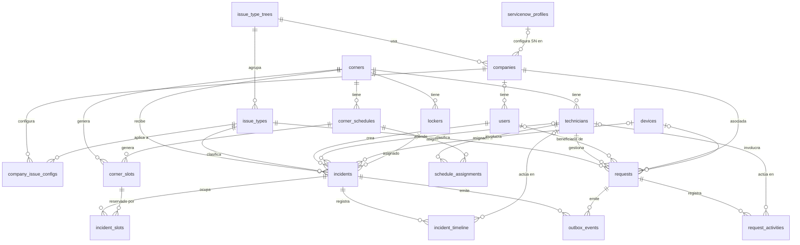
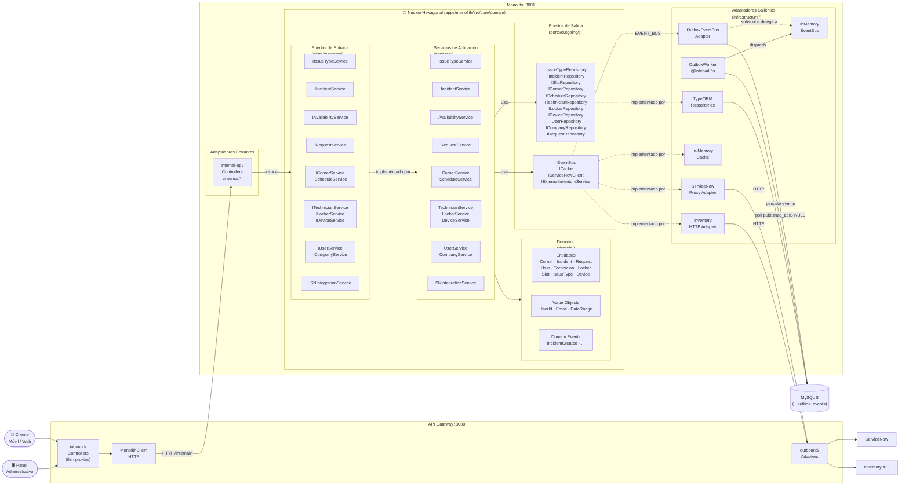
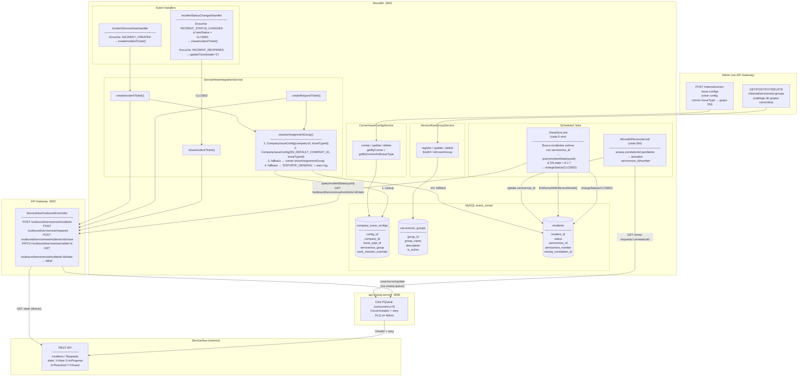
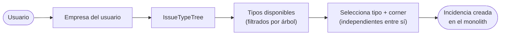
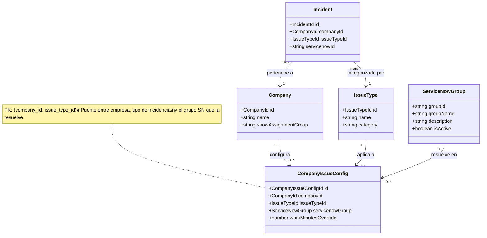

# Modelo Entidad-Relación — Event Corner v3

> Generado a partir de las entidades TypeORM del monolito y ABAC.
> Última actualización: 2026-07-09



```mermaid
erDiagram

    %% ── Árbol de tipos de incidencia ──────────────────────────────────────────
    issue_type_trees {
        varchar tree_id PK "Identificador único del árbol"
        varchar name "unique — Nombre del árbol de categorías"
        timestamp created_at "Fecha de creación"
        timestamp updated_at "Fecha de última modificación"
    }

    issue_types {
        varchar issue_type_id PK "Identificador único del tipo"
        varchar tree_id FK "Árbol al que pertenece"
        varchar name "Nombre visible del tipo de incidencia"
        varchar category "INCIDENT | REQUEST — clase del ticket"
        varchar device_type "nullable — tipo de dispositivo afectado"
        varchar servicenow_category "nullable — categoría en ServiceNow"
        varchar servicenow_close_category "nullable — categoría de cierre en SN"
        int     work_minutes "Tiempo estimado de trabajo (min)"
        int     spare_minutes "Tiempo de tolerancia adicional (min)"
        int     close_minutes "Tiempo para cierre automático (min)"
        boolean not_user_visible "true = solo visible para técnicos"
        int     position "Orden de aparición en la app"
        varchar icon "nullable — nombre del icono"
        boolean nps_disabled "true = no enviar encuesta NPS al cerrar"
        boolean is_active "false = tipo desactivado"
        timestamp created_at "Fecha de creación"
        timestamp updated_at "Fecha de última modificación"
    }

    %% ── Empresas ──────────────────────────────────────────────────────────────
    companies {
        varchar company_id PK "Identificador único de la empresa"
        varchar name "unique — Nombre comercial de la empresa"
        varchar tree_id FK "Árbol de tipos de incidencia asignado"
        varchar profile_id FK "nullable — perfil ServiceNow asignado"
        boolean is_active "false = empresa desactivada"
        timestamp created_at "Fecha de creación"
        timestamp updated_at "Fecha de última modificación"
    }

    %% ── Usuarios ──────────────────────────────────────────────────────────────
    users {
        varchar customer_id PK "Identificador interno del usuario"
        varchar external_id "unique — ID del usuario en el proveedor de identidad"
        varchar name "nullable — Nombre de pila"
        varchar last_name "nullable — Apellido"
        varchar full_name "nullable — Nombre completo concatenado"
        varchar email "nullable — Correo electrónico corporativo"
        varchar company_id FK "nullable — Empresa asignada manualmente por admin"
        varchar domain "nullable — Dominio corporativo del proveedor de identidad"
        varchar upn "nullable — UPN del proveedor de identidad (user@domain)"
        text    device_tokens "nullable — Tokens push para notificaciones (JSON array)"
        boolean is_active "false = usuario desactivado"
        timestamp created_at "Fecha de creación"
        timestamp updated_at "Fecha de última sincronización"
    }

    %% ── Corners ───────────────────────────────────────────────────────────────
    corners {
        varchar corner_id PK "Identificador único del corner"
        varchar name "Nombre del punto de servicio"
        varchar client_name "nullable — Nombre del cliente corporativo"
        varchar description "nullable — Descripción del corner"
        varchar servicenow_location "nullable — Ubicación registrada en ServiceNow"
        varchar snow_assignment_group "nullable — Grupo de asignación en SN"
        decimal latitude "nullable — Latitud geográfica"
        decimal longitude "nullable — Longitud geográfica"
        boolean only_technicians "true = solo técnicos pueden iniciar incidencias"
        boolean is_active "false = corner fuera de servicio"
        timestamp created_at "Fecha de creación"
        timestamp updated_at "Fecha de última modificación"
    }

    %% ── Técnicos ──────────────────────────────────────────────────────────────
    technicians {
        varchar technician_id PK "Identificador único del técnico"
        varchar corner_id FK "Corner al que está adscrito"
        varchar name "Nombre de pila"
        varchar last_name "nullable — Apellido"
        varchar full_name "nullable — Nombre completo"
        varchar email "Correo de contacto"
        boolean disabled "true = técnico inhabilitado"
        timestamp created_at "Fecha de creación"
        timestamp updated_at "Fecha de última modificación"
    }

    %% ── Lockers ───────────────────────────────────────────────────────────────
    lockers {
        varchar locker_id PK "Identificador único del locker"
        varchar corner_id FK "Corner donde está ubicado físicamente"
        varchar locker_code "unique — Código físico del locker"
        varchar status "AVAILABLE | OCCUPIED | OUT_OF_SERVICE"
        varchar description "nullable — Descripción o ubicación física"
        timestamp created_at "Fecha de creación"
        timestamp updated_at "Fecha de último cambio de estado"
    }

    %% ── Dispositivos ──────────────────────────────────────────────────────────
    devices {
        varchar device_id PK "Identificador único del dispositivo"
        varchar serial_number "unique — Número de serie"
        varchar model "nullable — Modelo del dispositivo"
        varchar brand "nullable — Marca del dispositivo"
        varchar device_type "nullable — Tipo: laptop, phone, tablet, etc."
        varchar assigned_user_id "nullable — soft ref al usuario asignado (sin FK)"
        varchar assigned_user_name "nullable — Nombre del usuario asignado (desnormalizado)"
        enum    status "SYNCED | STALE | NOT_FOUND | SYNC_ERROR | VIRTUAL | DISABLED — estado del equipo"
        boolean is_virtual "true = dispositivo virtual o simulado"
        timestamp last_sync_at "Última sincronización con inventario externo"
        timestamp created_at "Fecha de primera sincronización"
    }

    %% ── Horarios de corner ────────────────────────────────────────────────────
    corner_schedules {
        varchar schedule_id PK "Identificador único del horario"
        varchar corner_id FK "Corner al que aplica el horario"
        varchar name "Nombre descriptivo del horario"
        varchar day_of_week "MON|TUE|WED|THU|FRI|SAT|SUN — día de la semana"
        time    start_time "Hora de inicio de atención"
        time    end_time "Hora de fin de atención"
        date    valid_from "Fecha desde la que está vigente el horario"
        date    valid_until "Fecha hasta la que está vigente el horario"
        int     slot_duration_minutes "Duración de cada slot generado (min)"
        boolean is_active "false = horario desactivado"
        timestamp created_at "Fecha de creación"
        timestamp updated_at "Fecha de última modificación"
    }

    schedule_assignments {
        uuid    assignment_id PK "Identificador de la asignación"
        varchar schedule_id FK "Horario asignado al técnico"
        varchar technician_id FK "Técnico que cubre el horario"
        timestamp created_at "Fecha de asignación"
    }

    %% ── Slots ─────────────────────────────────────────────────────────────────
    corner_slots {
        varchar slot_id PK "Identificador único del slot"
        varchar corner_id FK "Corner al que pertenece (optimiza queries directos)"
        varchar schedule_id FK "Horario que generó este slot"
        timestamp starts_at "Inicio del intervalo de tiempo"
        timestamp ends_at "Fin del intervalo de tiempo"
        varchar status "AVAILABLE | HELD | BOOKED | EXPIRED"
        varchar held_by_user_id "nullable — ABAC user ID que retiene el slot (batch drafts)"
        timestamp held_until "nullable — cuándo expira el hold (TTL = 15 min)"
        timestamp created_at "Fecha de generación del slot"
        timestamp updated_at "Fecha de último cambio de estado"
    }

    %% ── Incidencias ───────────────────────────────────────────────────────────
    incidents {
        varchar incident_id PK "Identificador único de la incidencia"
        varchar issue_type_id FK "Tipo de incidencia seleccionado"
        varchar customer_id FK "Usuario que creó la cita"
        varchar corner_id FK "Corner donde se atiende"
        varchar current_technician_id FK "nullable — Técnico actualmente asignado"
        varchar device_id FK "nullable — Dispositivo involucrado en la reparación"
        varchar locker_id FK "nullable — Locker asignado durante la atención"
        varchar status "CREATED|DELIVERED|IN_PROGRESS|PENDING_THIRD_PARTY|PENDING_USER|PENDING_SPARE_PART|PENDING_PICKUP|PENDING_REPLACEMENT_DELIVERY|CLOSED|REOPENED|VALIDATED|CANCELED — ver incident-status.enum.ts"
        int     priority "Prioridad del ticket (1 = alta)"
        varchar origin_channel "Canal de origen: CUSTOMER_APP | TECHNICIAN_APP"
        timestamp scheduled_start "Inicio planificado de la cita"
        timestamp scheduled_end "Fin planificado de la cita"
        int     duration_minutes "Duración calculada a partir de los slots ocupados"
        varchar servicenow_id "nullable — sys_id del ticket en ServiceNow"
        varchar servicenow_number "nullable — número legible del ticket (INC0012345)"
        varchar snowq_correlation_id "nullable — correlationId de api-snowq-service mientras el ticket está en modo async; se limpia al reconciliar"
        json    metadata "nullable — datos extra del canal de origen"
        text    comment "nullable — último comentario registrado por el técnico"
        timestamp closed_at "nullable — fecha y hora de cierre efectivo"
        timestamp created_at "Fecha de creación"
        timestamp updated_at "Fecha de última modificación"
    }

    incident_slots {
        uuid    relation_id PK "Identificador de la relación"
        varchar incident_id FK "Incidencia que ocupa el slot"
        varchar slot_id FK "Slot reservado por la incidencia"
        timestamp created_at "Fecha en que se reservó el slot"
    }

    incident_timeline {
        uuid    activity_id PK "Identificador de la entrada del historial"
        varchar incident_id FK "Incidencia a la que pertenece"
        varchar technician_id FK "nullable — Técnico que ejecutó la acción"
        varchar action_type "Tipo de acción: TAKEN | RELEASED | STATUS_CHANGED | ..."
        varchar from_status "nullable — Estado anterior a la acción"
        varchar to_status "nullable — Estado resultante de la acción"
        timestamp worked_from "nullable — Inicio del período de trabajo registrado"
        timestamp worked_until "nullable — Fin del período de trabajo registrado"
        varchar comment "nullable — Comentario asociado a la acción"
        timestamp created_at "Fecha y hora de la acción"
    }

    %% ── Solicitudes (REQ) ─────────────────────────────────────────────────────
    requests {
        varchar request_id PK "Identificador único de la solicitud"
        varchar issue_type_id FK "Tipo de solicitud (category = REQUEST)"
        varchar technician_id FK "Técnico que gestiona la solicitud"
        varchar customer_id FK "Usuario beneficiario de la solicitud"
        varchar corner_id FK "Corner donde se realiza la gestión"
        varchar company_id FK "Empresa del usuario (valida árbol y resuelve SN)"
        varchar device_id FK "nullable — Dispositivo involucrado (feature pendiente)"
        varchar status "CREATED | IN_PROGRESS | CLOSED | CANCELLED"
        timestamp scheduled_at "Fecha y hora programada para la atención"
        varchar servicenow_id "nullable — sys_id del ticket en ServiceNow"
        varchar servicenow_number "nullable — número legible del ticket (REQ0012345)"
        varchar snowq_correlation_id "nullable — correlationId de api-snowq-service mientras el ticket está en modo async; se limpia al reconciliar"
        text    notes "nullable — Notas del técnico sobre la solicitud"
        timestamp closed_at "nullable — Fecha y hora de cierre"
        timestamp created_at "Fecha de creación"
        timestamp updated_at "Fecha de última modificación"
    }

    request_activities {
        uuid    activity_id PK "Identificador de la actividad"
        varchar request_id FK "Solicitud a la que pertenece"
        varchar technician_id FK "nullable — Técnico que realizó la acción"
        varchar from_status "nullable — Estado anterior"
        varchar to_status "Estado resultante de la acción"
        varchar comment "nullable — Comentario de la acción"
        timestamp created_at "Fecha y hora de la acción"
    }

    %% ── Batch Drafts (lote de incidencias) ──────────────────────────────────
    incident_batch_drafts {
        varchar id PK "UUID del draft"
        varchar user_id "ABAC user ID del técnico"
        timestamp created_at "Fecha de creación"
        timestamp updated_at "Fecha de última modificación"
    }

    incident_batch_draft_items {
        varchar id PK "UUID del item"
        varchar draft_id FK "Draft al que pertenece (ON DELETE CASCADE)"
        varchar local_id "UUID generado por el cliente (idempotencia)"
        varchar corner_id "Corner seleccionado"
        varchar corner_name "Nombre del corner (desnormalizado)"
        varchar customer_id "ID del usuario cliente"
        varchar customer_name "Nombre del cliente (desnormalizado)"
        varchar customer_email "Email del cliente (desnormalizado)"
        varchar device_serial "Serial del dispositivo"
        varchar issue_type_id "ID del tipo de incidencia"
        varchar issue_type_name "Nombre del tipo (desnormalizado)"
        json slot_ids "Array de slot IDs retenidos"
        timestamp start_time "Inicio del horario"
        timestamp end_time "Fin del horario"
        text description "nullable — descripción del problema"
        text notes "nullable — notas adicionales"
        varchar status "pending | error"
        text last_error "nullable — último mensaje de error"
        timestamp created_at "Fecha de creación"
    }

    incident_batch_drafts ||--o{ incident_batch_draft_items : "contiene"

    %% ── Outbox de eventos de dominio ─────────────────────────────────────────
    outbox_events {
        varchar event_id PK "UUID del evento (idempotency key)"
        varchar event_type "Tipo del evento: INCIDENT_CREATED, etc."
        varchar aggregate_id "ID del agregado que originó el evento"
        json    payload "Evento completo serializado (DomainEvent)"
        timestamp published_at "nullable — null = pendiente; fecha = ya despachado"
        timestamp created_at "Fecha de inserción (orden de procesamiento)"
        int     retry_count "Número de intentos de procesamiento realizados (default 0)"
        int     max_retries "Máximo de reintentos antes de mover a fallidos (default 5)"
        text    last_error "nullable — último mensaje de error capturado"
        timestamp retry_after "nullable — fecha mínima para el próximo reintento (backoff exponencial)"
        timestamp failed_at "nullable — fecha en que el evento fue marcado como fallido definitivamente"
    }

    %% ── Perfiles ServiceNow ───────────────────────────────────────────────────
    servicenow_profiles {
        varchar profile_id PK "Identificador único del perfil"
        varchar name "unique — Nombre identificador del perfil"
        varchar snow_company_sys_id "sys_id de la empresa en ServiceNow"
        varchar snow_company_name "Nombre de la empresa tal como aparece en SN"
        boolean is_active "false = perfil desactivado"
        timestamp created_at "Fecha de creación"
        timestamp updated_at "Fecha de última modificación"
    }

    %% ── Configuración de grupo SN por empresa/tipo ────────────────────────────
    company_issue_configs {
        varchar config_id PK "Identificador único de la configuración"
        varchar company_id FK "Empresa a la que aplica esta configuración"
        varchar issue_type_id FK "Tipo de incidencia al que aplica esta configuración"
        varchar servicenow_group "Grupo de asignación en SN para esta empresa+tipo (unique junto a company_id, issue_type_id)"
        int     work_minutes_override "nullable — sobreescribe issue_type.work_minutes para esta empresa"
        timestamp created_at "Fecha de creación"
    }

    %% ── Catálogo de grupos ServiceNow ─────────────────────────────────────────
    servicenow_groups {
        varchar group_id PK "Identificador único del grupo (sys_id en ServiceNow)"
        varchar group_name "unique — Nombre del grupo de asignación"
        varchar description "nullable — Descripción del grupo"
        boolean is_active "false = grupo desactivado"
        timestamp created_at "Fecha de creación"
        timestamp updated_at "Fecha de última modificación"
    }

    %% ── Relaciones ────────────────────────────────────────────────────────────

    issue_type_trees ||--o{ issue_types : "agrupa"
    issue_type_trees ||--o{ companies : "usa"

    servicenow_profiles |o--o{ companies : "configura SN en"

    companies |o--o{ users : "tiene"
    companies ||--o{ company_issue_configs : "configura"
    issue_types ||--o{ company_issue_configs : "aplica a"

    corners ||--o{ technicians : "tiene"
    corners ||--o{ lockers : "tiene"
    corners ||--o{ corner_schedules : "tiene"
    corners ||--o{ corner_slots : "genera"
    corners ||--o{ incidents : "recibe"

    technicians ||--o{ schedule_assignments : "asignado a"
    corner_schedules ||--o{ schedule_assignments : "asigna"

    corner_schedules ||--o{ corner_slots : "genera"

    issue_types ||--o{ incidents : "clasifica"
    users ||--o{ incidents : "crea"
    technicians |o--o{ incidents : "atiende"
    devices |o--o{ incidents : "involucra"
    lockers |o--o{ incidents : "asignado"

    incidents ||--o{ incident_slots : "ocupa"
    corner_slots ||--o{ incident_slots : "reservado por"

    incidents ||--o{ incident_timeline : "registra"
    technicians |o--o{ incident_timeline : "actúa en"

    issue_types ||--o{ requests : "clasifica"
    technicians ||--o{ requests : "gestiona"
    users |o--o{ requests : "beneficiario de"
    companies ||--o{ requests : "asociada"
    devices |o--o{ requests : "involucra"

    requests ||--o{ request_activities : "registra"
    technicians |o--o{ request_activities : "actúa en"

    incidents ||--o{ outbox_events : "emite"
    requests  ||--o{ outbox_events : "emite"

    incident_batch_drafts ||--o{ incident_batch_draft_items : "contiene"
```

---

## Notas de diseño

### Grupos de tablas

| Grupo | Tablas | Descripción |
|---|---|---|
| **Catálogo** | `issue_type_trees`, `issue_types` | Árbol de tipos de incidencia compartido entre empresas |
| **Organización** | `companies`, `users` | Empresas y sus empleados |
| **Infraestructura** | `corners`, `technicians`, `lockers`, `devices` | Física del corner |
| **Disponibilidad** | `corner_schedules`, `schedule_assignments`, `corner_slots` | Horarios y slots generados |
| **Operaciones** | `incidents`, `incident_slots`, `incident_timeline` | Ciclo de vida de incidencias |
| **Solicitudes** | `requests`, `request_activities` | Ciclo de vida de solicitudes REQ |
| **Catálogo SN** | `servicenow_profiles`, `servicenow_groups`, `company_issue_configs` | Catálogo de configuraciones ServiceNow. Una empresa referencia su perfil vía `profile_id FK`. `company_issue_configs` resuelve el grupo de asignación SN por empresa+tipo de incidencia (primer eslabón de `resolveAssignmentGroup()`); `servicenow_groups` es el catálogo local de grupos SN conocidos (sin FK entrante — solo referencia informativa). |
| **Outbox** | `outbox_events` | Persistencia transaccional de eventos de dominio. El worker los despacha al bus in-memory cada 5 s. |
| **Batch Drafts** | `incident_batch_drafts`, `incident_batch_draft_items` | Lote de incidencias pendiente de confirmación. Los slots se retienen (HELD) 15 min mientras el técnico arma el lote. |

### Descripción de tablas

#### Catálogo de tipos

| Tabla | Descripción |
|---|---|
| `issue_type_trees` | Árbol de clasificación de incidencias/solicitudes. Cada empresa apunta a un árbol (`company.tree_id`). Permite tener catálogos distintos por cliente sin duplicar filas. |
| `issue_types` | Tipo concreto de incidencia o solicitud dentro de un árbol. Define tiempos operativos (`work_minutes`, `spare_minutes`, `close_minutes`), la categoría SN para crear el ticket, si es visible para el usuario final y su posición en el menú. |

#### Organización

| Tabla | Descripción |
|---|---|
| `servicenow_profiles` | Catálogo de configuraciones de empresa en ServiceNow. Almacena el `snow_company_sys_id` (sys_id del tenant SN) y el nombre tal como aparece en SN. Varias empresas del mismo cliente corporativo pueden compartir un perfil. |
| `company_issue_configs` | Configuración de grupo de asignación SN por empresa + tipo de incidencia (`Unique(company_id, issue_type_id)`). Es el **primer eslabón** de `resolveAssignmentGroup()`: si existe fila, su `servicenow_group` gana sobre el fallback de `SN_DEFAULT_COMPANY_ID` y sobre `corners.snow_assignment_group`. También permite `work_minutes_override` por empresa. |
| `servicenow_groups` | Catálogo local de grupos de asignación SN conocidos (`group_id` = sys_id en SN). Tabla de referencia sin FK entrante — no impone integridad referencial sobre `company_issue_configs.servicenow_group` ni `corners.snow_assignment_group`, solo documenta qué grupos existen. |
| `companies` | Empresa registrada en el sistema, identificada de forma única por su `name`. Vincula al árbol de tipos de incidencia que le corresponde y, opcionalmente, al perfil SN. Sin perfil asignado, los tickets SN usan la empresa DEFAULT del `.env`. La asignación de usuarios a una empresa la realiza un administrador de forma manual. |
| `users` | Empleado del sistema. Se crea o actualiza automáticamente al hacer login (sync con el proveedor de identidad). Guarda tokens push para notificaciones móviles (`device_tokens`). No está ligado a un corner fijo: puede ser atendido en cualquier punto. |

#### Infraestructura física

| Tabla | Descripción |
|---|---|
| `corners` | Punto de servicio físico donde se atienden incidencias. Tiene coordenadas geográficas, grupo de asignación en SN (`snow_assignment_group`) y el flag `only_technicians` para corners que solo aceptan atención iniciada por técnicos. |
| `technicians` | Personal técnico adscrito a un corner. Puede estar asignado a horarios de atención (`schedule_assignments`) y es el responsable de tomar y resolver incidencias o gestionar solicitudes. |
| `lockers` | Casillero físico de un corner. Tres estados: `AVAILABLE` (libre), `OCCUPIED` (asignado a una incidencia activa), `OUT_OF_SERVICE` (avería o mantenimiento). |
| `devices` | Dispositivo de hardware (PC, laptop, tablet, etc.) sincronizado desde el inventario externo. La asignación a un usuario es una referencia blanda (sin FK) para no acoplar su ciclo de vida al del usuario. |

#### Disponibilidad

| Tabla | Descripción |
|---|---|
| `corner_schedules` | Plantilla semanal de atención de un corner. Define el día de la semana, horario de inicio/fin, duración de cada slot y el rango de fechas en que aplica (`valid_from` / `valid_until`). |
| `schedule_assignments` | Tabla pivot que asigna qué técnicos cubren un horario específico. Permite rotar técnicos por franja sin tocar la plantilla del horario. |
| `corner_slots` | Slot de tiempo concreto materializado a partir de un `corner_schedule`. Estados: `AVAILABLE` (libre), `HELD` (retenido temporalmente por un técnico mientras arma un batch draft, TTL 15 min), `BOOKED` (reservado permanentemente por una incidencia), `EXPIRED` (venció sin uso). |

#### Operaciones — Incidencias

| Tabla | Descripción |
|---|---|
| `incidents` | Incidencia de soporte creada por un usuario. Registra el técnico actual, el dispositivo y locker involucrados (opcionales), los tiempos planificados y el ticket SN asociado. Máquina de estados completa (12 valores + transiciones válidas) en `apps/monolith/src/core/domain/enums/incident-status.enum.ts` — fuente de verdad, no repetir aquí para evitar desincronización. |
| `incident_slots` | Tabla pivot que relaciona una incidencia con los slots que ocupa. Una incidencia puede requerir múltiples slots contiguos si la atención supera la duración de un slot. |
| `incident_timeline` | Historial inmutable de cambios de estado de una incidencia. Cada fila registra quién actuó, qué cambio de estado ocurrió, los tiempos reales de trabajo y un comentario opcional. Es la fuente de verdad para auditoría y métricas. |

#### Solicitudes

| Tabla | Descripción |
|---|---|
| `requests` | Solicitud de servicio (tipo REQ) iniciada por un técnico a nombre de un usuario. A diferencia de las incidencias, el técnico queda asignado desde la creación y no ocupa slots de disponibilidad. Se agenda con un `scheduled_at` libre. |
| `request_activities` | Historial de cambios de estado de una solicitud, equivalente al `incident_timeline`. Registra técnico actuante, transición de estado y comentario. |

---

### Decisiones clave

- **`users` no tiene `corner_id`** — un usuario puede ser atendido en cualquier corner, la FK era restrictiva e incorrecta respecto al legacy.
- **`company.tree_id`** vincula la empresa al árbol de tipos. Al crear una incidencia se valida que `issueType.treeId === company.treeId`.
- **`corners.snow_assignment_group`** — reemplaza el `servicenow_group` del legacy (JSON global hardcodeado) con un campo DB por corner.
- **`company.profile_id FK → servicenow_profiles`** — el perfil centraliza el `snow_company_sys_id` y el nombre SN. `null` = usar `SN_DEFAULT_COMPANY_SYS_ID` del `.env`. Varias empresas pueden compartir el mismo perfil SN.
- **`devices.assigned_user_id`** — referencia soft (no FK) para evitar acoplamiento con el ciclo de vida del usuario.
- **`incident_slots`** — tabla pivot que relaciona qué slots ocupa una incidencia (una incidencia puede ocupar múltiples slots contiguos).

---

## Arquitectura Hexagonal — Implementación

> Arquitectura de puertos y adaptadores aplicada al monorepo Event Corner v3.



### Convenciones del diagrama

| Símbolo | Significado |
|---|---|
| `──►` flecha sólida | Llamada directa (invocación en tiempo de ejecución) |
| `- -►` flecha punteada | Implementa / satisface un puerto (Dependency Inversion) |
| `subgraph` azul `⬡` | Núcleo hexagonal — sin dependencias hacia afuera |
| `subgraph` Adaptadores | Código que sí puede depender de frameworks/infra |

### Reglas de dependencia

1. **El núcleo no importa nada de `infrastructure/` ni de `internal-api/`.**
   Solo depende de `@app/shared` (tipos utilitarios sin frameworks).
2. **Los puertos de salida son interfaces** (`IXxxRepository`, `IEventBus`, …).
   La DI se resuelve en `CoreServicesModule` mediante `useFactory`.
3. **Los adaptadores salientes egresan siempre por el API Gateway.**
   El monolito nunca llama directamente a ServiceNow o Inventory — usa los proxies `outbound/` del gateway.
4. **Los controladores `internal-api/` son finos** — solo deserializan la request, invocan el servicio y serializan la respuesta con `unwrapOrThrow()`.

### Mapa de tokens DI (`service-tokens.ts` / `tokens.ts`)

| Token | Tipo | Implementación |
|---|---|---|
| `ISSUE_TYPE_SERVICE` | `IIssueTypeService` | `IssueTypeService` |
| `INCIDENT_SERVICE` | `IIncidentService` | `IncidentService` |
| `AVAILABILITY_SERVICE` | `IAvailabilityService` | `AvailabilityService` |
| `REQUEST_SERVICE` | `IRequestService` | `RequestService` |
| `CORNER_SERVICE` | `ICornerService` | `CornerService` |
| `SCHEDULE_SERVICE` | `IScheduleService` | `ScheduleService` |
| `TECHNICIAN_SERVICE` | `ITechnicianService` | `TechnicianService` |
| `LOCKER_SERVICE` | `ILockerService` | `LockerService` |
| `DEVICE_SERVICE` | `IDeviceService` | `DeviceService` |
| `USER_SERVICE` | `IUserService` | `UserService` |
| `COMPANY_SERVICE` | `ICompanyService` | `CompanyService` |
| `SERVICENOW_INTEGRATION_SERVICE` | `IServiceNowIntegrationService` | `ServiceNowIntegrationService` |
| `INCIDENT_REPOSITORY` | `IIncidentRepository` | `TypeOrmIncidentRepository` |
| `CORNER_REPOSITORY` | `ICornerRepository` | `TypeOrmCornerRepository` |
| `SLOT_REPOSITORY` | `ISlotRepository` | `TypeOrmSlotRepository` |
| `USER_REPOSITORY` | `IUserRepository` | `TypeOrmUserRepository` |
| `EVENT_BUS` | `IEventBus` | `InProcessEventBus` |
| `CACHE` | `ICache` | `InMemoryCache` |
| `SERVICENOW_CLIENT` | `IServiceNowClient` | `ServiceNowProxyAdapter` |
| `EXTERNAL_INVENTORY_SERVICE` | `IExternalInventoryService` | `InventoryHttpAdapter` |

---

## Modelo UML del Dominio

> Diagrama de clases centrado en agregados, entidades y value objects del núcleo.
> Las flechas representan asociaciones de dominio, no FKs de base de datos.

```mermaid
classDiagram
    direction TB

    %% ══════════════════════════════════════════════════════
    %% VALUE OBJECTS
    %% ══════════════════════════════════════════════════════
    class Email {
        <<value object>>
        +string value
        +create(raw) Result~Email~
        +toString() string
    }
    class DateRange {
        <<value object>>
        +Date start
        +Date end
        +durationMinutes() int
        +create(s,e) Result~DateRange~
        +reconstitute(s,e) DateRange
    }
    class ServiceNowId {
        <<value object>>
        +string value
        +create(raw) Result~ServiceNowId~
    }
    class ServiceNowNumber {
        <<value object>>
        +string value
    }

    %% ══════════════════════════════════════════════════════
    %% CATÁLOGO DE TIPOS
    %% ══════════════════════════════════════════════════════
    class IssueTypeTree {
        <<aggregate root>>
        +IssueTypeTreeId id
        +string name
        +create() Result~IssueTypeTree~
        +reconstitute() IssueTypeTree
    }
    class IssueType {
        <<entity>>
        +IssueTypeId id
        +IssueTypeTreeId treeId
        +string name
        +IssueCategory category
        +string? deviceType
        +ServiceNowCategory? servicenowCategory
        +int workMinutes
        +int spareMinutes
        +int closeMinutes
        +bool notUserVisible
        +bool npsDisabled
        +bool isActive
        +update() void
    }

    %% ══════════════════════════════════════════════════════
    %% ORGANIZACIÓN
    %% ══════════════════════════════════════════════════════
    class ServiceNowProfile {
        <<aggregate root>>
        +ServiceNowProfileId id
        +string name
        +ServiceNowId snowCompanySysId
        +string snowCompanyName
        +bool isActive
        +update() void
        +activate() void
        +deactivate() void
    }
    class Company {
        <<aggregate root>>
        +CompanyId id
        +string name
        +IssueTypeTreeId treeId
        +ServiceNowProfileId? profileId
        +bool isActive
        +hasServiceNowProfile() bool
        +assignServiceNowProfile(id) void
        +assignTree(treeId) void
        +update(name) void
    }
    class User {
        <<aggregate root>>
        +UserId id
        +string externalId
        +string? name
        +string? lastName
        +string? fullName
        +Email? email
        +CompanyId? companyId
        +string? domain
        +string? upn
        +string[] deviceTokens
        +bool isActive
        +syncFromProvider(data) void
        +addDeviceToken(t) void
        +removeDeviceToken(t) void
        +clearDeviceTokens() void
        +updateCompany(id) void
        +activate() void
        +deactivate() void
    }

    %% ══════════════════════════════════════════════════════
    %% INFRAESTRUCTURA FÍSICA
    %% ══════════════════════════════════════════════════════
    class Corner {
        <<aggregate root>>
        +CornerId id
        +string name
        +string? clientName
        +string? servicenowLocation
        +string? snowAssignmentGroup
        +bool onlyTechnicians
        +bool isActive
        +updateInfo() void
    }
    class Technician {
        <<entity>>
        +TechnicianId id
        +CornerId cornerId
        +string name
        +string? lastName
        +string email
        +bool disabled
        +update() void
    }
    class Locker {
        <<entity>>
        +LockerId id
        +CornerId cornerId
        +string lockerCode
        +LockerStatus status
        +string? description
        +occupy() void
        +release() void
        +putOutOfService() void
    }
    class Device {
        <<aggregate root>>
        +DeviceId id
        +string serialNumber
        +string? model
        +string? brand
        +string? deviceType
        +string? assignedUserId
        +DeviceStatus status
        +bool isVirtual
        +retire() void
        +markStale() void
    }

    %% ══════════════════════════════════════════════════════
    %% DISPONIBILIDAD
    %% ══════════════════════════════════════════════════════
    class CornerSchedule {
        <<aggregate root>>
        +ScheduleId id
        +CornerId cornerId
        +string name
        +DayOfWeek dayOfWeek
        +string startTime
        +string endTime
        +Date validFrom
        +Date? validUntil
        +int slotDurationMinutes
        +bool isActive
        +generateSlots(from, to) CornerSlot[]
    }
    class CornerSlot {
        <<entity>>
        +SlotId id
        +CornerId cornerId
        +ScheduleId scheduleId
        +DateRange scheduledRange
        +SlotStatus status
        +book() void
        +expire() void
    }

    %% ══════════════════════════════════════════════════════
    %% OPERACIONES
    %% ══════════════════════════════════════════════════════
    class Incident {
        <<aggregate root>>
        +IncidentId id
        +IssueTypeId issueTypeId
        +CustomerId customerId
        +CornerId cornerId
        +TechnicianId? currentTechnicianId
        +string? deviceId
        +LockerId? lockerId
        +IncidentStatus status
        +DateRange scheduledRange
        +int durationMinutes
        +int priority
        +IncidentOrigin origin
        +ServiceNowId? servicenowId
        +ServiceNowNumber? servicenowNumber
        +Date? closedAt
        +take(techId) void
        +complete(techId) void
        +cancel(techId) void
        +assignLocker(id) void
        +releaseLocker() void
        +updateServiceNowInfo(id, num) void
    }
    class Request {
        <<aggregate root>>
        +RequestId id
        +IssueTypeId issueTypeId
        +TechnicianId technicianId
        +CustomerId customerId
        +CornerId cornerId
        +CompanyId companyId
        +string? deviceId
        +RequestStatus status
        +Date scheduledAt
        +string? notes
        +ServiceNowId? servicenowId
        +ServiceNowNumber? servicenowNumber
        +Date? closedAt
        +start() void
        +complete() void
        +cancel() void
        +updateServiceNowInfo(id, num) void
    }

    %% ══════════════════════════════════════════════════════
    %% RELACIONES DE DOMINIO
    %% ══════════════════════════════════════════════════════

    IssueTypeTree "1" *-- "0..*" IssueType : contiene
    IssueTypeTree "1" <-- "0..*" Company : usa árbol

    ServiceNowProfile "0..1" <-- "0..*" Company : perfil SN

    Company "0..1" <-- "0..*" User : pertenece a

    Corner "1" *-- "0..*" Technician : emplea
    Corner "1" *-- "0..*" Locker : posee
    Corner "1" *-- "0..*" CornerSchedule : tiene

    CornerSchedule "1" ..> "0..*" CornerSlot : genera

    IssueType "1" <-- "0..*" Incident : clasifica
    User "1" <-- "0..*" Incident : crea
    Corner "1" <-- "0..*" Incident : recibe
    Technician "0..1" <-- "0..*" Incident : atiende
    Locker "0..1" <-- "0..1" Incident : asignado
    CornerSlot "1..*" <-- "1" Incident : ocupa

    Device "0..1" <-- "0..*" Incident : involucra
    Device "0..1" <-- "0..*" Request : involucra
    Device "0..1" ..> "0..1" User : asignado a (soft ref)

    IssueType "1" <-- "0..*" Request : clasifica
    Technician "1" <-- "0..*" Request : gestiona
    User "1" <-- "0..*" Request : solicita
    Corner "1" <-- "0..*" Request : recibe
    Company "1" <-- "0..*" Request : asociada

    User --> Email : tiene
    Incident --> DateRange : scheduledRange
    Incident --> ServiceNowId : servicenowId
    Incident --> ServiceNowNumber : servicenowNumber
    Request --> ServiceNowId : servicenowId
    ServiceNowProfile --> ServiceNowId : snowCompanySysId
```



### Explicación del modelo UML

#### Estereotipos y sus reglas

| Estereotipo | Qué significa | Regla de oro |
|---|---|---|
| `<<aggregate root>>` | Punto de entrada al agregado. Solo se puede acceder a sus entidades hijas a través de él. | Se obtiene desde repositorio. Tiene `create()` + `reconstitute()`. Emite domain events desde `create()`. |
| `<<entity>>` | Objeto con identidad propia pero que **no existe** fuera de su agregado. | No tiene repositorio propio. Su persistencia es responsabilidad del aggregate root. |
| `<<value object>>` | Objeto sin identidad. Se define completamente por sus atributos. Inmutable. | No tiene `id`. Dos instancias con los mismos valores son iguales. Se pasa por valor, no por referencia. |

#### Convención de flechas

| Notación | Tipo | Significa |
|---|---|---|
| `A "1" *-- "0..*" B` | Composición | B no existe sin A. Si A se elimina, B también. Ej: `Corner *-- Locker` |
| `A "1" <-- "0..*" B` | Asociación | B conoce a A por su ID, pero son ciclos de vida independientes. Ej: `IssueType <-- Incident` |
| `A "1" ..> "0..*" B` | Dependencia | A genera o usa instancias de B, pero B no vive dentro de A. Ej: `CornerSchedule ..> CornerSlot` |
| `A ..> B (soft ref)` | Referencia blanda | A guarda el ID de B como string, **sin FK en DB**. Ej: `Device ..> User` |

---

#### Grupos del modelo

##### Catálogo de tipos (`IssueTypeTree` → `IssueType`)

```
IssueTypeTree
  └── IssueType (INCIDENT | REQUEST)
        ├── workMinutes    → tiempo estimado de trabajo
        ├── spareMinutes   → tiempo de holgura antes del cierre
        ├── closeMinutes   → tiempo límite para cerrar
        └── servicenowCategory → categoría SN al abrir ticket
```

- `IssueTypeTree` agrupa los tipos de una empresa. Una empresa apunta a un árbol con `company.treeId`.
- Al crear una incidencia se valida: `issueType.treeId === company.treeId`. Si no coinciden → error.
- `category: INCIDENT | REQUEST` determina si el tipo aplica a incidencias, solicitudes o ambas.
- `notUserVisible = true` → el tipo existe en sistema pero no aparece en la app del usuario (usos internos).

##### Organización (`ServiceNowProfile` → `Company` → `User`)

```
ServiceNowProfile          ← catálogo de configuraciones SN (name, snowCompanySysId)
  └── Company              ← empresa interna, identificada por name (único). La asignación usuario→empresa la hace un admin
        ├── treeId         → árbol de tipos asignado
        ├── profileId?     → perfil SN (null = usar SN_DEFAULT_COMPANY_SYS_ID del .env)
        └── User           ← empleado de la empresa
              ├── externalId → identificador único en el proveedor de identidad
              ├── companyId? → null si el usuario no tiene empresa mapeada aún
              └── deviceTokens[] → tokens push para notificaciones móviles
```

- `User` **no tiene `cornerId`** — puede ser atendido en cualquier corner.
- La vinculación `company → user` es informativa: se usa para validar acceso y para el ticket SN.
- `ServiceNowProfile` agrupa el `snowCompanySysId` (sys_id en SN). Varias empresas pueden compartir el mismo perfil (mismo tenant SN).

##### Infraestructura física (`Corner` y sus partes)

```
Corner                             ← punto de servicio físico
  ├── snowAssignmentGroup?         → grupo SN que atiende este corner (reemplaza JSON hardcodeado)
  ├── servicenowLocation?          → ubicación SN para el ticket
  ├── onlyTechnicians              → si true, solo técnicos pueden crear incidencias
  ├── Technician[]                 → personal del corner (composición)
  ├── Locker[]                     → casilleros físicos (composición)
  └── CornerSchedule[]             → bloques horarios (composición)
        └── CornerSlot[]           → slots individuales generados (dependencia)
```

- `Locker.status`: `AVAILABLE → OCCUPIED` (al asignar a incident) `→ AVAILABLE` (al liberar) `→ OUT_OF_SERVICE`
- `CornerSlot.status`: `AVAILABLE → BOOKED` (permanente al crear incident) `→ EXPIRED` (al cancelar/expirar)
- `Device` **no es parte de Corner** — tiene ciclo de vida propio. Se relaciona con incidencias de forma referencial.

##### Disponibilidad (`CornerSchedule` → `CornerSlot`)

```
CornerSchedule (plantilla semanal)
  validFrom ──────────────────────────────── validUntil?
  dayOfWeek + startTime + endTime
  slotDurationMinutes = 30 (ej)

  genera →  CornerSlot [07:00-07:30]  AVAILABLE
            CornerSlot [07:30-08:00]  AVAILABLE
            CornerSlot [08:00-08:30]  BOOKED
            ...
```

- Un `CornerSchedule` define la plantilla. Los slots se **materializan** en DB previamente (no se generan on-demand).
- `schedule_assignments` (no modelado como clase porque es una tabla pivot simple) vincula qué técnicos cubren qué horario.

##### Operaciones: Incident

```
Incident (aggregate root)
  ├── issueTypeId  → tipo (categoría INCIDENT)
  ├── customerId   → usuario que generó la incidencia
  ├── cornerId     → corner donde se atiende
  ├── slotIds[]    → slots ocupados (uno o varios contiguos)
  ├── lockerId?    → locker asignado durante la atención (opcional)
  ├── deviceId?    → dispositivo involucrado (opcional)
  └── status:  PENDING → IN_PROGRESS → COMPLETED
                               └──────────→ CANCELLED
```

**Ciclo de vida del técnico:**

| Acción | Método | Transición |
|---|---|---|
| Técnico toma la incidencia | `take(techId)` | `PENDING → IN_PROGRESS` |
| Técnico completa | `complete(techId)` | `IN_PROGRESS → COMPLETED` |
| Se cancela | `cancel(techId)` | `PENDING\|IN_PROGRESS → CANCELLED` |
| Asignar locker | `assignLocker(id)` | — (Locker pasa a OCCUPIED) |
| Liberar locker | `releaseLocker()` | — (Locker vuelve a AVAILABLE) |

##### Operaciones: Request

```
Request (aggregate root)
  ├── issueTypeId  → tipo (categoría REQUEST)
  ├── technicianId → técnico que gestiona la solicitud
  ├── customerId   → usuario beneficiario
  ├── companyId    → empresa asociada (para ticket SN)
  ├── cornerId     → corner donde se procesa
  ├── deviceId?    → dispositivo involucrado (opcional)
  └── status:  PENDING → IN_PROGRESS → COMPLETED
                               └──────────→ CANCELLED
```

- `Request` siempre tiene un técnico asignado desde la creación (a diferencia de `Incident` que empieza sin técnico).
- `scheduledAt` es un timestamp único — no ocupa slots de disponibilidad.

##### Device

```
Device (aggregate root — ciclo de vida independiente)
  ├── serialNumber      → identificador único del hardware
  ├── assignedUserId?   → soft ref al usuario actual (sin FK)
  ├── status:  ACTIVE → STALE → RETIRED
  └── isVirtual         → true = dispositivo simulado/virtual (tests, demos)
```

- `Device` se sincroniza desde el inventario externo vía `InventoryHttpAdapter` → `IExternalInventoryService`.
- `assignedUserId` es una referencia blanda (string, sin FK) para evitar acoplamiento con el ciclo de vida del usuario.
- Un device puede aparecer en múltiples incidencias/requests a lo largo del tiempo (historial).

---

#### Reglas de invariantes del dominio

| Regla | Dónde se aplica |
|---|---|
| `issueType.treeId === company.treeId` al crear incident/request | `IncidentService.create()` |
| Un slot `BOOKED` no puede volver a `AVAILABLE` directamente | `CornerSlot.book()` lanza error si ya está BOOKED |
| Un técnico solo puede `take()` si el incident está en `PENDING` o `IN_PROGRESS` | `Incident.take()` valida `TAKEABLE_STATUSES` |
| `create()` genera `IncidentId` con `crypto.randomUUID()` | `IncidentService` — nunca en el controller |
| `reconstitute()` nunca emite eventos de dominio | Todos los aggregate roots |
| Todos los métodos de servicio retornan `Result<T>` — nunca lanzan | `IncidentService`, `RequestService`, etc. |

---


> Flujo estándar para agregar un caso de uso completo en la arquitectura hexagonal.

### Diagrama de flujo de implementación

```mermaid
flowchart TD
    A([🎯 Nueva funcionalidad]) --> B

    B["1️⃣  DOMINIO\napps/monolith/src/core/domain/\n─────────────────────\nEntidad: create() + reconstitute()\nValue objects si aplica\nDomain events si aplica\nErrors tipados"]

    B --> C["2️⃣  PUERTO DE SALIDA\napps/monolith/src/core/ports/outgoing/repositories/\n─────────────────────\nInterface IXxxRepository\nAgregar método al token existente\no crear nuevo token en tokens.ts"]

    C --> D["3️⃣  PUERTO DE ENTRADA\napps/monolith/src/core/ports/incoming/\n─────────────────────\nInterface IXxxService\nCommands / DTOs de entrada\nToken en service-tokens.ts"]

    D --> E["4️⃣  SERVICIO DE APLICACIÓN\napps/monolith/src/core/services/\n─────────────────────\nImplementa IXxxService\nOrquesta dominio + repos\nEmite domain events\nDevuelve Result&#60;T&#62;"]

    E --> F["5️⃣  MÓDULO DI\napps/monolith/src/core/services/core-services.module.ts\n─────────────────────\nAgregar provider con useFactory\nInyectar repos y tokens\nExportar token"]

    F --> G["6️⃣  REPOSITORIO TypeORM\napps/monolith/src/infrastructure/persistence/typeorm/\n─────────────────────\nEntidad @Entity con columnas\nImplementa IXxxRepository\ntoEntity() + toDomain()\nRegistrar en TypeOrmModule"]

    G --> H["7️⃣  CONTROLLER INTERNO\napps/monolith/src/internal-api/\n─────────────────────\nController /internal/xxx\n@Inject(XXX_SERVICE)\nunwrapOrThrow() en cada ruta\nRegistrar en InternalApiModule"]

    H --> I["8️⃣  PROXY API GATEWAY\napps/api-gateway/src/inbound/\n─────────────────────\nController público /api/xxx\nLlama MonolithClient.forward()\nRegistrar en InboundModule"]

    I --> J([✅ Funcionalidad lista])

    style A fill:#4CAF50,color:#fff
    style J fill:#4CAF50,color:#fff
    style B fill:#1565C0,color:#fff
    style C fill:#1565C0,color:#fff
    style D fill:#1565C0,color:#fff
    style E fill:#1565C0,color:#fff
    style F fill:#6A1B9A,color:#fff
    style G fill:#BF360C,color:#fff
    style H fill:#BF360C,color:#fff
    style I fill:#E65100,color:#fff
```



### Referencia rápida por paso

| Paso | Qué crear | Ruta base | Regla clave |
|---|---|---|---|
| **1 — Dominio** | Entidad / Value Object / Error | `apps/monolith/src/core/domain/` | `create()` emite eventos. `reconstitute()` no. Nunca importar infra. |
| **2 — Puerto salida** | `IXxxRepository` + token | `apps/monolith/src/core/ports/outgoing/repositories/` | Solo métodos que necesita el dominio. Sin TypeORM. |
| **3 — Puerto entrada** | `IXxxService` + Commands + token | `apps/monolith/src/core/ports/incoming/` | Commands son POJOs planos. El token va en `service-tokens.ts`. |
| **4 — Servicio** | `XxxService implements IXxxService` | `apps/monolith/src/core/services/` | Devuelve `Result<T>`. Nunca lanza excepciones. Inyecta por interfaz. |
| **5 — DI** | `useFactory` en `CoreServicesModule` | `apps/monolith/src/core/services/core-services.module.ts` | Un provider por token. `inject:` en el mismo orden que el constructor. |
| **6 — Repo TypeORM** | `TypeOrmXxxRepository` + `XxxEntity` | `apps/monolith/src/infrastructure/persistence/typeorm/` | `toDomain()` usa `reconstitute()`. `toEntity()` usa getters públicos. |
| **7 — Controller interno** | `InternalXxxController` | `apps/monolith/src/internal-api/` | Solo `@Inject` + `unwrapOrThrow()`. Sin lógica de negocio. |
| **8 — Gateway proxy** | `XxxController` inbound | `apps/api-gateway/src/inbound/` | Llama `MonolithClient.forward(req, '/internal/xxx')`. Sin lógica. |

### Checklist por entidad nueva

```
□ Entidad tiene create() y reconstitute() estáticos
□ create() genera ID con crypto.randomUUID()
□ Todos los campos son accesibles vía getters (sin bracket notation)
□ Los repos usan getters en toEntity() y reconstitute() en toDomain()
□ El servicio devuelve Result<T> en todos los métodos
□ El token está en service-tokens.ts / tokens.ts
□ El provider está en CoreServicesModule con useFactory
□ La entidad TypeORM está registrada en TypeOrmModule.forFeature([...])
□ El controller interno está en InternalApiModule.controllers[]
□ El gateway proxy reenvía a /internal/xxx sin lógica adicional
```




  El diagrama cubre los 4 flujos nuevos:

  ┌─────────────────────────┬────────────────────────────────────────────────────────────────────────────────────────────────────┐
  │          Flujo          │                                            Qué muestra                                             │
  ├─────────────────────────┼────────────────────────────────────────────────────────────────────────────────────────────────────┤
  │ Resolución de grupo     │ CompanyIssueConfig(company) → CompanyIssueConfig(default) → corner.snow_assignment_group →         │
  │                         │ fallback 'SOPORTE_GENERAL'                                                                          │
  ├─────────────────────────┼────────────────────────────────────────────────────────────────────────────────────────────────────┤
  │ Catálogo                │ CRUD admin, referencia local de todos los grupos SN conocidos                                      │
  │ servicenow_groups       │                                                                                                    │
  ├─────────────────────────┼────────────────────────────────────────────────────────────────────────────────────────────────────┤
  │ Cierre en SN            │ INCIDENT_STATUS_CHANGED(CLOSED) → handler → closeIncidentTicket() → gateway → snowq                │
  ├─────────────────────────┼────────────────────────────────────────────────────────────────────────────────────────────────────┤
  │ SnowSyncJob             │ Cada 5 min, consulta estado SN vía queryIncidentState() (GET directo, sin queue), si está cerrado  │
  │                         │ en SN lo cierra en monolith                                                                        │
  └─────────────────────────┴────────────────────────────────────────────────────────────────────────────────────────────────────┘

  ```mermaid
  flowchart TD
      START(["Crear ticket en ServiceNow\n(Incident o Request)"])

      Q1{"¿Existe CompanyIssueConfig\npara company.id + issueType?"}
      USE_CIC["Usar servicenow_group\nde CompanyIssueConfig(company)\n(configuración específica)"]

      Q2{"¿Existe CompanyIssueConfig\npara SN_DEFAULT_COMPANY_ID + issueType?"}
      USE_DEFAULT_CIC["Usar servicenow_group\nde CompanyIssueConfig(default)\n(configuración por defecto)"]

      Q3{"¿Tiene el corner\nsnow_assignment_group?"}
      USE_CORNER["Usar snow_assignment_group\ndel corner\n(configuración general)"]

      USE_DEFAULT["Usar 'SOPORTE_GENERAL'\n(fallback final, + warn log)"]

      CALL_SN["Llamar a ServiceNow\ncon assignment_group resuelto"]

      START --> Q1
      Q1 -->|"Sí"| USE_CIC
      Q1 -->|"No"| Q2
      Q2 -->|"Sí"| USE_DEFAULT_CIC
      Q2 -->|"No"| Q3
      Q3 -->|"Sí"| USE_CORNER
      Q3 -->|"No"| USE_DEFAULT
      USE_CIC --> CALL_SN
      USE_DEFAULT_CIC --> CALL_SN
      USE_CORNER --> CALL_SN
      USE_DEFAULT --> CALL_SN

      style USE_CIC fill:#d4edda,stroke:#28a745
      style USE_DEFAULT_CIC fill:#d4edda,stroke:#28a745
      style USE_CORNER fill:#fff3cd,stroke:#ffc107
      style USE_DEFAULT fill:#f8d7da,stroke:#dc3545

  ```
   La lógica es simple: prioridad de lo más específico a lo más genérico (4 niveles, ver `resolveAssignmentGroup()` en `servicenow-integration.service.ts`).

  ┌───────────────┬────────────────────────────────────────┬───────────────────────────────────────────────────────────┐
  │     Nivel     │                 Fuente                  │                       Cuándo aplica                       │
  ├───────────────┼────────────────────────────────────────┼───────────────────────────────────────────────────────────┤
  │ 🟢 Específico │ company_issue_configs (company.id)      │ Hay config para esa empresa + tipo de incidencia puntual  │
  ├───────────────┼────────────────────────────────────────┼───────────────────────────────────────────────────────────┤
  │ 🟢 Default    │ company_issue_configs (SN_DEFAULT_      │ No hay config para la empresa, pero sí para la empresa     │
  │               │ COMPANY_ID)                              │ default configurada en el monolith                        │
  ├───────────────┼────────────────────────────────────────┼───────────────────────────────────────────────────────────┤
  │ 🟡 General    │ corners.snow_assignment_group           │ El corner tiene un grupo por defecto pero sin config fina  │
  ├───────────────┼────────────────────────────────────────┼───────────────────────────────────────────────────────────┤
  │ 🔴 Fallback   │ 'SOPORTE_GENERAL'                       │ No hay ninguna configuración definida — se loguea warning │
  └───────────────┴────────────────────────────────────────┴───────────────────────────────────────────────────────────┘


  ```mermaid
   flowchart TD
      USER(["Usuario quiere crear una incidencia"])

      USER --> COMPANY["La empresa del usuario\ndetermina el árbol de tipos"]

      COMPANY --> TREE["IssueTypeTree\n(ej: 'Santander — Árbol Principal')"]

      TREE --> TYPES["Tipos de incidencia disponibles\n────────────────────────────\nHardware — General\nHardware — Teclado /
  Mouse\nSoftware — Sistema Operativo\nSoftware — Aplicación Corporativa\nRed — Sin Conectividad\nAcceso — Contraseña / Bloqueo"]

      USER --> CORNER["El usuario elige un corner\n(independiente del tipo)"]

      TYPES --> SELECT["Usuario selecciona\nun tipo de incidencia"]
      CORNER --> SELECT

      SELECT --> VALIDATE{"¿El issueType.treeId\n== company.treeId?"}
      VALIDATE -->|"Sí"| OK["✅ Incidencia creada"]
      VALIDATE -->|"No"| ERR["❌ IssueTypeNotAllowedForCompanyError"]

      style OK fill:#d4edda,stroke:#28a745
      style ERR fill:#f8d7da,stroke:#dc3545
      style TREE fill:#d1ecf1,stroke:#17a2b8
  ```



%%   Flujo 2 — Backend resuelve el grupo SN (después de crear, al enviar)
```mermaid
  flowchart TD
      INC(["Incidencia creada\nevent: INCIDENT_CREATED"])
      INC --> CIC{"¿Existe CornerIssueConfig\npara corner + issueType?"}
      CIC -->|"Sí"| G1["grupo de CornerIssueConfig"]
      CIC -->|"No"| CG{"¿corner tiene\nsnow_assignment_group?"}
      CG -->|"Sí"| G2["grupo del corner"]
      CG -->|"No"| G3["'SOPORTE_GENERAL'"]
      G1 --> SN(["POST ServiceNow\ncon assignment_group resuelto"])
      G2 --> SN
      G3 --> SN

  ```

  ```mermaid
  
  flowchart LR
      INC(["INCIDENT_CREATED"]) --> IT["IssueType.servicenow_group"]
      IT -->|"tiene valor"| SN(["POST ServiceNow\nassignment_group = issueType.group"])
      IT -->|"null"| FB["'SOPORTE_GENERAL'"]
      FB --> SN
  ```

   ```mermaid
   flowchart LR
      INC(["INCIDENT_CREATED"]) --> LOOKUP["CompanyIssueConfig\ncompany_id + issue_type_id"]
      LOOKUP -->|"tiene config"| G1["grupo de la compañía"]
      LOOKUP -->|"no tiene config"| G2["'SOPORTE_GENERAL'"]
      G1 --> SN(["POST ServiceNow"])
      G2 --> SN
  ```

```txt  
● Exactamente — el diseño que tenemos ya modela eso:

  - IssueType define la categoría de incidencia (el "tipo de problema")
  - servicenow_groups es el catálogo de grupos SN que existen en miCorner
  - CompanyIssueConfig es el puente: company + issueType → grupo SN específico

  Cada empresa configura qué grupo SN resuelve cada tipo de incidencia para ella. Si dos empresas comparten el mismo grupo para un
  issue type, tienen la misma fila en CompanyIssueConfig apuntando al mismo servicenow_group. Si difieren, tienen filas distintas.

  El modelo está completo. ¿Seguimos con los pendientes del status.md?

  - Eliminar apps/api-gateway/src/observability/ (carpeta huérfana)
  - Eliminar apps/api-gateway/src/outbound/servicenow/auth/servicenow-token.service.ts
  - Documentar variables de entorno
```



 Lectura del modelo:
  - Una Company puede tener configurados N grupos SN (uno por IssueType que maneje)
  - Un IssueType puede estar asignado a distintos grupos dependiendo de la Company
  - ServiceNowGroup es el catálogo de grupos válidos — CompanyIssueConfig solo puede referenciar grupos registrados ahí
  - Cuando llega un Incident, se navega company_id + issue_type_id → CompanyIssueConfig → servicenow_group

---

## ABAC Microservice — Entidad Application (2026-03-27)

La entidad `Application` en `abac_db` fue extendida con 4 columnas nuevas para soportar OAuth 2.0 y Entra ID:

```
applications
├── id              uuid PK
├── name            varchar(100)
├── apiKey          varchar(100) unique        ← también funciona como OAuth client_id
├── apiSecret       varchar(255)               ← bcrypt hash; también funciona como client_secret
├── ownerId         uuid FK→users              ← service account asociado
├── isActive        boolean
├── tokenDurationDays int
├── usageCount      int nullable
├── usageLimit      int nullable
├── expiresAt       timestamp nullable
├── settings        json nullable
│
│   ── Nuevas columnas (2026-03-27) ──────────────────────────────────
├── type            varchar(20) default 'internal'
│                   Valores: 'internal' | 'oauth_client' | 'entra_app'
├── scopes          json nullable
│                   Allow-list de permisos para OAuth clients
│                   Ej: ["incidents:read", "requests:read"]
│                   null = todos los permisos del owner (backward-compatible con M2M)
├── entraObjectId   varchar(100) nullable unique
│                   oid de Azure AD — identifica la app en Entra
└── entraTenantId   varchar(100) nullable
                    Tenant ID de Azure
```

**Discriminador `type`:**

| Valor | Uso |
|---|---|
| `'internal'` | Servicio del ecosistema (api-gateway, monolith, snowq). Creado por seed M2M. |
| `'oauth_client'` | App externa con OAuth 2.0 Client Credentials. Creada por `POST /applications/oauth`. |
| `'entra_app'` | Aplicación Azure AD registrada. Reservado para future use. |

Todas las filas existentes antes de 2026-03-27 tienen `type='internal'` por default — sin migración manual.
