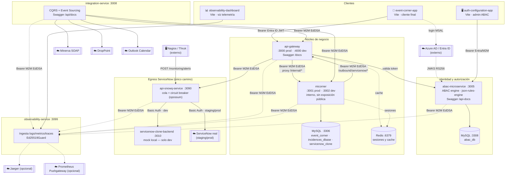

# Diagrama de Infraestructura — Event Corner (ecosistema completo)

> Vista de todos los servicios del workspace, sus puertos, dependencias de arranque y flujos de comunicación. Complementa el diagrama de dominio en [`er-diagram.md`](./er-diagram.md) (que cubre solo el modelo de datos del micorner) y el detalle textual en `CLAUDE.md` (raíz del workspace).

## Mapa completo



**Leyenda:** línea sólida = llamada síncrona (request/response) · línea punteada = fire-and-forget, telemetría o dependencia de solo-lectura · `☁️` = sistema externo al workspace · `[[...]]` = actor o sistema externo.

---

## Orden de arranque (dependencias)

```
MySQL + Redis → servicenow-clone-backend → api-snowq-service
             → abac-microservice → micorner → api-gateway
             → integration-service (independiente, necesita api-gateway)
             → observability-service (independiente, sink de telemetría)
```

> `api-middleware-service` fue **retirado** de la infraestructura — la carpeta puede seguir existiendo en el workspace pero ya no forma parte del ecosistema ni del flujo entre servicios.

## Puertos y Swagger

| Servicio | Puerto (staging/prod) | Dev | Notas |
|---|---|---|---|
| event-corner-app | — | Vite dev server | Cliente final, Entra ID real |
| auth-configuration-app | — | Vite dev server | Admin de ABAC (usuarios, roles, permisos, políticas) |
| observability-dashboard | — | Vite dev server | Visualiza la telemetría de `observability-service` |
| api-gateway | 3000 | 4000 (`API_GATEWAY_PORT`) | Swagger `/docs` |
| micorner | 3001 | 3002 (`MICORNER_PORT`) | Interno, sin exposición pública |
| abac-microservice | 3005 | 3005 | Swagger `/api-docs`, métricas `/metrics` |
| integration-service | 3008 | 3008 | Swagger `/api/docs` — CQRS + Event Sourcing |
| servicenow-clone-backend | 3010 | 3010 | Mock local de ServiceNow — **solo dev** |
| api-snowq-service | 3090 | 3090 | Cola + circuit breaker hacia ServiceNow |
| observability-service | 3099 | 3099 | `/ingest/{logs,metrics,traces}` |
| MySQL (principal) | 3306 | 3306 | DBs: `event_corner`, `incidences_dbase`, `servicenow_clone` |
| MySQL (abac) | 3308 | 3308 | DB: `abac_db` |
| Redis | 6379 | 6379 | Sesiones y cache |

## Los tres mecanismos de autenticación

| Mecanismo | Quién lo usa | Cómo funciona |
|---|---|---|
| **Entra ID (Azure AD)** | Usuarios humanos de `event-corner-app` | `event-corner-app` es el cliente Azure real (hace el login vía MSAL); el token se pasa como Bearer y `abac-microservice` lo valida vía JWKS/RS256 (`EntraIdService`) — no es un cliente Azure registrado, solo verificador |
| **M2M (Ed25519/EdDSA)** | Servicios internos entre sí (gateway↔micorner↔integration-service↔api-snowq-service↔observability-service) | `abac-microservice` firma con `ED25519_PRIVATE_KEY`/`ED25519_KID` vía `POST /auth/m2m-token`; cada servicio verifica **localmente** con `ED25519_PUBLIC_KEY`, sin llamada de red |
| **OAuth 2.0 Client Credentials** | Apps externas de terceros | `POST /auth/oauth/token` en ABAC; scopes = permisos ABAC (`resource:action`) |

Los tres convergen en el motor ABAC (`json-rules-engine`) para la autorización fina por rol/política.

## Notas de esta rama (`feature/appointment-domain-remodel`)

- El único egress hacia ServiceNow sigue siendo `api-gateway → api-snowq-service` — `integration-service` **no** maneja ServiceNow (solo Minerva/DropPoint/Outlook).
- El micorner ya no polea estado desde ServiceNow (`SnowSyncJob` fue eliminado) — cierra los tickets directamente vía `ServiceNowTicketLink` cuando la cita pasa a `CLOSED`.
- `auth-configuration-app` ahora permite editar `firstName`/`lastName`/`username`/`phone` de un usuario ABAC directamente (antes solo se completaban en el primer login vía Entra ID).
